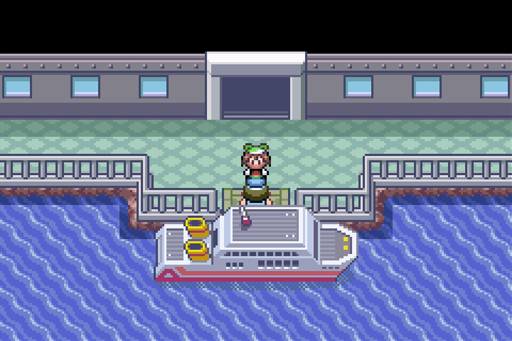

# Shiny Hunt - Deoxys

## Program Description

Use the run away method to shiny hunt Deoxys in Emerald.

## Game Settings

1. Text Speed: Fast
2. Battle Scene: Off
3. Frame: Type 1

## Switch Settings

1. Full screen
2. No filter

## Setup

1. Your lead Pokemon must be able to run away successfully, or must have a Smoke Ball.
2. (Optional) Your lead does not have any abilities that activate on entry.

## Instructions

1. Travel to Birth Island and place your character in the selected starting position. (See option below.)
2. Start the program in game.

## Notes

If you stop the program and switch off or soft reset your game, try to vary the amount of time you wait before starting the program again. This is due to Emerald's broken RNG.

## Options

### Starting Position:

The starting location and situation you are in.

Boat/Walk up:

Your character has just arrived and has not moved from where they exited the ship. Alternatively, they are anywhere on the straight line walking up to the Deoxys rock. The Deoxys puzzle has not been solved.

Triangle rock, puzzle is unsolved:

You are in front of the triangular rock. The Deoxys puzzle has not been solved.

Triangle rock, puzzle is already solved:

You are in front of the triangular rock, having already solved the Deoxys puzzle.

### Walk up/down time:

The amount of time it takes to walk from the ship to the triangle rock.

## Credits

- **Author:** kichithewolf

**Discord Server:** 

