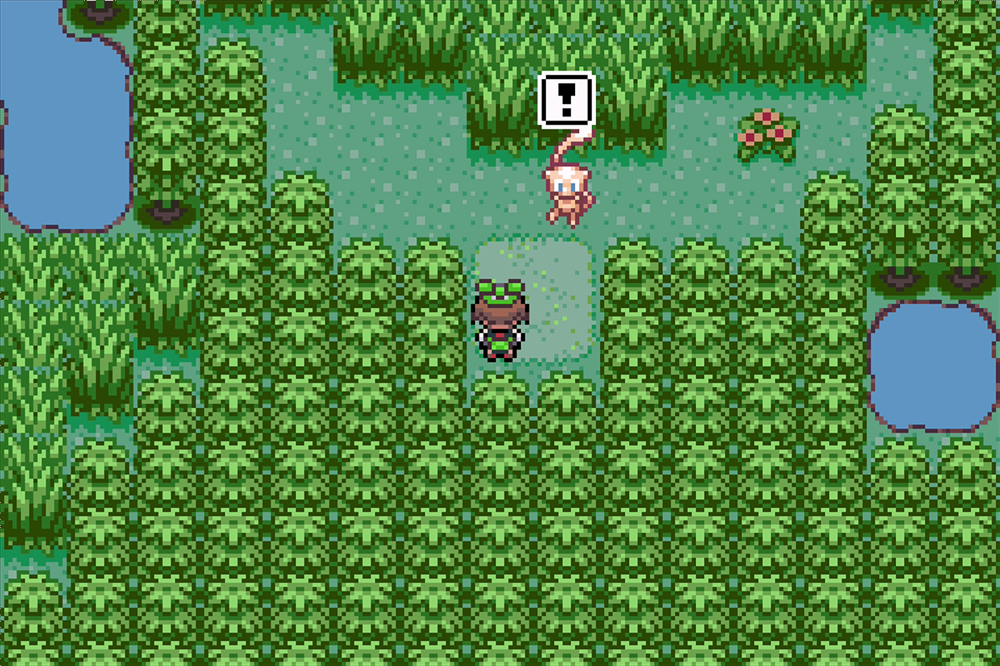
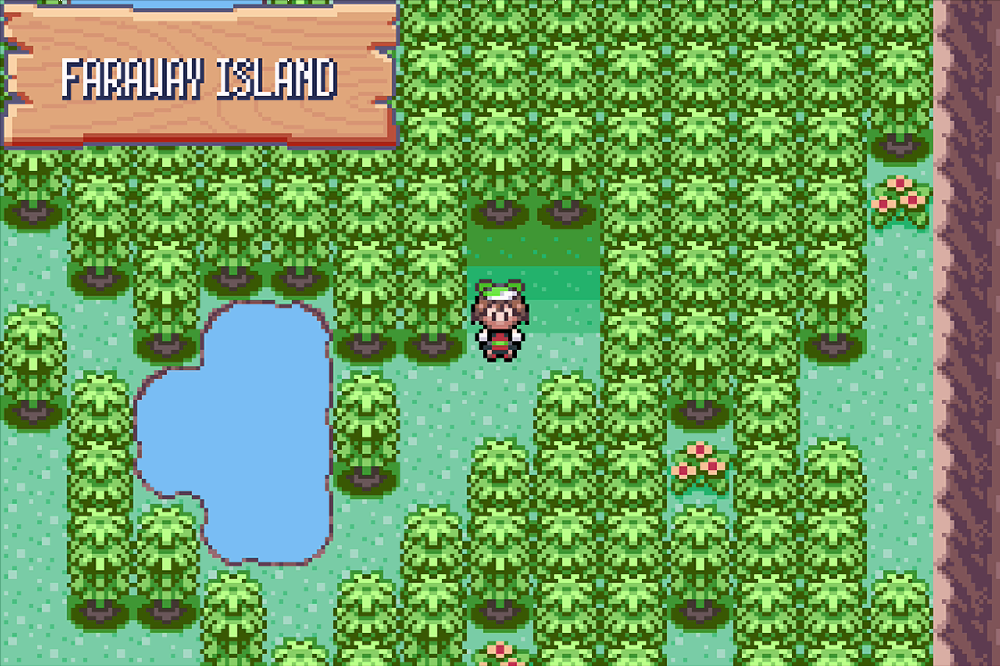
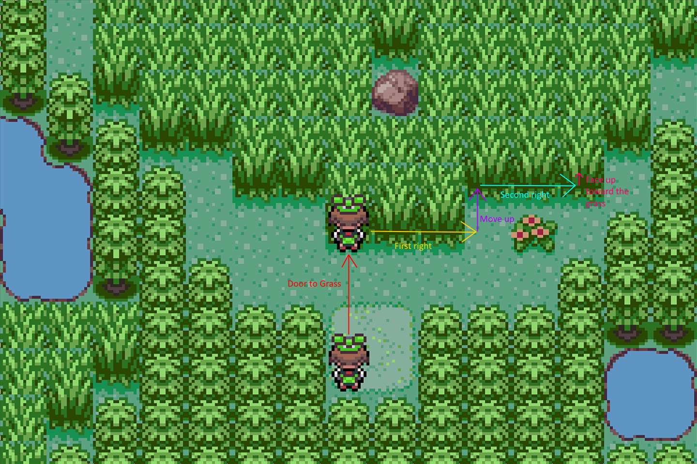

# Shiny Hunt - Mew

## Program Description

Use the Run Away method to shiny hunt Mew in Emerald.

## Game Settings

1. Text Speed: Fast
2. Battle Scene: Off
3. Frame: Type 1

## Switch Settings

1. Full screen
2. No filter

## Setup

1. Your lead Pokemon must be able to run away successfully, or must have a Smoke Ball.
2. (Optional) Your lead does not have any abilities that activate on entry.

## Instructions

1. Travel to Faraway Island and stand in the position pictured above.
2. Start the program in game.

## Notes

If you stop the program and switch off or soft reset your game, try to vary the amount of time you wait before starting the program again. This is due to Emerald's broken RNG.

## Options

You should not need to touch of these options below.

### Mew wait time:

Wait this long after entering for Mew to hide in the grass.

### Door to grass time:

Time it takes to run from the door to the edge of the tall grass. (Three steps up.)

### First Right time:

Time it takes to turn right and take three steps. This follows the edge of the grass.

### Move Up time::

Time it takes turn up and take one step.

### Second Right time:

Time it takes to turn right and take two steps.

### Face Up time:

Time it takes to tap the up button and face up, without taking a step.

## Credits

- **Author:** kichithewolf

**Discord Server:** 

