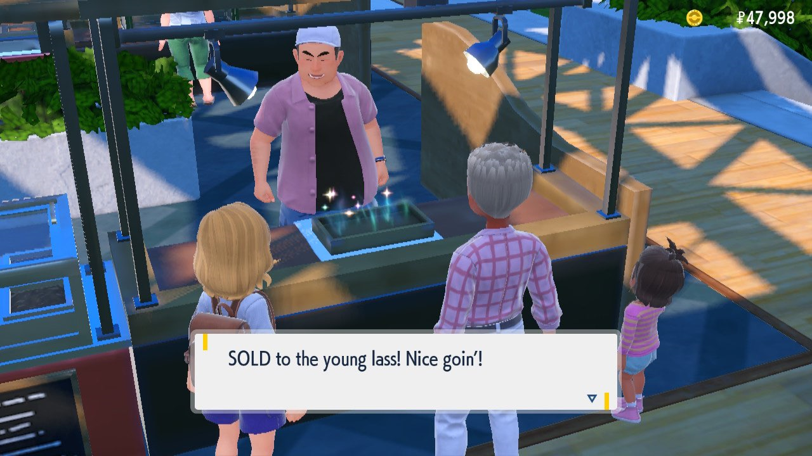
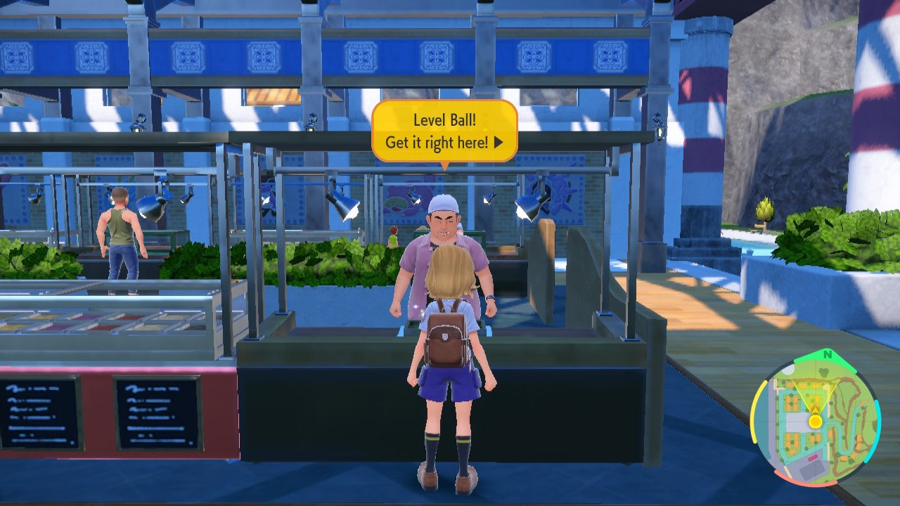

# Auction Farmer

*This program is still in development. It is not yet available to the public.*

## Program Description

This program resets the game in front of an auction NPC and bids on any wanted items. 

The program saves the game after each auction and will continue to bid on items even if you do not have enough money to buy them.

### Setup of Settings

1. Text Speed: Fast
2. System time: Un-synced
3. The language in the option must match your in-game language.

### Instructions

Stand in front of and face an auctioneer who offers items you specified in [Items](#items). 
Some items are offered by multiple NPCs, e.g. Apricorn Balls, while other items are only offered by a single NPC, e.g. EV Berries.
After resetting the game only one yellow speech bubble should be visible. You can check this by pressing the L button while the camera is zoomed in.

## Options

### Game Language:

The language you are playing in. This is required to read which items are offered.

### Items:

This table lets you specify which items the program will buy.

Note: The program cannot distinguish between the Japanese names of Bottle Caps (ぎんのおうかん) and Gold Bottle Caps (きんのおうかん). If the language is set to Japanese and Bottle Caps or Gold Bottle Caps are selected the program will buy both.

## Credits

- **Author:** Fye

**Discord Server:** 

