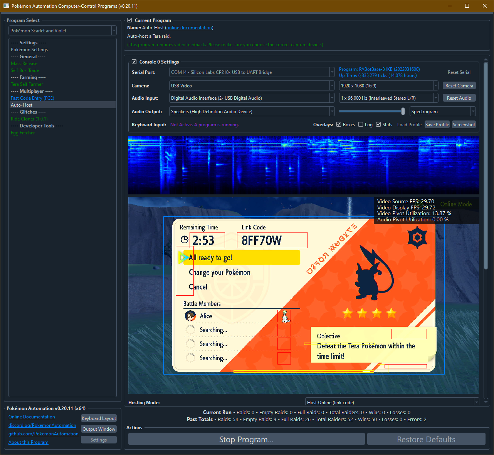
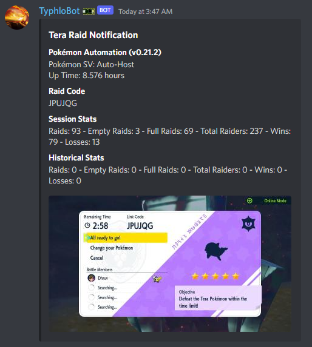

# Tera Auto-Host

*This program is still in development. It is not yet available to the public.*

## Program Description

Similar to the Sword/Shield den auto-hosts. This will auto-host a Tera raid.

This program will go host a raid, battle it through using the first Pokémon and it's first move. Then reset after it returns to the overworld.

By finishing the raid, it avoids the disconnect penalty and softban. However, the program will still reset the game if it encounters an error. And two consecutive resets will stop the program as it does not know how close it is to the softban.

This program will also change your time to prevent the date from rolling over as this will lose the raid.

---

**Important Warning:**

As with the Sword/Shield auto-hosts, this Tera auto-host carries a risk of losing the raid. In particular, going online will hard-save the game. If the date (and therefore the raids) has rolled over, you will lose the raid. Likewise you will always lose a raid when going online after an event changes.

Even though this program changes the time to try to prevent rollover, it is not guaranteed to always work and may even backfire. You have been warned.

---

**General Tera Hosting Notes:**

Unlike Sword/Shield max raids, SV Tera raids cannot be RNG manipulated. So the only way to find shiny Tera raids is to find natural ones.

There are currently three main ways to do it without hacking:

1. Manual checking, i.e. brute-force. (slow)
2. Use [Tera Farmer](TeraSelfFarmer.md) or [Ride Cloner](RideCloner-101.md) and set them to stop when shiny raid is found. (slowest, but automated)
3. Use CFW scanning. (very fast, but requires a hacked Switch to read memory)

Once you find a shiny raid, you need to save in front of the crystal. Note the current date as you will need to keep the date on this day to retain the raid.

To host your shiny raid, make sure your raid is still there. If it isn't, close the game, set the date back to what it was when you first found it, then reload the game.

When you host online with a link-code, the code is always randomized. For the purpose of auto-hosting, you will need to either stream the auto-host or use the Discord notifications to communicate the raid code to your audience.

For speed and convenience for [Fast Code Entry (FCE)](FastCodeEntry.md) users, the notifications will include the code as copy-pastable text. (The program will read the code from the video feed using optical character recognition.)

**Notes about Tera Raid Retention:**

1. Raids always rollover when the date changes forward in-game.
2. To set your date back, always do it with the game closed.
3. Every time you go online, your game will be hard-saved. This cannot be reversed by loading the backup save.
4. If you go online and the event differs from what you currently are on, all raids will be rolled over.*

*This means that you will not be able to preserve a raid beyond the current event (or lack of event). Though further research is needed to confirm this.

---

### Setup of Settings

1. System Time: Unsynced
2. Text Speed: Fast
3. Auto-Save: Off

### Instructions

1. You are standing in front of and facing a Tera crystal.
2. You are saved in this position.
3. You are safe from being attacked by wild Pokémon.
4. You are in the overworld. (not in the menus)
5. Start the program in the game.

## Options

### Mode:

- Host Locally
- Host Online (everyone)
- Host Online (link code)

### Lobby Wait Delay (in seconds):

Wait this long before starting raid. Start time is 3 minutes minus this number.

If not everyone is ready, the program will wait until everyone is ready even if it goes beyond this time limit.

### Start Players:

Start the raid when this many players are joined. Again, it will wait until everyone who has joined is ready.

### Rollover Prevention:

Periodically set the time back to 12AM to prevent the date from rolling over and losing the raid.

### Description:

A custom message to be put on the notification posts when a raid goes up.

## Credits

- **Author:** Kuroneko/Mysticial

**Discord Server:** 

