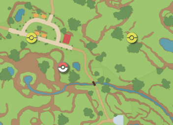

# Autostory (beta only)

# Program Description

This program will automate the Scarlet/Violet story.

**This is currently a work in progress. Only the early game sections have been done.**

The program has two sections: the tutorial and the main story. After it finishes the tutorial, the program will pause. If you want to automate the main story, you will need to ensure that your party has a level 100 Gardevoir, and two other strong pokemon (see below for more details). This allows us to focus on automating the story elements, without also having to consider training up the team or dealing with the battle AI.

# Team setup instructions for the main story
Your main team needs to consist of 3 pokemon. A Gardevoir and two other strong pokemon. The two other pokemon are for the Team Star autobattle portions, so I prefer something that can fly such as Talonflame.

## Gardevoir

The Gardevoir should be level 100, with the moves in the following order:  Moonblast, Dazzling Gleam, Psychic, Mystical Fire. All PP should be maxed. Max Speed and Special Attack EVs. Max IVs except for Attack. Ability: Synchronize or Telepathy (we don't want Trace). Tera Fairy. Holding Choice Specs. Modest nature.

Gardevoir @ Choice Specs  
Ability: Synchronize  
Tera Type: Fairy 
EVs: 252 SpA / 252 Spe 
Modest Nature 
IVs: 0 Atk 
\- Moonblast 
\- Dazzling Gleam 
\- Psychic 
\- Mystical Fire

### How to train up the Gardevoir
Essentially, we catch the Ralts in the Autostory save file, move it to your main account via Pokemon Home. Train it up with candies/vitamins, then move the Gardevoir back to the Autostory save file.

**Catching the Ralts and moving it the main account**
-	In the autostory save file: Go to Los Platos. Catch the Ralts near the cliff (at the red pokeball in the map below). The gender of the Ralts doesn't matter.

-	Move Ralts to the box
-	Save and close the game
-	Open Pokemon Home with your main account.
  -	To get Pokemon Home: Download it from the eShop.
-	Open the Pokemon Home box. Select the autostory account. 
-	Move the Ralts into Pokemon Home
-	Open the Pokemon Home box again. But select your main account this time.
-	Move Ralts into your main account
-	Open Pokemon SV on your main account

**Building the Ralts/Gardevoir**
-	Level up Ralts with EXP candy (these can be farmed via [Item Printer RNG](ItemPrinterRNG.md), or with Tera raids). Evolve it to Gardevoir. Get it to level 100. 
NOTE: Don’t give all the EXP candy at once. Give it in at least 2 batches, so that Ralts has the chance to evolve twice. If you end up with a level 100 Kirlia, to evolve it to Gardevoir you have to give an extra rare candy. 
NOTE 2: I recommend disabling Move learning. So you skip all the dialog boxes from the moves you will learn as you level up. Afterwards, you can just relearn the moves as needed.
- Set the moves to the following: 
\- Moon Blast
\- Dazzling Gleam
\- Psychic
\- Mystical fire
- Give 26 carbos and 26 Calcium to maximize Speed and Special Attack EVs. Afterwards, give 1 Iron to give an extra point of Defense (make sure to do this after giving the Carbos and Calcium)
- Give Modest Mint. To change nature to Modest
- Use PP ups/PP max on all moves
- Give Choice Specs to hold
- Go to Montenevera to Hypertrain all stats except Attack.
- Ensure the ability is Synchronize or Telepathy. You may need to use an Ability Capsule or Ability Patch respectively. We don't want the ability Trace.
- Optional: Go to Treasure eatery in Medali to change the tera type to Fairy
- NOTE: after vitamins, mint and hypertraining, the stats should be as follows: HP 277, Attack [doesn't matter], Defense 167, Speed 259, Sp. Def 266, Sp. Atk 383

**Moving the Gardevoir back to the Autostory account**
- In your main account, put the Gardevoir back into the box. Save and close the game.
-	Open Pokemon Home on the main account. Move the Gardevoir into the Home box.
-	Open Pokemon Home on the autostory account. Move the Gardevoir into the autostory account’s box.
-	Open Pokemon SV on the autostory account. 
- Move Gardevoir from the box and into your team. Move the starter back into the box.

## Two additional Pokemon
As mentioned above, you need an additional two Pokemon, so that you have three Pokemon to do the Team Star autobattle challenges. 

I recommend having two Level 100 Talonflames. Fletchinder are commonly found in the Los Platos area. Evolve them and get them to level 100 by feeding them EXP candy on your main account, as detailed above. Since we only need them for autobattling, there's no need for these Talonflames to have specific moves, items or EVs.

# Options

## Game Language:

This is the language of your game and is required to read the text in game.

## Story Section
- Tutorial: From the intro cutscene, until you finish the school section of the story and when you first mount Koraidon/Miraidon.
- Main Story: From when you first mount Koraidon/Miraidon, until you finish the Scarlet/Violet main story. Note: your team needs to be setup as per the instructions above, with a Gardevoir and two other strong pokemon (e.g. level 100 Talonflames).

## Start Point
Start the autostory program at this segment in the story.

## End Point
End the autostory program at this segment in the story.

# Credits

- **Author:** jw, Nymphea

**Discord Server:** 

