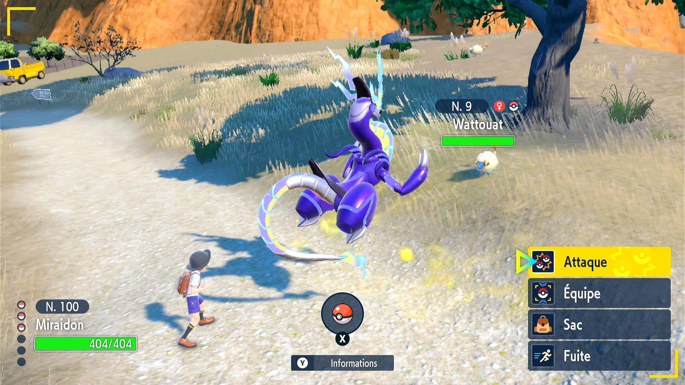

# Autonomous Ball Thrower

*This program is still in development. It is not yet available to the public.*

## Program Description

Keep throwing ball until you catch the Pokémon you're fighting. In case of failure to catch the Pokémon (in case your Pokémon or the opposing Pokémon faint, you run out of balls, etc) it will stop the program.

## Preparation Instructions

1. Screen size: Must be 100% within the Switch settings
2. Video Resolution: 1280 x 720 or higher in program settings

## Instructions

1. Run the program while in fight with the Pokémon you want to catch

## Options

### Ball Select:

The ball you want to catch the Pokémon in.

### Game Language:

Pick the language you're playing in.

## Credits

- **Author:** pifopi

**Discord Server:** 

