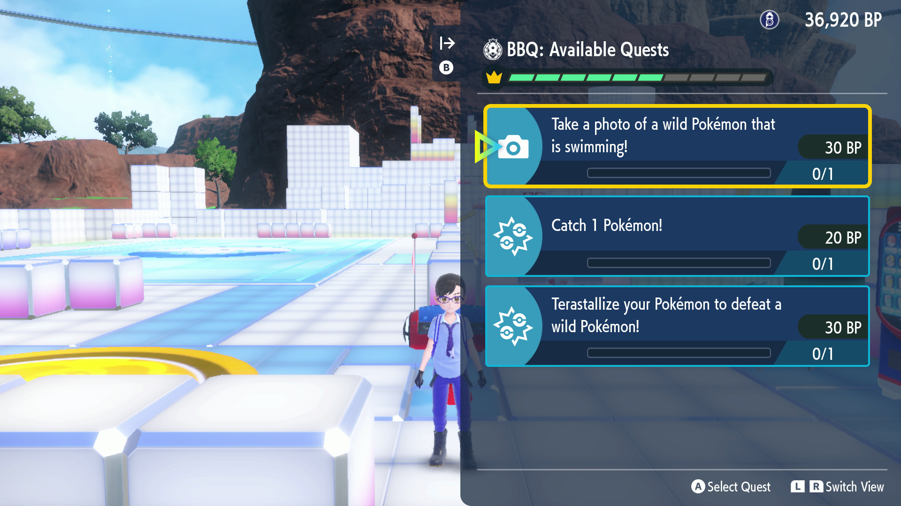

# BBQ Farmer

*This program publicly available, but is still in testing.*

## Program Description

Farm Blueberry Quests in the Terarium for BP.

## Setup of Settings

**Switch Settings:**
1. Screen size: Must be 100% within the Switch settings
2. [Switch 2: The profile you are using must be the 1st (left-most) profile.](/Wiki/Programs/NintendoSwitch/Switch2Notes.md#resetting-a-game-moves-the-cursor-to-the-1st-user-profile)
3. System Time: Unsynced

**Program Settings:**
1. Video Resolution: 1080p or higher

**Game Settings:**
1. Text Speed: Fast
2. Auto-Save: Off
3. Skip Move Learning: On
4. Give Nicknames: Off
5. Send to Boxes: Automatic
6. Camera Support: Off
7. Vertical/Horizonal Camera Controls: Regular
8. Camera Interpolation: Normal
9. You have done a raid at least once to clear in-game raid guide.
10. You have made a sandwich at least once to clear to in-game guide.
11. Flying must be unlocked. This requires completing the Indigo Disk story. See setup.

## Setup

1. Your party must be full, contain no shiny Pokemon, and have the below setup:
	* Slot 1: Pick something that is fast and hits hard.
        * The first move must be capable of defeating all Pokemon types (so no Psychic moves because of Dark types, no Water moves because of Water Absorb, etc.), as it will be used for multiple quests involving defeating wild Pokemon and weakening wild Tera Pokemon.
        * The fourth move should be non-damaging for capture quests.
        * A Smoke Ball is equipped to flee from unwanted encounters, or your lead is immune to Trapinch's Arena Trap, Geodude-A's Magnet Pull, etc.
	* Slot 2: Tera Raid
        * The Pokemon in this slot must be set up to handle Tera Raids.
	* Slots 3/4/5/6:
        * Filler. One Pokemon should have Flame Body/Magma Armor/Steam Engine for the Egg Hatching quest. Make sure none of them will evolve while running the program.
2. All the fly locations in the Terarium must be unlocked.
3. The Indigo Disk story must be completed and Koraidon/Miraidon's flying has been unlocked. (Talk to Amarys in Classroom 3-2.)
4. You are offline and not in a Union Circle.
5. You have plenty of balls for auto-catching.
6. You are well stocked on the following Sandwich ingredients: Apple, Cheese, Watercress, Fried Fillet, Noodles, Rice, Chili Sauce, Marmalade, Butter, Curry Powder, Salt, and Pepper.
7. Your current box in storage is filled with eggs and the number is correctly set (see the options below). Run [Egg Fetcher](EggFetcher.md) to fill a box.
8. You have space to catch Pokemon in your boxes.
9. You have plenty of TM crafting materials and LP (use [LP Farmer](LPFarmer.md) if needed), ideally for lower-numbered TMs.

## Instructions

1. Fly to Central Plaza.
2. Start the program in-game.

## Notes

Depending on weather and lag, certain quests (some more sensitive than others) might not always complete the first attempt.

Shiny checking: Shiny checks only happen on encounters, the program cannot see overworld shinies. Program will stop on any encountered shiny. Tera Raid quest does not include a shiny check.

**Low number TMs with easy materials:**
* TM001: Lechonk Hair, Yungoos Fur
* TM005: Wooper Slime
* TM007: Lechonk Hair, Scatterbug Powder

**Pokemon targeted in combat:** Targets were selected based on location and ease of navigation.
* Battle a wild Tera Pokémon: Stellar Tera Skarmory, which has a chance of being changed to Graveler, Girafarig, Altaria, Magnezone, Scrafty, Cinccino, Golurk, Malamar, or Minior.
* Terastallize your Pokémon to defeat a wild Pokémon: Kleavor
* Catch 1 Pokémon/Catch 1 [TYPE]-type Pokémon: Pyroar, Duosion, Exeggutor-A, Golett, Snubbull, Hitmontop (Tera Ice), Kleavor, Vullaby/Mandibuzz, Geodude-A, Dugtrio-A, Muk-A, Lapras (Tera Bug)
* Defeat 10/30 wild Pokémon using Auto Battle: Pokemon in Chargestone Cavern

**Sandwich recipes used:** Preset recipes were used to avoid encounter powers and to keep the options neat.
* Sour - Apple, Marmalade: Catch Flying 1, Item Drop Ice 1, Egg 1
* Sweet - Apple, Butter: Egg 1, Item Drop Ice 1, Raid Steel 1
* Spicy - Apple, Curry Powder: Raid Steel 1, Item Drop Ice 1, Teensy Flying 1
* Salty - Cheese, Salt: Exp Point Electric 1, Raid Normal 1, Catching Psychic 1
* Bitter - Watercress, Pepper: Item Drop Normal 1, Raid Power Flying 1, Exp Point Fighting 1
* 3 or more ingredients - Fried Fillet, Noodles, Rice, Chili Sauce: Huge Water 1, Raid Flying 1, Catching Normal 1

## Options

### Language:

This is required to read quests.

### Number of Quests to run:

The amount of quests to complete.

### Save and reset the game after attempting this many quests:

Save after every x number of quests are completed. Zero disables saving. The game will then reset to try and avoid lag in the long run. This setting does not count saves made before Tera Raids.

### Inverted Flight:

Check this box if flight controls are set to inverted.

### Catch Quest - Throw Quick Ball:

During the "Catch a Pokemon" type quests, use a Quick Ball on the first turn. This does not apply if the target is a tera Pokemon, as it takes a least one turn to break Tera and enable catching.

### Catch Quest - Ball Select:

The ball to use when catching wild Pokemon.

### Hatch Quest - Number of Eggs:

The number of eggs located in your current box. It is recommended to fill the entire box for longer runs. Eggs in the box do not have to be placed consecutively.

### Hatch Quest - Zero Eggs:

When out of eggs to hatch, perform the selected action. Note that rerolling will cost 50 BP, and selecting ignore will block the high-earning Red/Bonus quests.

### Hatch Quest - Fix time for eggs:

Fix the system time before hatching an egg.

### Tera Raid Quest only - Battle AI:

**Try to Terastillize:** Try to terastillize if available. Adds 4 seconds per try but can greatly increase win rate.

**Move Table:** Pre-program your Pokémon to use this sequence of moves. When the end of the table is reached, it will repeat the last entry of the table until the battle is won or lost.

### Tera Raid Quest only - Catch on Win:

**Ball Select:** Catch the Pokémon using this ball.

**Fix Clock on Catch:** Fix the time when catching so the caught date will be correct.

### Number of Retries:

Reattempt a quest this many times if it fails.

### Go Home when Done:

Go to the Switch Home to idle when finished.

## Credits

- **Author:** kichithewolf
- **Tera Self Farmer:** Kuroneko/Mysticial
- **Egg Hatching/Sandwiches/Sandwich infra:** Gin, Pif

**Discord Server:** 

