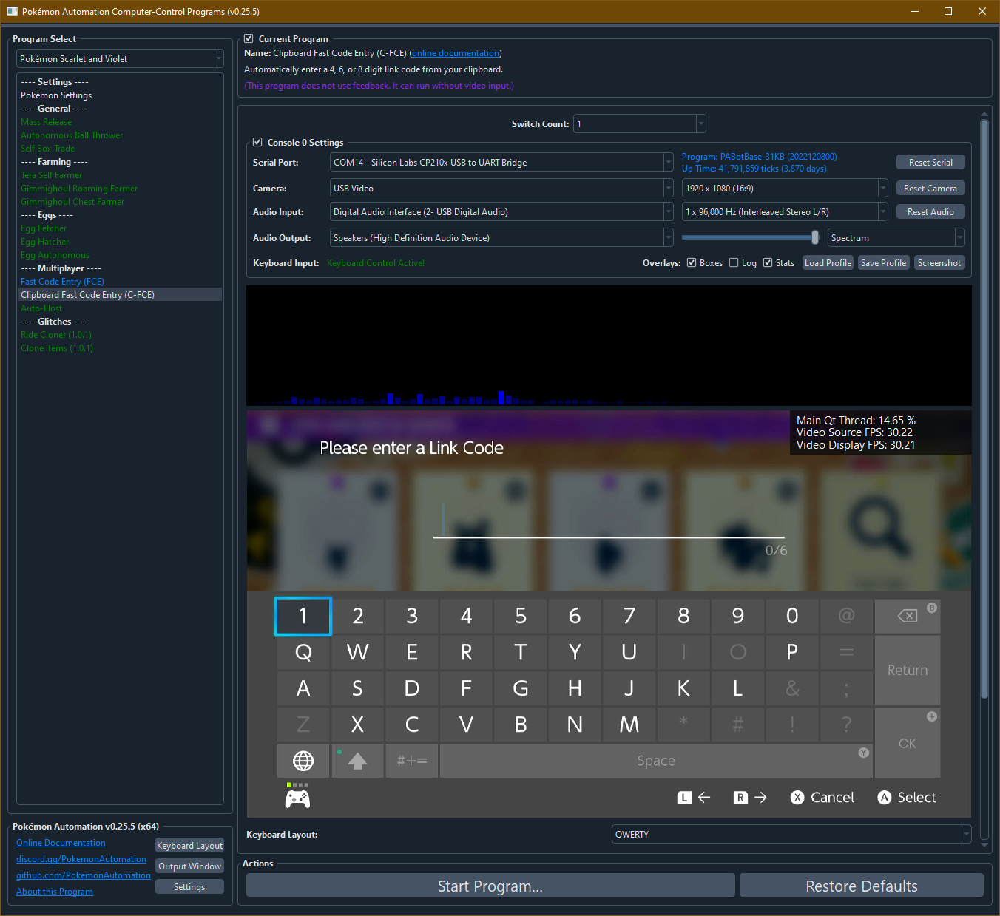

# Clipboard Fast Code Entry (C-FCE)

*This program is currently developer-only. It is not yet available to the public.*

## Program Description

This is an optimized version of the original [Fast Code Entry](/Wiki/Programs/PokemonSwSh/FastCodeEntry.md).

This program does not have a code entry box. Instead, it monitors your clipboard and immediately begins entering it the moment you copy a valid code.

Therefore, this program is faster than the original FCE for entering raids as it automates away the CTRL-V and start program clicks. Furthermore, this program will allow you to FCE into auto-hosted raids without moving the mouse as you only need to double-click and CTRL-C.

As with all FCE programs, the usual disclaimer applies:

***By using this program, you agree that you are an asshole. Furthermore, you will be required to embrace your asshole status by flaunting it in front of all the people you've blocked out of raids.***

### Instructions

- The code entry pad must be up.
- The cursor must be over the "1" digit.
- Start the program.
- Copy a code anywhere else in the computer. The program will immediately begin entering it.

## Options

Most of the options here are self-explanatory.

## Credits

- **Author:** Kuroneko/Mysticial
- **Concept:** SakuraKim (from the original Sword/Shield FCE)

**Discord Server:** 

