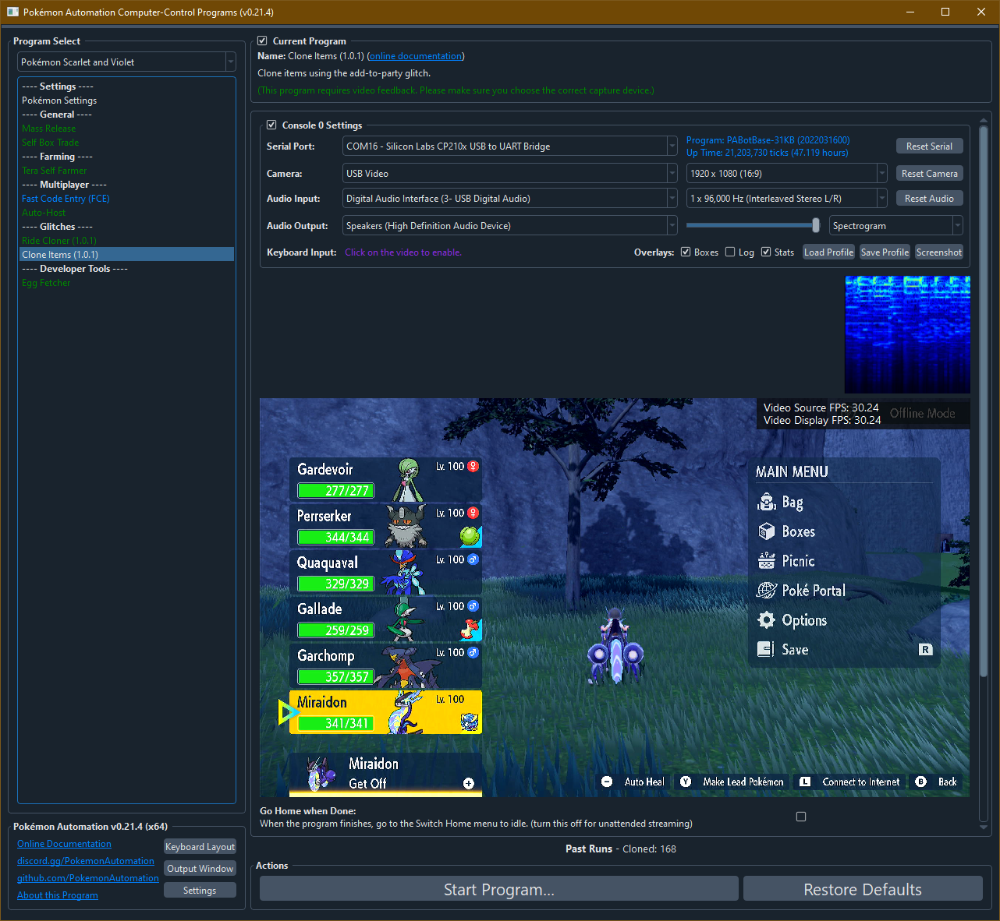
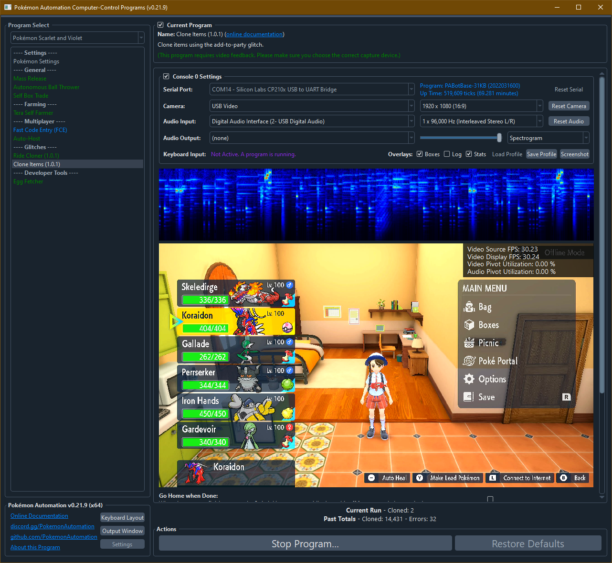

# Clone Items (v1.0.1)

***This program relies on a glitch that was patched out in 1.2.0. It can only be used on versions 1.0.0 - 1.1.0.***

**Related Programs:**
- **Microcontroller:** [Item Dupe](https://github.com/PokemonAutomation/Microcontroller/blob/master/Wiki/Programs/PokemonSV/ItemDupe.md)
- **Computer Control:** [Clone Items](https://github.com/PokemonAutomation/ComputerControl/blob/master/Wiki/Programs/PokemonSV/CloneItems-101.md) (this program)

The microcontroller and computer-control versions of this program are functionally identical.

**This program requires a setup that can only be performed on version 1.0.1 and earlier. But it will work on version 1.1.0 if setup prior to upgrading.**

## Program Description

This program automates the cloning method described in this video: https://www.youtube.com/watch?v=staa9Fv0Rwo

To set this program up, you will need to have activated the glitch and have cloned your ride legendary. If you don't want to do it manually, the you can run the [Ride Cloner](RideCloner-101.md) for one or more iterations and it will have cloned your ride legendary into your boxes. From there you can move it into your party to complete the setup.

This activation glitch (by press A + B) only works in versions 1.0.1 and earlier as it was patched out on 1.1.0. So if you did not already perform this prior to updating to 1.1.0, you will not be able to use this program.

## Item Cloning in v1.1.0:

As covered in the videos, this fast cloning method consists of two parts:

1. Clone your ride legendary using the A+B glitch (race condition).
2. Once cloned, have your ride legendary in ride form, then place a clone in your party. Then exploit the box system.

Furthermore, your ride legendary (including clones)
1. Cannot be moved from party to box. (unless you exploit the A+B glitch again)
2. Cannot be released from your party, but can be released from the box system.
3. Cannot be traded.
4. Can be deleted from your party if you are mounted.

What this means is that once you update to v1.1.0, you cannot make any more clones. However, you can continue using the clones you have to duplicate items. Once a clone is moved from box to party, it cannot be moved back and can only be kept in the party or deleted permenantly.

So if you haven't updated yet, and you wish to clone in 1.1.0, just make a bunch of ride clones and keep them in your boxes. Each time you move one to your party and delete it, you'll consume one. So make as many as needed.

Most people can keep their ride legendary in their party all the time since it's a pretty good Pokémon. So this shouldn't too much of an issue.

---

### Setup of Settings

1. Text Speed: Fast

### Instructions

1. Your ride legendary is in its ride form.
2. You have a clone of your ride legendary in either the 2nd slot or the 6th slot of your party. (depends on your version, see below)
3. The clone of your ride legendary is holding the item you wish to clone.
4. In your box system, you must be on Box 1.
5. Start the program in the menu. (your start setup should be exactly like one of the images below)

| **Version 0.21.8** (6th slot in your party) | **Version 0.21.9 and later** (2nd slot in your party) |
| --- | --- |
|  |  |

### Recommendations

For better performance, stand somewhere indoors where there is no weather. (such as your dorm room)

## Options

Most of the options here are self-explanatory.

## Credits

- **Author:** Kuroneko/Mysticial

**Discord Server:** 

