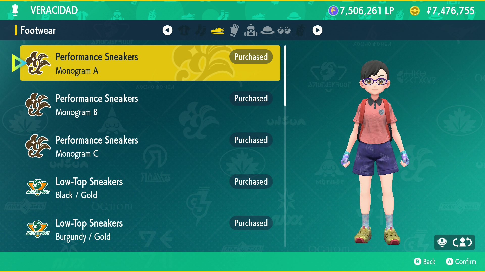

# Clothing Buyer

## Program Description

Purchase clothing from shops.

## Settings

**Switch Settings:**
1. Screen size: Must be 100% within the Switch settings

**Program Settings:**
1. Video Resolution: 1080p or higher

**Game Settings:**
1. Text Speed: Fast

## Instructions

1. The selection arrow is on the first item in the menu for buying clothing.
2. Start the program in-game. The program will automatically stop if you run out of cash/LP, or when the number of categories is hit (see options).

## Options

### Use LP to Purchase:

Check this to use LP instead of cash. Do not select this if the clothing shop does not accept LP (Kitakami stall).

### Wear new clothing after purchase:

Check this if you want to put on items after purchase.

### Number of categories:

The number of clothing categories (ex. Footwear, Gloves, Bags) that the shop you are in has. Minimum is 1, maximum is 5.
- To purchase everything in a shop: set the number of categories to match the shop.
- To purchase only one category of clothing: set the number of categories to 1 and navigate to that category. Leave the selection arrow on the first item. 
- If this number is larger than the number of categories in the shop, the program will still run and complete. However, it will take much longer as it attempts buy already purchased items.

### Go Home when Done:

Go to the Switch Home to idle when finished.

## Credits

- **Author:** kichithewolf

**Discord Server:** 

