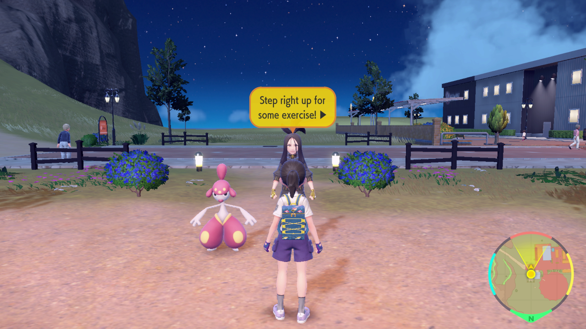

# ESP Training

## Program Description

Replay the ESP training gym challenge in knockout mode to farm EV berries.

## Setup

**Switch Settings:**
1. Screen size: Must be 100% within the Switch settings

**Program Settings:**
1. Video Resolution: 1080p or higher

**Game Settings:**
1. Text Speed: Fast
2. Complete the Alfornada gym.
3. Speak to Dendra at least once to clear out any dialog explaining the mode.

## Instructions

1. Stand in front of Dendra.
2. Start the program in-game.

## Options

### Rounds:

Number of times to run through the ESP training.

### Save:

Save the game between rounds.

### Go Home when Done:

Go to the Switch Home to idle when finished with the number of collection attempts.

## Credits

- **Author:** kichithewolf

**Discord Server:** 

