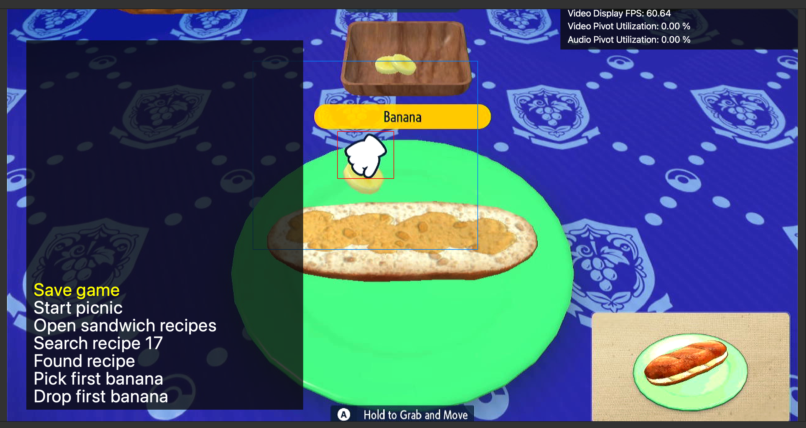
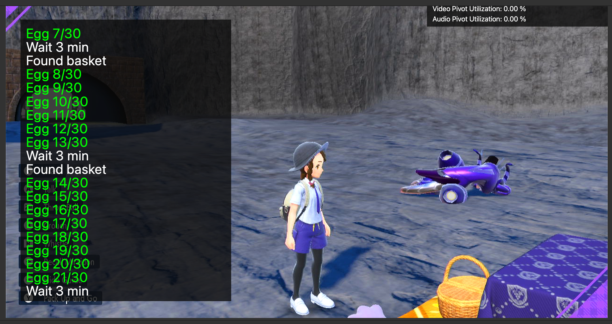
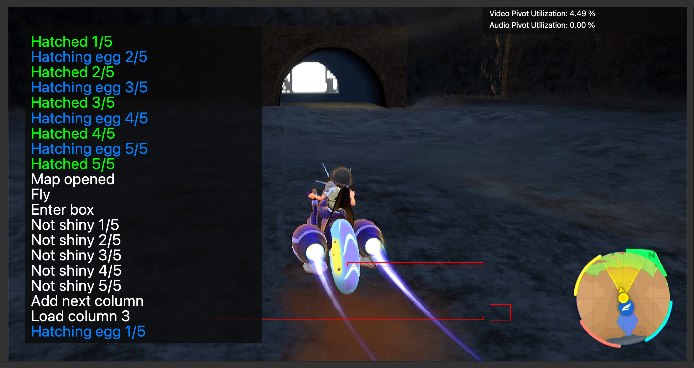

# Egg Autonomous

**Related Programs:**
 - [Egg Fetcher](EggFetcher.md)
 - [Egg Hatcher](EggHatcher.md)
 - [Egg Autonomous](EggAutonomous.md) (this program)

## Program Description

A fully autonomous bot that uses visual feedback to fetch and hatch eggs.
It will automatically detect and keep shinies and can also be configured to keep specific gender and IV spreads.
It combines the functionalities of [Egg Fetcher](EggFetcher.md) and [Egg Hatcher](EggHatcher.md).

At every iteration, this program makes a sandwich with Egg Power, collects 30 eggs and hatches them.
It keeps the hatched Pokémon that meets the requirement in a box and releases the rest.
It can reset the game if there is no Pokémon to keep in those 30 eggs, thereby saving the ingredients of the sandwich.
It can also reset the game when encountering minor program errors.
It can run completely unattended for many days without intervention.

### Setup of Settings

1. Text Speed: Fast
2. Skip Move Learning: On
3. Give Nicknames: Off
4. Auto-Save: Off

### Box Setup

1. Prepare three boxes.
- 1.1. Left box: place a Flame Body Pokémon at first row and first column of the left box.
This Pokémon will be used to hatch the eggs. Make sure the second box column from the left is empty.
This column will be used to hold your fetcher party when the program is hatching eggs.
- 1.2. Middle box: leave it empty. It is used to hold eggs.
- 1.3. Right box: this is the box to hold Pokémon you would like to keep. Give it enough space.
2. Set the current box as the middle box.
3. All three boxes need to use the default wallpaper, Wallpaper 1.
4. If you want to selectively keep Pokémon with certain IV spreads,
you need to unlock IV judge functionality and set the current box view to be judge view.

### Instructions

1. You have picniced at least once to clear in-game picnic guide.
2. For best performance, use the default tablecloth on your picnic table. Other tablecloths may contain white patterns that will slow down the program detecting the white picnic hand cursor.
3. You have a party of two or more Pokémon that can produce eggs. Usually one Ditto and another Pokémon. Eggs collected will not fill empty spots in the party. They will be sent to the current box directly.
4. Making a sandwich gives 100 exp to each party Pokémon. Make sure when the program is running, none of your party Pokémon will evolve by sandwich exp. You can use the option **Num Sandwiches** to control at most how many sandwiches will be made to avoid evolving.
5. You have unlocked Great Peanut Butter Sandwich recipe (recipe ID 17). The program will make the sandwich to gain Egg Power Lv 2. Without Egg Power, it will be very slow to produce eggs in the picnic basket. You don't need to unlock other sandwich recipes. The program can read recipe IDs and find the correct recipe to use.
6. To make the program more reliable reading recipe IDs, you need to buy enough ingredients of all kinds so that all your unlocked recipes are available for making sandwiches in a picnic. For example, in the image below, Recipe 1, 12, 20 and 84 are available while Recipe 80 is not available. Available recipes have solid images, while unavailable recipes have semi-transparent images. Make sure all your unlocked recipes have solid images. This helps the program read recipe IDs.

7. You have bought enough ingredients for making enough sandwiches set by **Num Sandwiches**. Each Great Peanut Butter Sandwich costs one butter, one peanut butter, one banana and one pick. Any pick is fine: the program will always choose the first pick in the pick selection list. You can buy lots of silver picks for the cheap price.
8. Fly to Zero Gate flying spot (see image below). Stand on foot. Don't get on your ride. Don't turn your character around. You can turn camera around.

9. Start the program in game.

Note: Pokémon with large parts of bright yellow color (e.g. Skeledirge) may interfere with the current visual feedback method, with a small chance to cause errors to egg fetching detection. Avoid those Pokémon if possible. For example, if you would like to breed shiny Fuecoco line, don't bring Skeledirge. Bring Fuecoco.

### Notes on Egg mechanism

- If there is only one Pokémon in your party holding an item and that item is a Destiny Knot, all the item-free Pokémon can only pair with that Destiny Knot holder to generate eggs. So you can bring multiple native Pokémon to all pair with a single foreign 6IV Ditto that holds a Destiny Knot to generate Masuda-method eggs with good IVs.

- If more than one Pokémon holds Destiny Knot and the rest holds nothing, only the Pokémon with Destiny Knots will pair among themselves. So if you bring two Ditto with Destiny Knots and some other Pokémon without items, you will never get eggs as Ditto won't produce eggs with another Ditto.

For more investigation on Scarlet & Violet egg mechanism and how to optimize egg fetching, visit https://rotomlabs.net/article/breeding-scarlet-violet.

## Options

### Go Home when Done:

After the program finishes, go to the Switch Home to idle.

### Num Sandwiches:

How many Great Peanut Butter Sandwiches the program can make.
Set **Num Sandwiches** to avoid running out of ingredients and avoid Pokémon in the egg fetching party from leveling up due to sandwich exp.

### Game Language:

The language you are playing in. This is required only if you are doing IV filtering via the [Actions Table](#actions-table).

### Max Keepers:

Stop the program once it has kept this many babies. The program will also stop if the right box is full of kept Pokémon.

### Auto-Saving Mode:

This controls the auto-saving behavior to various things such as error-recovery, reusing ingredients, and unhatching eggs.

**<ins>No Auto-Saving:</ins>**

Repeat this iteration until a stop condition is met:

1. Picnic and collect eggs.
2. Hatch and move keepers to keeper box.

This is the most basic mode. No saving means no error-recovery. No resets mean the ingredients are consumed at a high rate.

**<ins>Save before picnic and after keeping a baby:</ins>**

Repeat this iteration until a stop condition is met:

1. Save game.
2. Picnic and collect eggs.
3. Hatch and move keepers to keeper box.
4. Save the game after each keeper. If no keepers or there are errors, reset the game.

This is the default and more efficient mode. Ingredient usage is low since they are reused if there are no keepers. Errors are recoverable by resetting.

**<ins>Save before every batch:</ins>**

Repeat this iteration until a stop condition is met:

1. Save game.
2. Picnic and collect eggs.
3. For each column of 4 or 5 eggs:
    1. Save game.
    2. Hatch and move keepers to keeper box.

The mode allows you to unhatch eggs. If the program is configured to stop on a baby matching a filter, you can unhatch that egg by resetting the game. However, ingredient usage is high since they are fully consumed and never reset. Errors are fully recoverable.

The ability to unhatch eggs makes it possible to hunt for shiny eggs or high-IV eggs to be re-hatched in a different language for the purpose of building breeding parents.

### Actions Table:

This tables lets you specify the actions to perform on babies that meet a certain criteria.

By default, there is one action which is to keep all shinies. (deposit them into the right box)
But you can add more actions to keep babies of certain gender and IV spreads. This is useful if you are still selectively breeding for perfect parents.

## Credits

- **Author:** Gin

**Discord Server:** 

