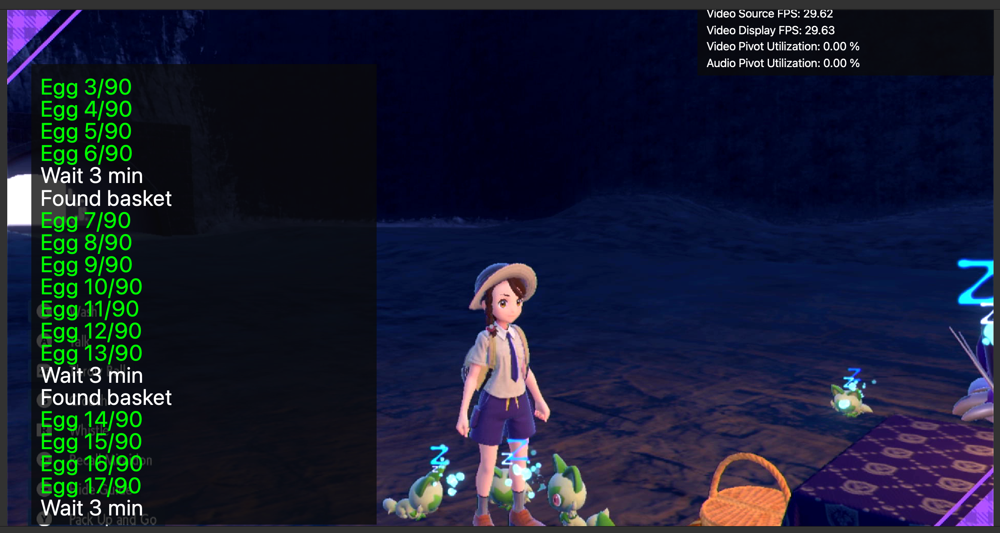

# Egg Fetcher

## Program Description

Make sandwiches and collect eggs.

### Setup of Settings

1. Text Speed: Fast

### Box Setup

1. Place consecutive empty boxes to host collected eggs. Set the current box as the first of those boxes.

### Instructions

1. You have a party of two or more Pokémon that can produce eggs. Usually one Ditto with one or more other Pokémon. Eggs collected will not fill empty spots in the party. They will be sent to boxes directly.
2. You have unlocked Great Peanut Butter Sandwich recipe (recipe ID 17). The program will make the sandwich to gain Egg Power Lv 2. Without Egg Power, it will be very slow to produce eggs in the picnic basket.
3. You have bought enough ingredients for making the chosen number of sandwiches. Each Great Peanut Butter Sandwich costs one butter, one peanut butter, one banana and one pick. Any pick is fine: the program will always choose the first pick in the pick selection list. You can buy silver picks for its cheap price.
2. Fly to Zero Gate flying spot (see image below).
4. Start the program in game.

## Options

The options here are self-explanatory.

## Credits

- **Author:** Gin

**Discord Server:** 

