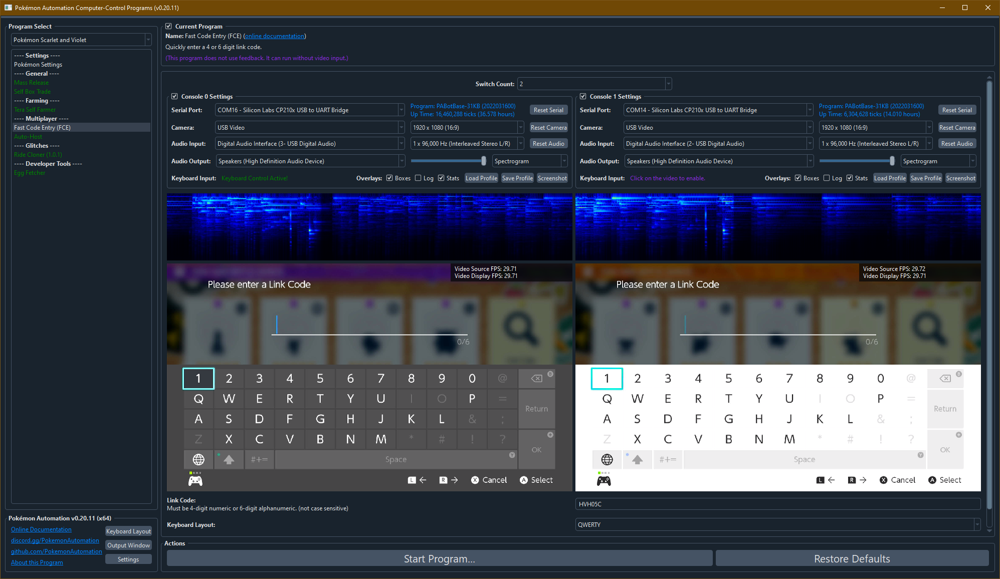

# Fast Code Entry (FCE)

**Related Programs:**
- [Fast Code Entry (FCE)](FastCodeEntry.md) (this program)
- [Clipboard Fast Code Entry (C-FCE)](ClipboardFastCodeEntry.md)
- [Video Fast Code Entry (V-FCE)](VideoFastCodeEntry.md)

## Program Description

This program is similar to the [Sword/Shield Fast Code Entry](/Wiki/Programs/PokemonSwSh/FastCodeEntry.md).

### Link Code Modes

Quickly and easily enter a 4-digit or 6-character link code. 4-digit codes are very fast. 6-character codes are slower, but still superhuman speed. This program can be used to force yourself into people's raids by outspeeding everyone who isn't also using automation.

***By using this program, you agree that you are an asshole. Furthermore, you will be required to embrace your asshole status by flaunting it in front of all the people you've blocked out of raids.***

This program supports multiple Switches. So if you want to be an even bigger asshole, you can force multiple Switches into the same raid at the same time.

### Mystery Gift Mode

The mystery gift mode can take any mystery gift code and enter it really fast. This is useful if the code is randomized and difficult to type manually, if you have game saves across multiple Switches that you want to get the mystery gift on, or if you are resetting a mystery gift for the desired IVs/Nature/Gender/etc.

### Instructions

- The code entry pad must be up.
- The cursor must be over the "1" digit.
- No digits or characters have been entered yet.
- Start the program.

## Options

Most of the options here are self-explanatory.

## Credits

- **Author:** Kuroneko/Mysticial
- **Concept:** SakuraKim (from the original Sword/Shield FCE)

**Discord Server:** 

