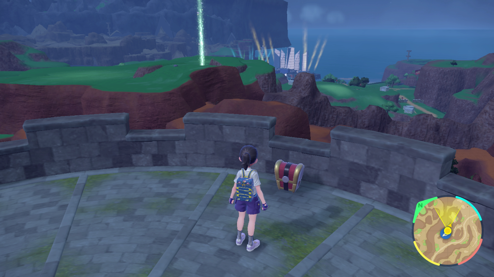

# Gimmighoul Chest Farmer

## Program Description

Farm Gimmighoul chests by advancing the in-game day with date skipping.

## Settings

1. System time: Un-synced
2. Skip Move Learning: On

## Setup

1. Your lead Pokemon must be able to defeat Gimmighoul in one hit using its first move. Pick a move with 100 accuracy.
2. Ensure none of the pokemon in your party will evolve from defeating Gimmighouls.

## Instructions

1. Fly to the East Province (Area One) Watchtower fast-travel point.
2. (Optional) Clear out any wild pokemon between your character and the watchtower.
	> Only the first walk up to the watchtower needs to be clear. Be sure not to move off the fly point.
3. Start the program in-game.
	> After defeating a chest, the program will reset your position by flying and climbing the tower. Very rarely, a wild Pokemon will run into you. If this happens, the program will attempt to defeat it and then reset position again. It will not check if it is shiny.

Note that any extra coins obtained past 999 can be picked up from a NPC in Medali.

## Options

### First Attack PP:

Amount of PP remaining on the first attack of your lead Pokemon.

### Start Location:

Your starting location. By default this is the fly point. If you know the position of the chest and what distance to be from it, you can select "in front of chest" to skip the initial walkup.

### Go Home when Done:

Go to the Switch Home to idle when finished with the number of collection attempts.

### Fix Time when Done:

After the program is finished, briefly sync the system clock to fix the date/time.

## Credits

- **Author:** kichithewolf

**Discord Server:** 

