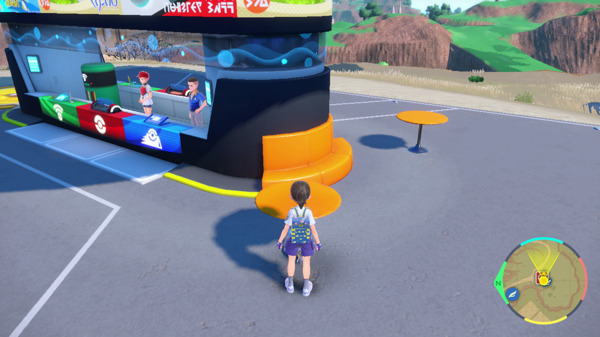

# Gimmighoul Roaming Farmer

**Related Programs:**
- **Microcontroller:** [Roaming Gimmighoul Farmer](https://github.com/PokemonAutomation/Microcontroller/blob/master/Wiki/Programs/PokemonSV/RoamingGimmighoulFarmer.md)
- **Computer Control:** [Gimmighoul Roaming Farmer](https://github.com/PokemonAutomation/ComputerControl/blob/master/Wiki/Programs/PokemonSV/GimmighoulRoamingFarmer.md) (this program)

The microcontroller and computer-control versions of this program are functionally identical.

## Program Description

Farm roaming Gimmighoul for coins by date skipping.

## Settings

**Switch Settings:**
1. Screen size: Must be 100% within the Switch settings
2. [Switch 2: The profile you are using must be the 1st (left-most) profile.](/Wiki/Programs/NintendoSwitch/Switch2Notes.md#resetting-a-game-moves-the-cursor-to-the-1st-user-profile)
3. System Time: Unsynced

**Program Settings:**
1. Video Resolution: 1080p or higher

**Game Settings:**
1. Text Speed: Fast
2. Auto-Save: Off

## Instructions

1. Stand facing a roaming Gimmighoul in a safe location where wild Pokemon will not interrupt you. Pokemon Centers work well for this.
2. Start the program in-game.

Note that any extra coins obtained past 999 can be picked up from a NPC in Medali.

## Options

### Number of Attempts:

Number of day skips/collection attempts to perform.

### Go Home when Done:

Go to the Switch Home to idle when finished with the number of collection attempts.

### Fix Time when Done:

After the program is finished, briefly sync the system clock to fix the date/time.

## Credits

- **Author:** kichithewolf

**Discord Server:** 

