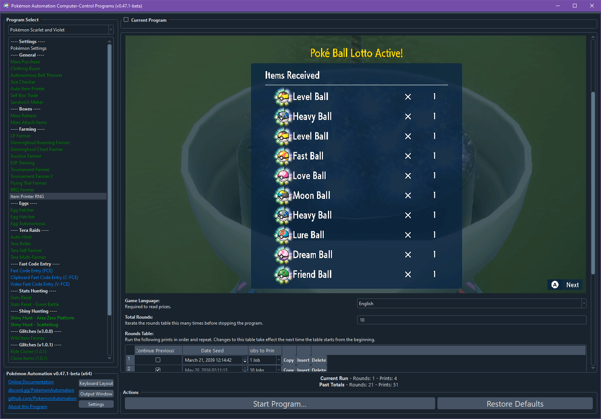
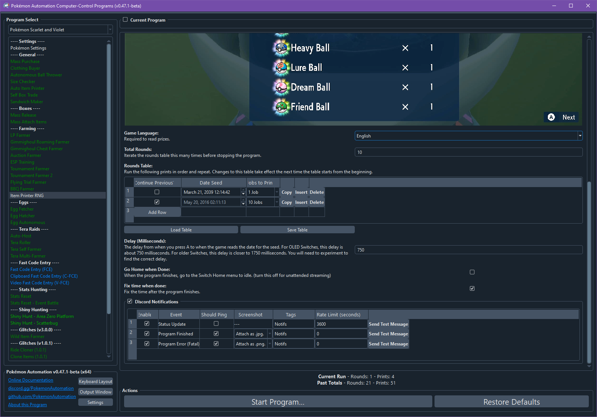

# Item Printer RNG

**Related Programs:**
- [Auto Item Printer](https://github.com/PokemonAutomation/ComputerControl/blob/master/Wiki/Programs/PokemonSV/AutoItemPrinter.md)
- [Item Printer RNG](https://github.com/PokemonAutomation/ComputerControl/blob/master/Wiki/Programs/PokemonSV/ItemPrinterRNG.md) (this program)

# Program Description

This program will RNG manipulate the Item Printer to farm rare items. See this video for a tutorial of how this works: https://www.youtube.com/watch?v=_wmDXrI5Wz4

Before you proceed, make sure you understand the mechanics of this exploit and how to do it manually.

The default settings for this program will produce 10 rare balls using only a single seed. (using a seed found by Anubis) If you want other seeds for other items, please look them up online. Here is a list of useful seeds from Anubis: https://gist.github.com/Lusamine/112d4230919fadd254f0e6dfca850471

# Caution

The item printer depletes Pokémon materials and saves after each iteration, be sure that if there are Pokémon materials you want to keep (to make TMs etc.) that you don't overrun this program.

# Setup of Settings

1. System Time: Unsynced
2. Text Speed: Fast

## In-Game Setup

1. You have unlocked the Item Printer in the League Room.
2. The Item Printer should be fully upgraded for the commonly published seeds to work.
2. Have enough BP (can be farmed with [Flying Trial Farmer](PokemonSV/FlyingTrialFarmer.md)) and Pokémon materials (can be farmed with [Shiny Hunt - Area Zero Platform](PokemonSV/ShinyHunt-AreaZeroPlatform.md) running Dragon Encounter Power) to run the program.

## Instructions

1. Stand in front of the NPC that operates the Item Printer.
2. Start the program.

You do not need to adjust "Delay (Milliseconds)". As long as it is within 2 seconds of correct value, the program will be able to automatically detect how much it is off by and adjust accordingly.
Once it is fully calibrated, the accuracy is typically around 70%.

# Options

## Game Language

This is needed to read the prizes for the purposes of detecting whether you hit the desired frame.

## Standard Mode

### Number of rounds per Item Printer session

Execute the rounds table (see below) the specified number of times before stopping the program. If Automatic Material Farming is enabled, the program will proceed to material farming instead of stopping.

Number of rounds to automate before stopping. Make sure to not set this number too high if you have Pokémon materials you want to save.

### Rounds Table

This table lists the instructions that the program should perform. Each row is a single usage of the Item Printer.

- **Date Seed** specifies the date (and thus RNG seed) that the program should target.
- **Jobs to Print** is how many items to print for this run. It can be 1, 5, or 10.
- **Continue Previous?** If this is checked, the program will not reseed the date. Instead it will just perform this print immediately after the previous one returns to the materials menu. If this option is checked, the date is not used and is disabled.
- **Desired item** This is an optional dropdown that automatically specifies the date (and RNG seed) for commonly desired items. 

The program will run the instructions in the table repeatedly - returning to the 1st row after finishing the last row.

"Continue Previous" is an extension to the exploit that is not covered by the YouTube video tutorial linked above. There are certain seeds that will produce rare balls without needing to reseed the 2nd run. In other words, after the first run finishes (activates the bonus) and returns to the materials menu, you can immediately proceed to running it again and it will produce 10 rare balls.

Note that to get the Pokeballs (e.g. Master Ball, Beast Ball), you need to ensure the Ball Bonus is active first. Keep in mind that the Ball Bonus cannot be activated while the Item Bonus is active.

Also note that the Ball Bonus and Item Bonus remain active for 10 prints. All the items in the "Desired item" dropdown print a maximum of 5. So, you need two rows, when using the "Desired item" dropdown, in order to fully use up a Ball/Item bonus.

### Material Farmer

When this is enabled, after using the item printer, automatically fly to North Province (Area 3) to farm materials, then fly back to keep using the item printer.

- **Trigger to start material farmer:** There are 2 options for when to trigger the material farmer:
  - **Start material farmer when done a certain number of print jobs:**
    - **Print jobs per Material Farming Session:** 
      - Run the material farmer once this many jobs have been printed
  - **Start material farmer when Happiny Dust is less than a certain number**
    - **Minimum Happiny Dust:**
      - Run the material farmer before the number of Happiny dust you have drops below this number. This ensures that no other material drops below this number. If a material starts below this threshold, it remains there.
      - Changes to this number only take place after returning to the item printer, after material farming.
- **Run Duration**
  - Run the material farmer for this many minutes.
- **Make a Sandwich**
  - Make Sandwiches to boost spawns (e.g. Chansey/Blissey) for material farming

## Auto Mode (in development - available to developers only)

Select your desired item and its quantity, and items will be automatically printed. The program will automatically farm materials as needed.

Requirements:
- Have enough Blueberry points to do all your desired prints (accounting for the 70-75% success rate for each print to give you the correct item(s))
- Maxed out in your inventory on the following sandwich ingredients: Chorizo, Bananas, Mayonnaise, Whipped cream
- Strong/fast lead pokemon for auto-battling, for farming materials. (e.g. Ceruledge)

### Auto mode: Item Table 

Input your desired item and desired quantity into the table. If there are duplicate items in the table, only the higher quantity will be considered.

## Delay (Milliseconds)

This is the critical delay from when you press A to when the game reads the date for the seed. This is typically 1-2 seconds, with OLED Switches being faster and older Switches being slower. The program will automatically adjust this for you if the following option is enabled.

## Automatically adjust delay

This option automatically adjusts the delay, depending on the desired item and the actual print result.

The way it works is that if it hits the expected target, the delay remains the same. If it hits the target plus one, the delay is increased 50 ms. If it hits the target minus one, the delay is reduced 50 ms. If it hits the target plus two or minus two, it increases or decreases the delay by 1000 ms, respectively.

## Go Home when Done

When the program finishes, go to the Switch Home to idle.

## Fix Time When Done

When the program finishes, fix the date by toggling the clock sync. This is useful since this program will mess up your date.

# Credits

- **Author:** Mysticial/Kuroneko
- **Original Auto-ItemPrinter:** Nymphea
- **Major Improvements:** jw

**Discord Server:** 

