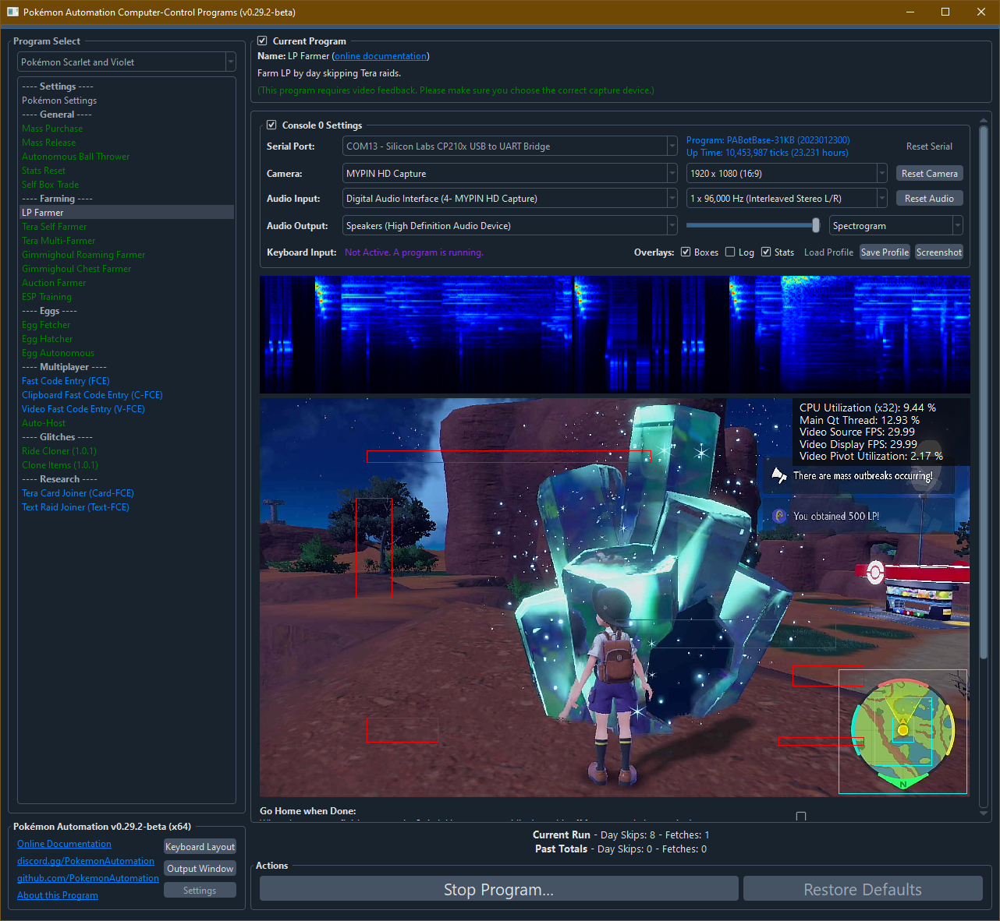

# LP Farmer

## Program Description

Farm LP from a Tera crystal.

This program will date-spam in front of a Tera crystal and grab the LP from it whenever it spawns.

For versions prior to v0.29, LP Farming used to be part of the Tera Self Farmer. Starting from v0.29, it has been split out into a separate program.

### Setup of Settings

1. Text Speed: Fast
2. System time: Un-synced

### Instructions

1. You have done a raid at least once to clear in-game raid guide.
2. You must be facing an active Tera raid crystal facing south, or standing directly on a crystal spawn spot.
3. Your location should be safe from getting attacked by wild Pokémon.
4. Start the program in game.

## Options

Most of the options here are self-explanatory.

## Credits

- **Original:** Scotteh
- **Split Out:** Kuroneko/Mysticial

**Discord Server:** 

