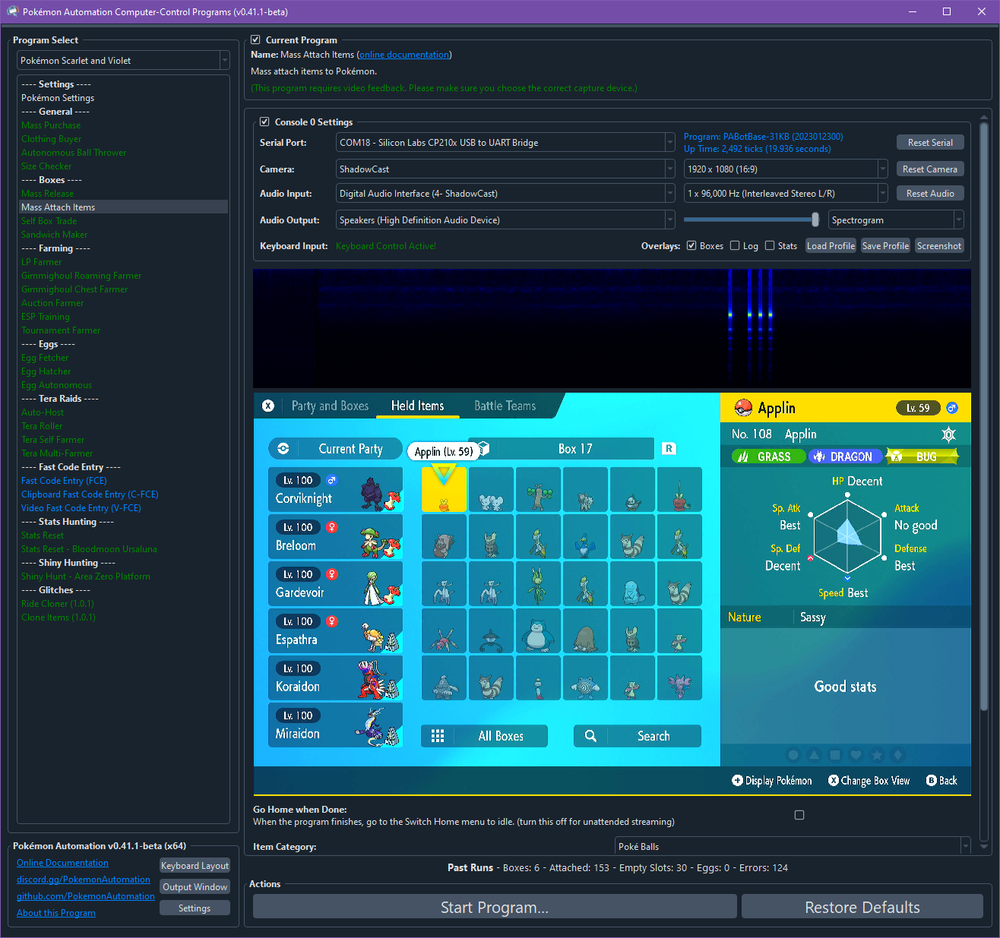

# Mass Item Attach

## Program Description

Attach items to Pokémon in your boxes.

When combined with [Self Box Trade](SelfBoxTrade.md), this program is useful for transfering items from one save to another.

### Setup of Settings

1. Text Speed: Fast

### Box Setup

1. Place boxes of Pokémon to be given items consecutively.
2. Boxes do not need to be full. This program will automatically skip empty slots.

### Instructions

1. When entering your bag and scrolling to the correct pocket, the cursor must already be on the item you wish to mass attach.
2. You must have enough of the item to attach to all the Pokémon in the selected boxes.
2. You must in the box system.
3. The selection mode must be "Items".
4. If you have eggs inside your boxes, you will need to have the default background.
5. Start the program in game.

This program will iterate through every Pokémon in the specified number of boxes and attach the item to all of them.
If a Pokémon is already holding an item, it will be replaced with the item you are attaching.

## Options

Most of the options here are self-explanatory.

## Credits

- **Author:** Kuroneko/Mysticial

**Discord Server:** 

