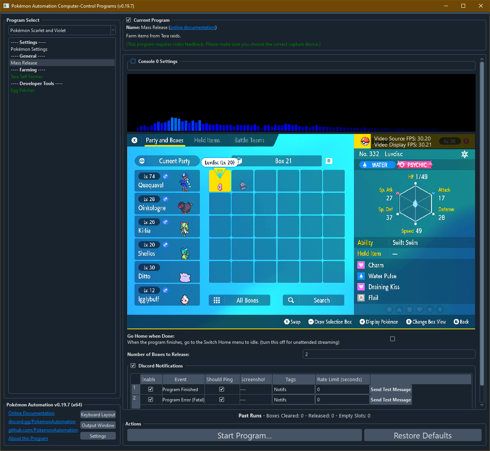

# Mass Release

**Related Programs:**
- **Microcontroller:** [Mass Release](https://github.com/PokemonAutomation/Microcontroller/blob/master/Wiki/Programs/PokemonSV/MassRelease.md)
- **Computer Control:** [Mass Release](https://github.com/PokemonAutomation/ComputerControl/blob/master/Wiki/Programs/PokemonSV/MassRelease.md) (this program)

## Program Description

Mass release boxes of Pokémon.

### Setup of Settings

**Switch Settings:**
1. Screen size: Must be 100% within the Switch settings

**Game Settings:**
1. Text Speed: Fast

### Box Setup

1. Place boxes of Pokémon to be released consecutively.
2. Boxes marked for deletion do not need to be full. This program will automatically skip empty slots.

### Instructions

1. You must in the box system.
2. The cursor must be over the 1st Pokémon in the box. (top-left corner)
3. The selection mode must be "Party and Boxes".
4. If you selected "Skip Shinies", you need to be on the view displaying the shininess (with a star) on the top right corner.
5. If you have eggs inside your boxes, you will need to have the default background.
6. Start the program in game.

## Options

Most of the options here are self-explanatory.

## Credits

- **Author:** Kuroneko/Mysticial

**Discord Server:** 

