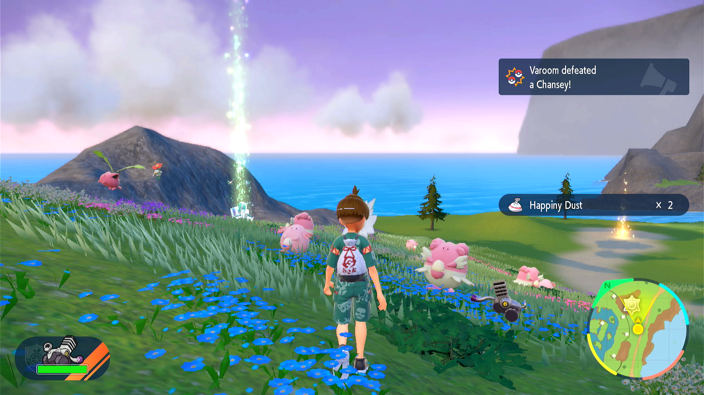

# Material Farmer

## Program Description

This program will farm Happiny Dust from the Chanseys/Blisseys at North Province (Area 3). It earns approximately 500 Happiny Dust per sandwich, with a Normal Encounter power level 2 sandwich. It can also farm the materials of other Pokemon located in that area.

This program works by making a sandwich to boost spawns, then repeatedly sending out your lead for Let's Go to kill everything in sight, to farm their materials. It then flies back to the Pokecenter to reset your position and repeat the loop.

**NOTE: This is not a shiny hunting program. This program will not detect shiny Pokemon.**

### Setup of Settings

**Switch Settings:**
1. Screen size: Must be 100% within the Switch settings

**Program Settings:**
1. Video Resolution: 1080p or higher
2. The language in the option must match your in-game language.

**Game Settings:**
1. Text Speed: Fast
2. After game version 2.0.1 (the DLC 1 update): Camera Support: On

### Instructions

1. You have completed the Indigo Disc DLC and have unlocked Flying (talk to Amarys in Classroom 3-2). You can use either Regular or Inverted controls.
2. Make sure your party is full.
3. Your lead Pokémon is not shiny.
4. Your lead Pokémon is fast and capable of defeating everything without taking damage. Ceruledge works well in my experience.
5. All your party Pokémon won't produce evolve animation due to received XPs from battles.
6. You have plenty of potions for auto-healing.
7. Start at North Province (Area 3) Pokémon Center.
8. You are on foot. (Not mounted on your ride.)
9. Start the program in the overworld with all menus closed.

**Additional Instructions for Making Sandwich**
1. You have picniced at least once to clear the picnic tutorial.
2. You have plenty of sandwich ingredients. (For any ingredient, you need at least 1 more than the required amount to successfully complete the sandwich.)
3. For best performances, select the default tablecloth for your picnic table. (Light-colored tablecloth may interfere with with video recognition.)

Suggested sandwich for Normal Encounter power level 2:
- Chorizo x4, Banana x2, Mayonnaise x3, Whipped Cream x1
- This recipe allows for the Sandwich maker to drop either 1 Chorizo or 2 Bananas and still get encounter level 2. Even in the worst case scenario where multiple items drop, it will still be Normal Encounter power level 1.
  - This is in contrast to Sandwich #34, which also gives Normal Encounter level 2, but has to be perfect and has no room for error. The jalapeno tends to fall off when using the sandwich making program (as of this writing), which turns it into Fighting Encounter level 1.

## Options

### Save Game before each sandwich:

Recommended to leave on, as the sandwich maker will reset the game if it detects an error.

### Number of sandwich rounds to run:

One sandwich round consists of making a sandwich, then repeatedly running the material farmer until the sandwich expires. Each sandwich round takes approximately 35 minutes.

### Game Language:

This is the language of your game and is required to read the names of sandwich ingredients.

### Sandwich Maker:

The program will make the selected sandwich on program start and on every sandwich round to keep the desired sandwich power active.

- Sandwich Recipe: Select from a preset of recipes or custom sandwich mode. If running a generic recipe, select the type in the suboption. If running a paradox-specific recipe, select the target recipe in the suboption.
- Herba Mystica: Select the herba mystica pair to be used when running a generic recipe. Note that not every combination is possible.
- Custom Sandwich: If running on custom sandwich mode, use this table to select the ingredient(s) and condiment(s) to use for the sandwich.

See above for the recommended custom sandwich for Normal Encounter power level 2.

NOTE: This is not a shiny hunting program. This program will not detect shiny Pokemon. **I recommend not wasting Herba Mystica for this program.**

While the program will attempt to build any given custom recipe, it is not guaranteed to build it successfully. Please test that your custom sandwich is able to be built using the [Sandwich Maker](SandwichMaker.md) program first.

### Go Home when Done:

If the programs stops for whatever intended reason (a shiny, or explicit stop condition), go to the Switch Home to freeze the game. This is useful for preserving remaining sandwich time.

### Auto-Heal %:

Auto-heal your lead if its HP drops below a certain point. This will obviously consume items from your inventory.

## Credits

- **Author:** jw
- Based on ShinyHunt-Scatterbug by Gin, Kuroneko/Mysticial

**Discord Server:** 

