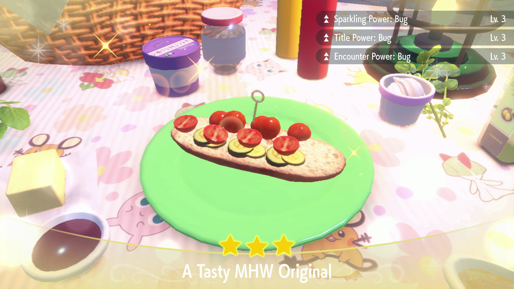

# Sandwich Maker

## Program Description

Make a sandwich of your choice.

## Setup

1. You have picniced at least once to clear in-game picnic guide.
2. For best performance, use the default tablecloth on your picnic table.
	- Other tablecloths may contain white patterns that will slow down the program detecting the white picnic hand cursor.
	- Yellow tablecloths may intefere with the bowl label reader.
3. You have the ingredients in the quantities you want to use.

## Instructions

1. Enter picnic mode and select "make a sandwich."
	> Stay on the Sandwich Recipe menu.
2. Start the program in-game.

## Sandwich Recipe selection

*Credit Nymphea for the modified Encounter recipes and the Paradox-specific Title + Encounter + Humungo/Teensy recipes.*

To use a preset recipe, select it from the dropdown. Otherwise, select Custom and use the Ingredients table to pick your ingredients.

### Preset Recipes:

Select a base preset recipe, and then use the second dropdown to pick the type/paradox.

Note: While more efficient recipes exist, the below encounter recipes were selected for greater flexibility in herb selection and as a hedge against ingredients falling off.

All preset recipes use the following type-specific fillings:

|**Type**|**Ingredient**|
|--------|------------|
|Normal  |Tofu        |
|Fire|Red Pepper|
|Water|Cucumber|
|Electric|Yellow Pepper|
|Grass|Lettuce|
|Ice|Klawf Stick|
|Fighting|Pickle|
|Poison|Green Pepper|
|Ground|Ham|
|Flying|Prosciutto|
|Psychic|Onion|
|Bug|Cherry Tomato|
|Rock|Bacon|
|Ghost|Red Onion|
|Dragon|Avocado|
|Dark|Smoked Fillet|
|Steel|Hamburger|
|Fairy|Tomato|

#### Sparkling + Title + Encounter:

The sparkling preset recipes are based off of [this](https://twitter.com/silentdestroysr/status/1597664770991468545) chart, with two extra fillings of Curry Powder for consistency.

Each use will require:
- 1x Cucumber
- 1x Pickle
- 3x type-specific filling
- 2x Curry Powder
- 2x Herba Mystica

For example, a Fighting type sandwich would have: 1x Cucumber, 4x Pickle, 2x Curry Powder, and 2x Herba Mystica.

Herba exclusions for this sandwich are:
- 1x Sweet and 1x Sour do not work for any type
- 1x Salty and 1x Sour only work for: Flying, Ground, Rock, and Ice
- 1x Sour and 1x Bitter do not work for: Fighting, Bug, and Fairy
- 2x Sour do not work for any type
- 2x Sweet do not work for: Bug

#### Sparkling + Title + Humungo:

Both the humungo and teensy recipes are from [here](https://old.reddit.com/r/PokemonScarletViolet/comments/zi7ag1/ultimate_guide_for_all_18_types_of/). Unfortunately, both humungo and teensy are not as flexible as encounter is.

Each use will require:
- 1x type-specific filling
- 2x Mustard
- 1x Spicy Herba
- 1x Herba Mystica

Spicy Herba is required. The second Herba Mystica can be anything except Sweet.

#### Sparkling + Title + Teensy:

Each use will require:
- 1x type-specific filling
- 2x Mayonnaise
- 1x Sour Herba,
- 1x Herba Mystica

Sour Herba is required. The second Herba Mystica can be anything except Sweet.

#### Title + Encounter + Humungo/Teensy: Paradox-specific:

The recipes in this category are dual-type and intended for hunting Paradoxes only. As with the Humungo/Teensy recipes above, these recipes require certain Herba Mystica flavors. Unlike the above recipes, these flavors are not as flexible, so the recipes cannot be modified. However, **these only require one Herba Mystica.**

Please refer to the chart in [Paradox Recipes](ParadoxRecipes.md) for the ingredients and Herba required by each selection.

### Herba selection:

All preset recipes require two herba mystica to achieve Lv. 3 Sparkling Power. When selecting the Herba you have/want to use, keep in mind invalid combinations. ex. Sweet and Sour will not result in the effects you want for the Sparkling + Title + Encounter sandwiches, and Sweet will not work with Humungo/Teensy at all.

### Custom Sandwich:

Pick the fillings (ex. Hamburger, Onion) and condiments (ex. Ketchup, Herba) you wish to use. If you want to use an ingredient more than once, select it in multiple rows. Keep in mind the ingredient limits are six fillings and four condiments. If you exceed the limits or do not pick at least one filling and one condiment, the program will throw an error.

For example, a Normal type Sparkling + Title + Encounter sandwich from the preset recipes above would be entered as:
- Cucumber
- Pickle
- Tofu
- Tofu
- Tofu
- Curry Powder
- Curry Powder
- 1st Herba
- 2nd Herba

However, as this is a custom sandwich, you could also do the following for the same effects\*:
- Tofu
- Salty Herba
- Salty Herba

\* This assumes the program can place the ingredients without falling. Make sure to test any custom recipes before using with other automated programs.

If the ingredient selection is valid, the program will attempt to make the sandwich. Larger fillings will be placed first and smaller fillings placed last following an internal order the program has. Not all custom ingredient lists are guaranteed to work, as this program is focused on making sure the preset recipes are consistent. For example, six servings of cherry tomatoes will fail, but there are no recipes that call for six servings of cherry tomatoes.

Also note that the baguette will be ignored if selected, as it has no effect on the sandwich outcome.

## Options

### Game Language:

Select the language that matches what you are using in-game. This setting is required.

### Sandwich Recipe:

See the information above.

### Herba Mystica:

See the information above.

### Go Home when Done:

Go to the Switch Home to idle when finished.

## Credits

- **Author:** kichithewolf

**Discord Server:** 

