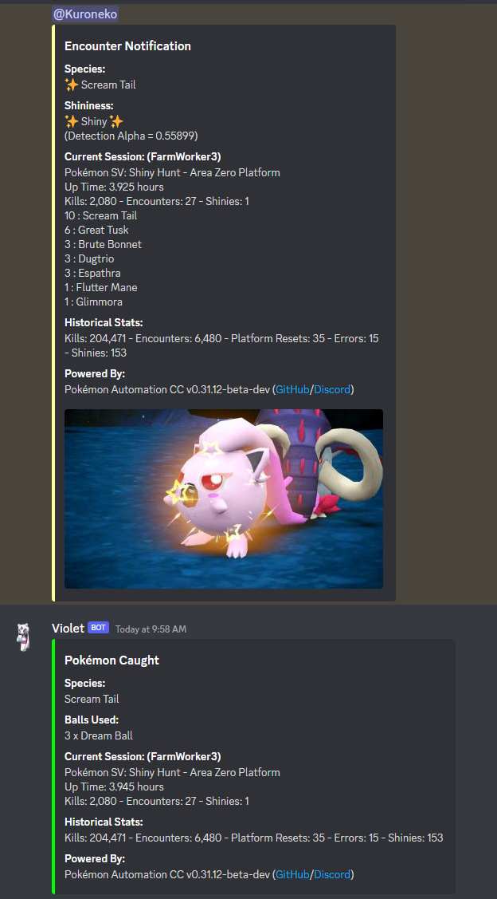
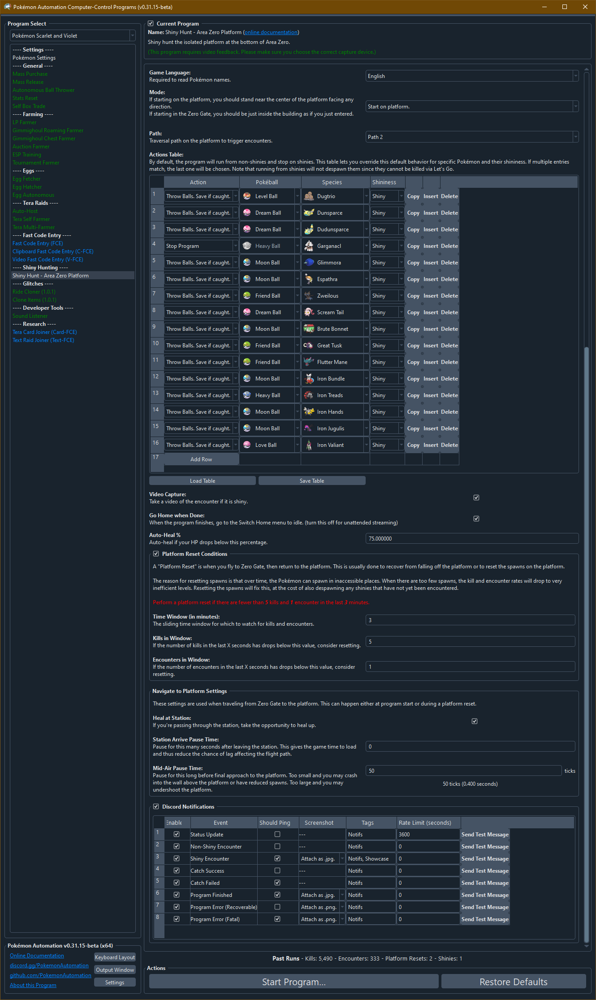

# Shiny Hunt - Area Zero Platform

(Image shamelessly stolen from Scotteh's run of the program.)

## Program Description

This program will shiny hunt on the specific platform detailed in this video: https://youtu.be/5NeLVaE7t8c?t=274

While that video is focused on the idling the ghost exploit for Flutter Mane, the same platform can be used to shiny hunt almost everything else there.

In particular, this program can be used to shiny hunt all of these paradox Pokémon:

- Great Tusk
- Scream Tail
- Brute Bonnet
- Flutter Mane
- Roaring Moon (requires game version 2.0.1)
- Iron Treads
- Iron Bundle
- Iron Hands
- Iron Jugulis
- Iron Valiant (requires sandwich prior to 2.0.1)

This program works by standing on an inside edge of the platform and sending out your lead for Let's Go to kill everything in sight. Because Let's Go auto-battle does not attack shinies, shinies will remain and (with fairly high probability) will wander close enough to your character to trigger an encounter. While the program cannot detect shinies in the overworld, it can hear them during an encounter.

Since the program cannot see shinies in the overworld, it will not immediately try to engage them when they spawn. So there is a chance that a shiny will despawn (Dunsparce) or fall off the platform. Our statistics suggest around 30% of shinies are lost this way. But that's an acceptable cost of automating.

Running on sandwich mode will drastically increase shiny and/or mark rates and better target what you are hunting for. This allows for the full automation on hunting paradox Pokémon given sufficient sandwich ingredients.

Like the encounter bots from Sword/Shield and BDSP, this encounter bot supports auto-catching by blindly throwing balls. But due to the low catch rates of paradox Pokémon, you will need a very tanky lead and a lot of balls.

### Setup of Settings

1. Text Speed: Fast
2. Skip Move Learning: On
3. Give Nicknames: Off
4. Auto-Save: Off

### Instructions

1. Make sure your party is full.
2. Your lead Pokémon is not shiny. (Shiny will cause false positive detections.)
3. Your lead Pokémon is fast and capable of defeating everything without taking damage.
4. Your lead Pokémon is unaffected by Dugtrio's Arena Trap. (Flying or ghost type. Or holding a Smoke Ball.)
5. You have plenty of potions for auto-healing.
6. You have plenty of balls for auto-catching.
7. You are zoomed all the way out to maximize your view.
8. You are on foot. (Not mounted on your ride.)
9. Stand near the center of the platform or in the Zero Gate building as if you just entered.
10. Start the program in the overworld with all menus closed.

**Additional Instructions for Sandwich Mode**
1. You have picniced at least once to clear the picnic tutorial.
2. You have plenty of sandwich ingredients. (For any ingredient, you need at least 1 more than the required amount to successfully complete the sandwich.)
3. For best performances, select the default tablecloth for your picnic table. (Light-colored tablecloth may interfere with with video recognition.)
4. Stand inside Area Zero or near Zero Gate. Make sure you are in the overworld and not inside a research building.
5. Place a hard save before starting the program.

If running without Encounter power active, the best known Pokémon for a lead is Corviknight that is level 100, defensively trained, and holding leftovers. Miraidon and Lucario will also work if given a Smoke Ball. However, the lack of leftovers for self-healing makes them less suitable for auto-catching.

On Violet, Corviknight has issues walling Iron Hands and Iron Bundle during auto-catch:
- Impish 252hp/252def will wall Iron Hands, but takes more than leftovers can heal against Iron Bundle.
- Careful 252hp/252spdef will wall Iron Bundle, but takes more than leftovers can heal against Iron Hands.

Corviknight also cannot outrun Flutter Mane and Iron Bundle without significant speed investment. So it will take damage over time just running from them. But the program can auto-heal as necessary.

If running with Encounter power active, select a lead Pokémon that specifically tanks your target for better auto-catching results.

In sandwich mode, the Sparkling/Title/Encounter preset recipes have a built-in margin for fallen ingredients. It is an intended program feature to drop a few ingredients and still activate the correct sandwich powers. The paradox-specific Humungo/Teensy recipes have less error tolerance built-in and may fail if ingredients fall off, and the fail rate differs depending on the selected recipe.

## Options

### Game Language:

This is the language of your game and is required to read the names of what you encounter. Thus this is also required for auto-catch to work.

### Mode:

Start the game either on the platform or just inside the Zero Gate station.

### Sandwich Reset Time:

Reset the game and make a new sandwich after this many minutes since the last sandwich.

### Sandwich Maker:

If running on sandwich mode, the program will make the selected sandwich on program start and on every sandwich reset to keep the desired sandwich power active.

- Sandwich Recipe: Select from a preset of recipes or custom sandwich mode. If running a generic recipe, select the type in the suboption. If running a paradox-specific recipe, select the target recipe in the suboption.
- Herba Mystica: Select the herba mystica pair to be used when running a generic recipe. Note that not every combination is possible.
- Custom Sandwich: If running on custom sandwich mode, use this table to select the ingredient(s) and condiment(s) to use for the sandwich.

For more information on the preset recipes, including what herba mystica combinations will fail or what ingredients are used for the paradox-specific recipes, please refer to [Generic Recipes](SandwichMaker.md) and [Paradox Recipes](ParadoxRecipes.md) for details.

While the program will attempt to build any given custom recipe, it is not guaranteed to build it successfully. Please test that your custom sandwich is able to be built using the [Sandwich Maker](SandwichMaker.md) program first.

### Actions Table:

By default, the program will run from non-shinies and stop on shinies. Here you can specify an action for different encounter types by Pokémon name and shininess. This will let you auto-catch Pokémon in your desired ball type.

**Warning:** Level 60 Garganacl knows Explosion. Don't try to auto-catch them unless you don't mind losing some.

### Video Capture:

Take a video of the encounter if the program detects a shiny.

### Go Home when Done:

If the programs stops for whatever intended reason (a shiny, or explicit stop condition), go to the Switch Home to freeze the game. This is useful for preserving remaining sandwich time.

### Auto-Heal %:

Auto-heal your lead if its HP drops below a certain point. This will obviously consume items from your inventory.

### Platform Reset Conditions:

A platform reset is when you fly to Zero Gate, then return to the platform. This is usually done to recover from falling off the platform or to reset the spawns on the platform.

The reason for resetting spawns is that over time, the Pokémon can spawn in inaccessible places. When there are too few spawns, the kill and encounter rates will drop to very inefficient levels. Resetting will fix this, at the cost of also despawning any shinies that have not yet been encountered.

The suboptions here are:

- Time Window
- Kills in Window
- Encounters in Window

The idea here is that if there are fewer then X kills and Y encounters in the last Z minutes, then perform a platform reset. Time spent in battles and other non-productive tasks are not counted towards the time window. So if you get stuck auto-catching something for 10 minutes causing your 10 minute time window to have few or no kills/encounters, the program will know to ignore that and not reset.

### Navigate to Platform Settings:

These settings govern how the program navigates from Zero Gate to the platform during a platform reset. You shouldn't need to touch anything here.

## Credits

- **Author:** Kuroneko/Mysticial
- Sandwich mode by Nymphea

**Discord Server:** 

