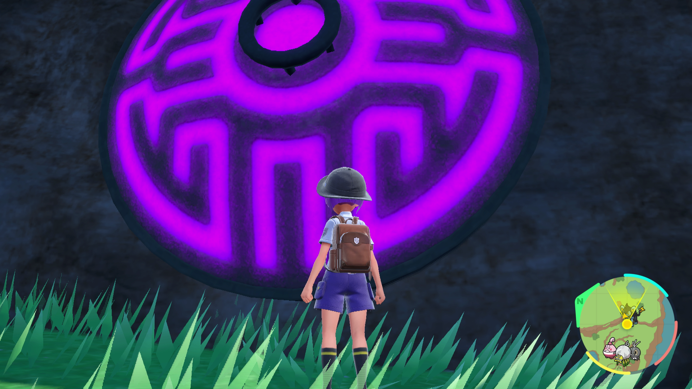

# Stats Reset

## Program Description

Repeatedly catch the Treasures of Ruin until you get the stats you want.

## Settings

1. Text Speed: Fast
2. Skip Move Learning: On
3. Give Nicknames: Off
4. Auto Save: Off

## Setup

1. Your party must contain exactly 5 Pokemon.
2. If you are not using a Master Ball, your lead Pokemon must be able to wall the Pokemon you are targeting.
3. Nothing in your party will evolve after catching your target.
4. The IV judge is unlocked and the current box view must be set to the IV panel.
5. The language option is set to match your in-game language. This is required to read ball names.
6. The actions table is set up to the IVs you want. For shiny locked pokemon make sure the Shininess filter is set to Anything/Not Shiny.

## Instructions

1. Stand in front of your target and save the game.
	> For the Treasures of Ruin, their vault must first be unlocked by pulling their respective stakes.
2. Start the program in-game.
	> Master Ball strongly recommended for legendaries

## Notes
- If hunting the Treasures of Ruin, the shininess filter must be set to Anything or Not Shiny, as they are all shiny locked.
- It is recommended to hunt for 0IV only, as all other stats can be bottle capped.
- The generic setting will only work for Pokemon that you press A to talk to. Regular static spawns (ex. Spiritomb or wild Tera Pokemon) will have the same stats, so resetting for them will not work.
- Attempting to reset for the former titan Pokemon or the box legend will not work either, as their IVs and natures are locked.
- tl;dr use the generic setting for Gimmighoul only. This program will most likely need updates for any future DLC scenarios.

## Options

### Target:

The Pokemon you are resetting for. Set to Treasures of Ruin if you are targeting Wo-Chien, Chien-Pao, Ting-Lu, or Chi-Yu. Set to Generic 

### Game Language:

Select the language that matches what you are using in-game. This setting is required.

### Ball Select:

The ball you want to catch your target in.

### Actions Table:
Use this table to specify the criteria for keeping a legendary. This is the same table used in the egg hatching programs, so be sure to change the Shininess filter to Anything/Not Shiny if resetting for a shiny locked target.

### Go Home when Done:

Go to the Switch Home to idle when finished.

## Credits

- **Author:** kichithewolf

**Discord Server:** 

