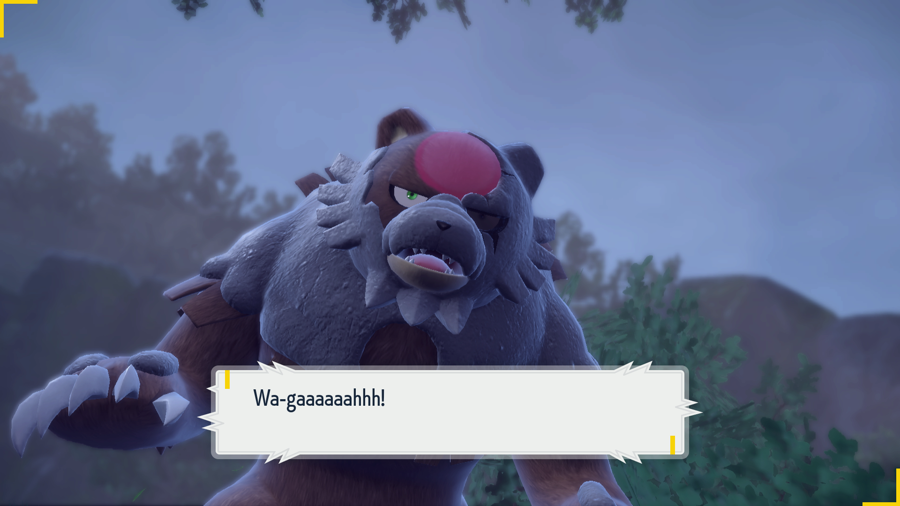

# Stats Reset - Bloodmoon Ursaluna

## Program Description

Repeatedly catch Bloodmoon Ursaluna until you get the stats you want.

## Settings

1. Text Speed: Fast
2. Skip Move Learning: On
3. Give Nicknames: Off
4. Auto Save: Off

## Setup

1. Your party must contain exactly 5 Pokemon.
2. The Pokemon in your party must be able to reliably defeat Ursaluna by spamming their first move.
3. Nothing in your party will evolve after catching your target.
4. The IV judge is unlocked and the current box view must be set to the IV panel.
5. The language option is set to match your in-game language.
6. The actions table is set up to the IVs you want.

Kyogre can one-shot Ursaluna without using terastallization, making it a great way to save time :

Kyogre @ Choice Specs
Ability: Drizzle
EVs: 252 SpA
Modest Nature
- Water Spout

## Instructions

1. Stand in front of Perrin and save the game.
2. Start the program in-game.

## Notes
- It is recommended to hunt for 0IV only, as all other stats can be bottle capped.

## Options

### Game Language:

Select the language that matches what you are using in-game. This setting is required.

### Ball Select:

The ball you want to catch your target in.

### Use Terastillization:

If checked, will tera your lead Pokemon at the start of battle.

### Actions Table:
Use this table to specify the criteria for keeping a catch. There is no shiny filter or check, as Bloodmoon Ursaluna is shiny locked.

### Go Home when Done:

Go to the Switch Home to idle when finished.

## Credits

- **Author:** kichithewolf

**Discord Server:** 

