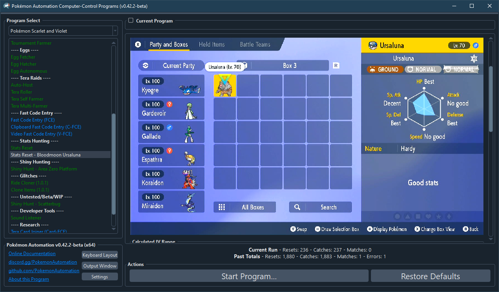
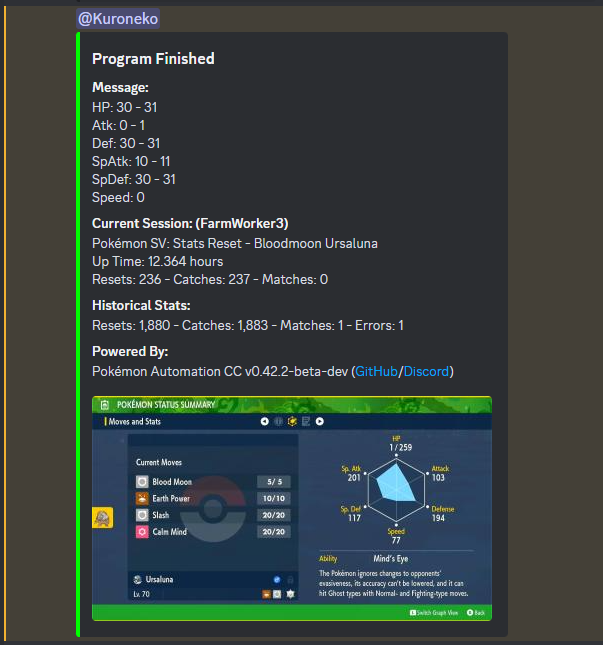

# Stats Reset - Event Battle

## Program Description

Repeatedly catch Bloodmoon Ursaluna or Pecharunt until you get the stats you want.

Starting from program version 0.42, the average times to find the following stat distributions for Ursaluna are:

| **IV Spread** | **Average Resets** | **Average Time** |
| --- | --- | --- |
| Perfect 00 (0 atk + 0 spd) | 5,120 | 11 days |
| VGC 00 (0-1 atk + 0-1 spd) | 1,280 | 2.7 days |
| Perfect 0 Attack (0 atk) | 64 | 3.2 hours |
| Perfect 0 Speed (0 spd) | 64 | 3.2 hours |
| VGC 0 Attack (0-1 atk) | 32 | 1.6 hours |
| VGC 0 Speed (0-1 spd) | 32 | 1.6 hours |

These are calculated assuming 3 minutes per reset which is achievable if you can consistently OHKO without terastallizing.

## Settings

**Switch Settings:**
1. Screen size: Must be 100% within the Switch settings
2. [Switch 2: The profile you are using must be the 1st (left-most) profile.](/Wiki/Programs/NintendoSwitch/Switch2Notes.md#resetting-a-game-moves-the-cursor-to-the-1st-user-profile)

**Program Settings:**
1. Video Resolution: 1080p or higher

**Game Settings:**
1. Text Speed: Fast
2. Auto-Save: Off
2. Skip Move Learning: On
3. Give Nicknames: Off

## Setup

The setup will depend on which version you are running.

**Version v0.41 and earlier:**

1. Your party must contain exactly 5 Pokémon.
2. The Pokemon in your party must be able to reliably defeat Ursaluna by spamming their first move.
3. Nothing in your party will evolve after catching your target.
4. The IV judge is unlocked and the current box view must be set to the IV panel.
5. The language option is set to match your in-game language.
6. The stop conditions table is set up to the IVs you want.

**Version v0.42 and later:**

1. Your party must be full.
2. The Pokemon in your party must be able to reliably defeat Ursaluna by spamming their first move.
3. Nothing in your party will evolve after catching your target.
4. The language option is set to match your in-game language.
5. The stop conditions table is set up to the IVs you want.

Kyogre can one-shot both Ursaluna and Pecharunt without using terastallization, making it a great way to save time:

    Kyogre @ Choice Specs
    Ability: Drizzle
    EVs: 252 SpA
    Modest Nature
    - Water Spout

## Instructions

1. Stand in front of Perrin/Pecharunt and save the game.
   > For Perrin, this is right after taking photographs for her. If she asks "You all ready to meet the Bloodmoon Beast?" back out and save.
2. Start the program in-game.

## Notes

It is recommended to hunt for 0IV only, as all other stats can be bottle capped.

The below is for Ursaluna only, as the IV calculator can distinguish between 0 and 1 for Pecharunt.

Starting from v0.42, the program will calculate the IV range from Ursaluna's stats instead of finishing the post-catch dialog and navigating to the box system to use the IV judge. This has the following implications:

1. It saves about a minute for each attempt.
2. It allows the program to detect 1 attack and 1 speed which is not possible by using just the IV judge.
3. It is no longer possible to distinguish 0 atk and 1 atk as they both have a value of 103.

| **Stat - IV** | **Actual Stat** |
| --- | --- |
| Attack - 0 IV | 103 |
| Attack - 1 IV | 103 |
| Attack - 2 IV | 104 |
| Speed - 0 IV | 77 |
| Speed - 1 IV | 78 |
| Speed - 2 IV | 79 |

While the program can distinguish speed IVs of 0, 1, and 2, it cannot distinguish attack IVs of 0 and 1.

So if you are searching for perfect 0atk+0spd using an IV filter of `xx/0-0/xx/xx/xx/0-0`, you will get a false positive 50% of the time as the program will stop on 1 attack. You can easily disambiguate (manually) using the IV judge.

If you are just searching for VGC 00 (0-1 attack and 0-1 speed), setting a filter of `xx/0-1/xx/xx/xx/0-1` will stop only on VGC 00 with no false positive.

## Options

### Target:

The Pokemon you are resetting for.

### Game Language:

Select the language that matches what you are using in-game. This setting is required.

### Ball Select:

The ball you want to catch your target in.

### Use Terastillization:

If checked, will tera your lead Pokemon at the start of battle.

### Stop Conditions:
Use this table to specify the criteria for keeping a catch. There is no shiny or nature filters, as Bloodmoon Ursaluna is shiny and nature locked.

### Go Home when Done:

Go to the Switch Home to idle when finished.

## Credits

- **Original Author:** kichithewolf
- **IV Range Update:** Kuroneko/Mysticial

**Discord Server:** 

