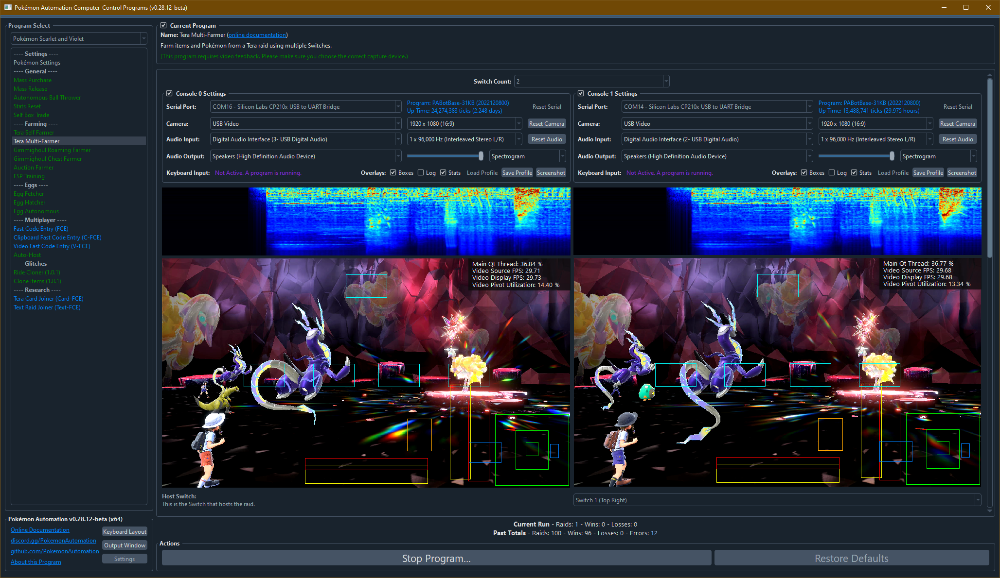

# Tera Multi-Farmer

*This program is still in development. It is not yet available to the public.*

## Program Description

Auto-host a raid from one Switch while farming it with 1-3 more Switches. Thus this is a multi-Switch program that requires at least 2 Switches to run.

This program can be used to farm both items and Pokémon from a raid. By using pre-programmed moves, it can also be used to farm herbs from higher level raids.

### Setup of Settings

**The Host Switch:**

1. Text Speed: Fast
2. System time: Un-synced
3. Auto-save is off.
4. Airplane mode is disabled and you are offline.
5. You have done a raid at least once to clear in-game raid guide.
6. You must be facing an active Tera raid crystal facing south, or standing directly on a crystal spawn spot.*
7. Your location should be safe from getting attacked by wild Pokémon.
8. You are in the overworld with all menus closed.
9. Save the game in this position. (standing on north side of crystal facing south)

\*After completing a raid, your character will rotate to face south. Thus if you aren't already facing south, the crystal spawns may no longer be in front of you.

**The Raiding Switch(es):**

1. Text Speed: Fast
2. Airplane mode is disabled and you are offline.
3. You have done a raid at least once to clear in-game raid guide.
4. You are in a place where you can access the Poké Portal.
5. Your location should be safe from getting attacked by wild Pokémon.
6. You are in the overworld with all menus closed.

### Instructions

Once you have set up your Switches as above, just start the program.

The hosting Switch will run an auto-hosting routine and the raiding Switches will join and farm it.

## Global Options

### Host Switch:

This selects which Switch is the hosting Switch. Can be any of the 4 Switches and must be one that exists. (Can't choose Switch 3 if you only have 2 enabled.)

### Max Wins:

Stop the program after this many wins.

## Rollover Prevention:

On the hosting Switch, periodically set the time back to 12AM to prevent the date from rolling over and losing the raid.

## Recovery Mode:

- Stop the program if an error happens on any raiding Switch.
- On every raiding Switch, save the game before each raid. If an error happens, reset that Switch.

In all cases, if an error happens on the host that doesn't affect the raiding Switches, only the host will be reset.

## Per-Switch Options

### Game Language

This is used by the raiding Switches for ball selection. Must be set properly on raiding Switches that are choosing to catch the Pokémon.

### Catch the Pokémon:

Check this if you want the Switch to catch the Pokémon. Only relevant to raiding Switches.

### Ball Select:

If the raiding Switch is set to catch the Pokémon, this is the ball to use.

### Battle AI:

This option lets you choose how you want this Switch to battle.

## Credits

- **Author:** Kuroneko/Mysticial

**Discord Server:** 

