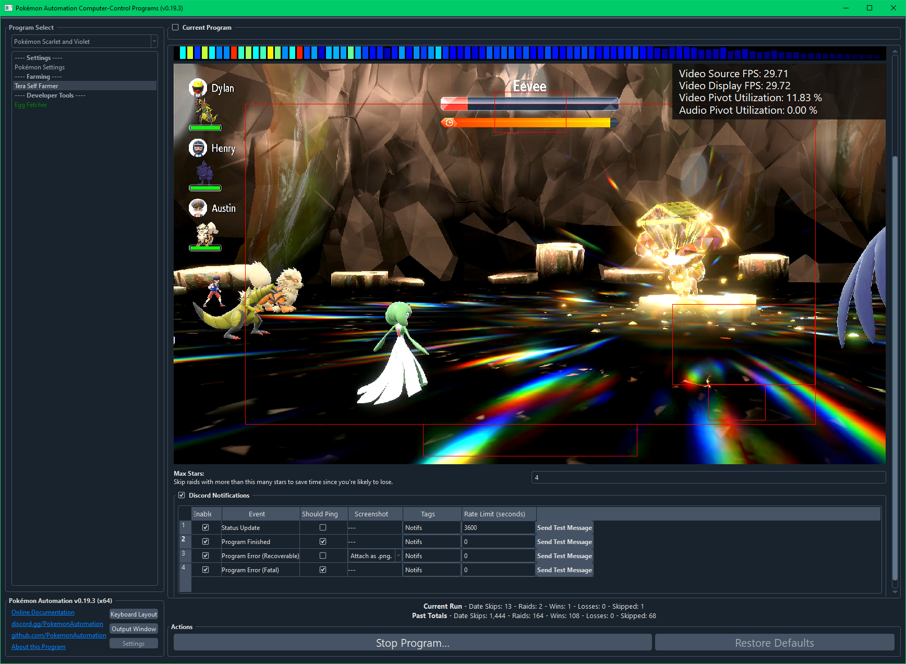

# Tera Self Farmer

This program is currently in development and is not yet available.

## Program Description

This program will date-spam for tera raids and battle them by mashing A (the first move of your lead Pokémon).

This program is useful for farming items from easier raids. It cannot be used to beat hard raids.

This program cannot detect shinies. So it will kill them unless you manually stop the program.

### Setup of Settings

1. Text Speed: Fast
2. System time: Un-synced
3. Nicknaming must be off.
4. Auto-deposit must be set to manual.

### Instructions

1. You must be facing an active Tera raid crystal on the *opposite side* of the black entrance.*
2. Your location should be safe from getting attacked by wild Pokémon.
3. Your lead Pokémon should be able to reliably beat raids by spamming its first move. Pick a move that is strong and has few types resistant to it.
4. Start the program in game.

*After completing a raid, your character will rotate in a direction as if you were exiting the crystal through the entrance. Thus you must be facing the other side or you will be rotated away from the crystal such that you won't be able to interact with it anymore.

## Options

### Max Stars:

Skip raids with more than this many stars to save time since you're likely to lose. 4 star raids seem to be the limit of what can be beaten with this program.

## Credits

- **Author:** Kuroneko/Mysticial

**Discord Server:** 

