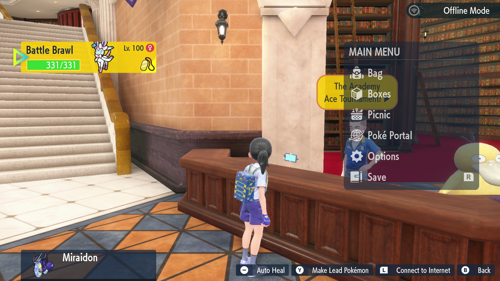
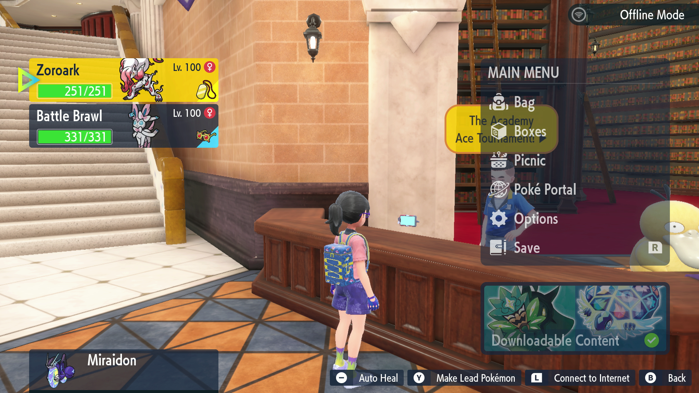

# Tournament Farmer

**Related Programs:**
- [Tournament Farmer](TournamentFarmer.md) (this program)
- [Tournament Farmer 2](TournamentFarmer2.md)

## Program Description

Farm the Academy Ace Tournament for money and prizes.

**Indigo Disk DLC Update:** Because of the increased difficulty of the tournament after completing DLC2, the methods described here are no longer reliable. Use [Tournament Farmer 2](TournamentFarmer2.md) instead.



## Setup

1. Your party must contain Pokemon capable of clearing the tournament by spamming its first move. (ex. Chi-Yu or Sylveon, see below)
	* This cannot be your mount as the program will use it to return to the academy if you end up at the Pokemon Center.
	* It is strongly recommended that your Pokemon is level 100.
	* Remember to equip Amulet Coin.
2. The last Pokemon Center visited is Mesagoza West. The program will attempt to return to the academy from here if you lose the tournament.

Note: Pre-v0.38.3 required that you only have a single Pokemon in your party. Versions 38.3 and later support having a full party of Pokemon and will swap Pokemon in on faint. All party members will use their first move.

```
Sylveon @ Amulet Coin
Level: 100
Modest Nature
Ability: Pixilate
EVs: 78 Def / 252 SpA / 180 Spd
- Hyper Voice
```
**Indigo Disk DLC Update:** If you decide to continue using this program anyway after completing DLC2, one of the following setups is necessary:
```
Kyurem (White) @ Choice Specs
Level: 100
Tera Type: Ice
Modest Nature
EVs: 252 Special Attack, 252 Speed
- Freeze Dry / Ice Beam
Note: Delete all other moves. If it runs out, it can still use Struggle.

Calyrex-Ice @ Choice Band
Level: 100
Tera Type: Ice
Adamant Nature
EVs: 252 Attack, 252 Speed
- Glacial Lance
Note: Max out the PP on Glacial Lance and delete all other moves. If it runs out, it can still use Struggle.
```
Note that this sacrifices the Amulet Coin for Choice Specs as this is needed to reliably win. Happy Hour Zoroark can still be used (as does a Smeargle with the same moves), but this will hurt the win-rate due to giving the opponent free turns to setup Trick Room or Light Screen.

## Instructions

1. Stand in front of the tournament entry NPC.
2. Start the program in-game.

## Happy Hour H-Zoroark (or Smeargle) Setup + Instructions



If you have a Hisuian Zoroark from the Scarlet/Violet DLC preorder, you can use the event-exclusive move Happy Hour (which stacks with Amulet Coin) to double your winnings. However, Happy Hour is not a damaging move, so it will not work with the program normally, and requires a slightly different setup as follows:

1. Your party must only contain two Pokemon: The event Zoroark and your regular tournament farming 'mon.
	* Zoroark must be your lead. It's first move must be Happy Hour and its second move must be Memento.
	* Zoroark does not need a particular EV spread. As long as it can use Happy Hour on the first turn it is fine.
	* The Pokemon in your second slot is setup to farm tournaments with the requirements from above.
	* Note: Having two Pokemon in your party means you can give Zoroark the Amulet Coin. This frees up the item slot on your farming 'mon. Give them the appropriate Choice item for faster kills.
2. Check the "Happy Hour H-Zoroark" option.
3. As with the normal setup, the last Pokemon Center visited is Mesagoza West and your farming Pokemon is not your mount.

Once the conditions above are set, start the tournament as usual. In each fight, H-Zoroark will use Happy Hour on the first turn. Then, if it hasn't fainted, it will use Memento to faint. Once that's done your farming Pokemon will be sent out (and tera'd if that option is checked) to complete the battle.

**Indigo Disk DLC Update:** With the release of DLC2, the event Hisuian Zoroark can be substituted with a Smeargle. Use Sketch to learn Happy Hour in slot 1 from the event H-Zoroark, and then Sketch any move that will kill Smeargle (ex. Memento, Explosion) in slot 2. Memento can be blocked by Protect and still count for Sketching purposes.

## Notes
- The Turbo A/Turbo Button programs will run through the tournament faster than this, and can be used instead if none of the options (ex. Tera during battle, Prize reading, continuing even if tournament lost) in this program are needed.

## Options

### Number of Tournaments to run:

The number of tournaments you wish to complete.

### Use Terastillization:

If checked, will tera your Pokemon at the start of each battle. Will take much longer to farm tournaments but may be worth the attack boost if your Pokemon isn't specifically built for farming.

### Save every this many tournaments:

Save every x number of tournaments. Zero disables saving.

### Stop after earning this amount of money:

After winning x amount of money, stop the program when the tournament is over. Money lost from losing a battle will not count toward this total. Set this to 0 to disable the setting.

### Happy Hour H-Zoroark:

Check this if you have an event Hisuian Zoroark or a Smeargle with Happy Hour with the set up from the above instructions. Do not check this option if you do not have the setup for this, as the program will not function.

### Go Home when Done:

Go to the Switch Home to idle when finished.

### Game Language:

Select the language that matches what you are using in-game. This setting is required to read prizes.

### Items Table:

Use this table to specify which prizes you want to be notified for.

## Credits

- **Author:** kichithewolf


<hr>

**Discord Server:** 

[](https://discord.gg/cQ4gWxN)

