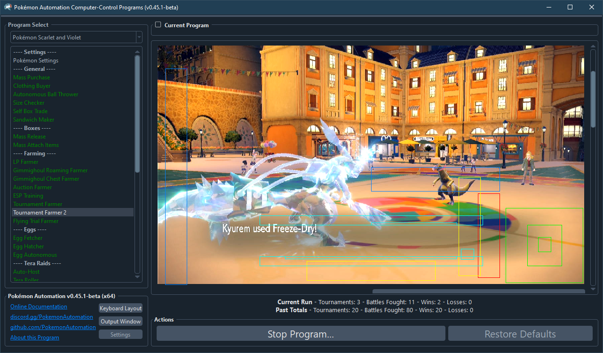
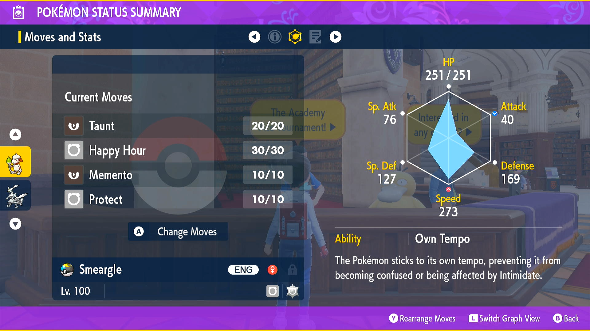
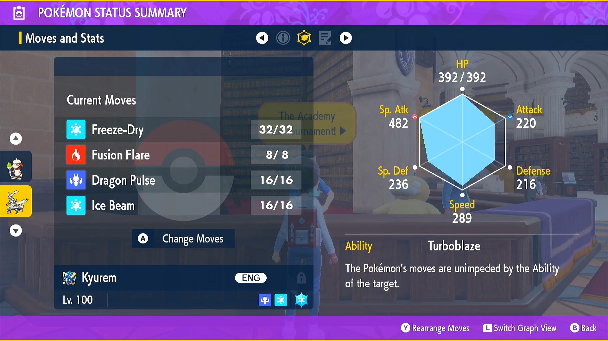
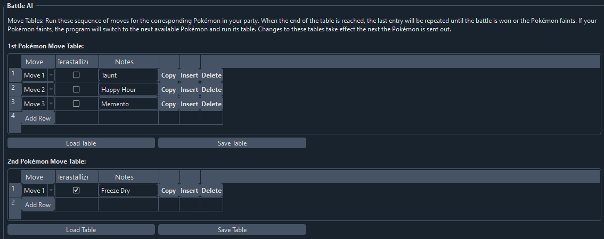

# Tournament Farmer 2

**Related Programs:**
- [Tournament Farmer](TournamentFarmer.md)
- [Tournament Farmer 2](TournamentFarmer2.md) (this program)

## Program Description

Farm the Academy Ace Tournament for money and prizes. (updated version for Indigo Disk DLC)

Because of the increased difficulty of the tournament after completing DLC2, this version of the tournament farmer is better as it allows better customization move selection. However, as of this writing, it cannot track money or item rewards.

## Setup

1. Your party is capable of reliably clearing the tournament by using blind move combinations. (usually just spamming one move)
2. The last Pokémon Center visited is Mesagoza West. The program will attempt to return to the academy from here if you lose the tournament.
3. The move selection tables are properly setup.

## Recommended Setups:

All Pokémon should be level 100 with 31 IVs (or hypertrained) in the relevant stats.

| **1st Pokémon** | **2nd Pokémon** |
| --- | --- |
| **Smeargle:** Ability: Own Tempo Spread: Timid - 252 defense, 252 speed Item: Amulet Coin Moves:  - Taunt  - Happy Hour  - Memento  -- or --  **Zoroark (Hisiuan):** Spread: Timid - 252 defense, 252 speed Item: Amulet Coin Moves:  - Taunt  - Happy Hour  - Memento | **Kyurem (White):** Spread: Modest - 252 spatk, 252 speed Tera: Ice Item: Choice Specs Moves:  - Freeze Dry   (Freeze Dry is weaker than Ice Beam, but will kill all the bulky water types.)  -- or --  **Calyrex (Ice):** Spread: Adamant - 252 atk, 252 speed Tera: Ice Item: Choice Band Moves:  - Glacial Lance |
|  |  |

The strategy behind this setup is as follows:
- Kyurem/Calyrex is your main attacker. With Choice Specs/Band + Ice Tera it will be able to OHKO nearly every Pokémon in the league.
- Smeargle/Zoroark is your suicide lead for increasing money rewards.
    - Amulet Coin and Happy Hour will quadruple the money rewards.
    - Taunt is needed to prevent the opponent from setting up Trick Room/Reflect/Light Screen that would make it hard for your attacker to sweep the opposing team.
    - Memento will let your lead die for a free switch into your main attacker.

The main from the [original Tournament Farmer](TournamentFarmer.md) is that you move the Amulet Coin off the attacker for a Choice item to boost its damage output. Then you add Taunt to the suicide lead to block any setup that would prevent sweeping.

**Happy Hour H-Zoroark:**
- Happy Hour H-Zoroark is an event Pokémon that was given out as an event for those who preordered the DLC.
- Smeargle is an alternative if you do you not have (or don't want to use) the event Happy Hour H-Zoroark.

**Smeargle Sketching:**
- Given an existing Pokémon that knows Happy Hour (as well as most other moves), find a wild Ditto and let it transform into this Pokémon. Then switch to your Smeargle and Sketch it when the Ditto uses it.
- Taunt is harder to get because it will block your use of Sketch. But you can either wait it out or block it with Protect.
- The easiest way sketch Memento is to block it with Protect, then Sketch it the next turn. The Koffings by the Crystal Pool in Kitakami will know Memento.
- Since Protect is useful for sketching both Taunt and Memento, you will want your Smeargle to sketch Protect first. (even though it won't be used for the tournament)

Since Happy Hour cannot be transfered from other games and the DLC preordering has already expired, you either already have it somewhere or must trade for it. Regardless, Happy Hour is optional and the program can run without it. It will just be less efficient with rewards.

## Instructions

1. Stand in front of the tournament entry NPC.
2. Start the program in-game.

## Options

### Number of Tournaments to run:

The number of tournaments you wish to complete.

### Battle AI

This contains 6 move tables, one for each Pokémon in your party.

The program will send out the Pokémon in the order they are in your party and use the moves in the selected order. Once the last move is reached, it will be repeated until the battle is won or the Pokémon has fainted. If your Pokémon faints, the program will send out the next Pokémon in your party.

### Save every this many tournaments:

Save every x number of tournaments. Zero disables saving.

### Go Home when Done:

Go to the Switch Home to idle when finished.

## Other Attack Options

While Kyurem-W and Calyrex-Ice are the recommended attackers, there may be others that will work.

**Good:**
- **Sylveon:** The same one from the original Tournament Farmer may work if given Choice Specs. While untested, the damage output (on paper) is higher than Kyurem-W, though it is more fragile.
- **Dialga:** With Flash Cannon + Choice Specs, it appears viable through limited testing.

**Bad:**
- **Kyogre:** While it undoubtedly has the highest damage output due to double-STAB Surf/Water Spout, it will not ***will not work***. Penny's Vaporeon has Water Absorb.
- Any move type with an immunity: Electric, Ground, Ghost, Normal, Fighting, Poison, Psychic, Dragon, Water (Water Absorb), Grass (Sip Sapper), Fire (Flash Fire). This leaves just Steel, Fairy, Ice, Flying, Rock, Bug, and Dark.
- Any move that's not 100% accurate. Give the opponent a free turn and they'll setup or status you.

## Credits

- **Original Program:** kichithewolf
- **Author (version 2):** Kuroneko/Mysticial

**Discord Server:** 

