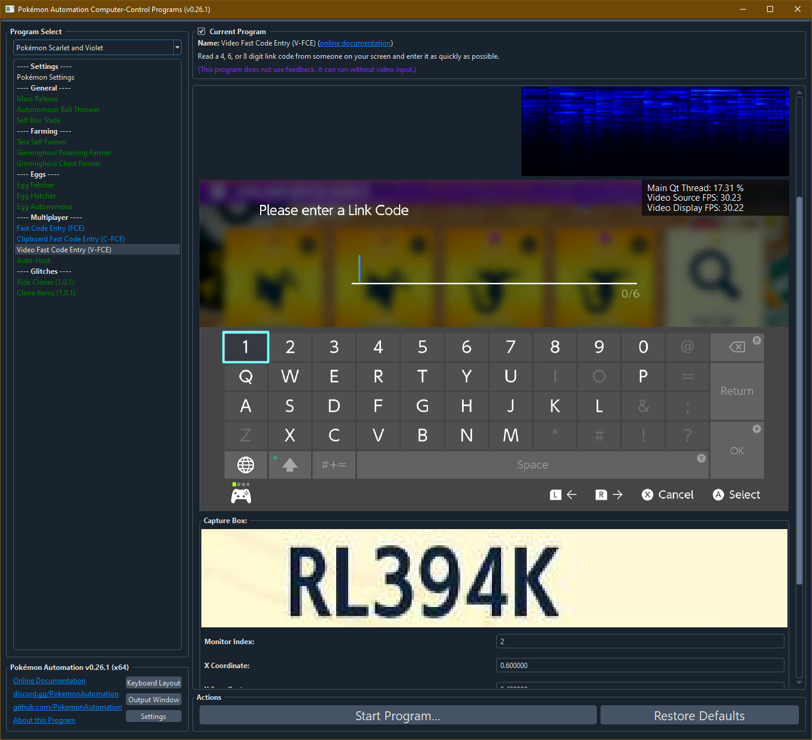

# Video Fast Code Entry (C-FCE)

**Related Programs:**
- [Fast Code Entry (FCE)](FastCodeEntry.md)
- [Clipboard Fast Code Entry (C-FCE)](ClipboardFastCodeEntry.md)
- [Video Fast Code Entry (V-FCE)](VideoFastCodeEntry.md) (this program)

## Program Description

Yet another improved version of the [Fast Code Entry](/Wiki/Programs/PokemonSwSh/FastCodeEntry.md).

This FCE uses text recognition to read the link code from a part of your screen. Thus this program no longer requires a copy-pasteable code.

Be aware that Video FCE is not for everyone. It is annoying to setup and will likely require a fast computer with two high resolution monitors. But once setup and calibrated, Video FCE is faster than the Clipboard FCE since you no longer need to double-click + CTRL-C. A single click is all that's needed for V-FCE to enter a raid.

As with all FCE programs, the usual disclaimer applies:

***By using this program, you agree that you are an asshole. Furthermore, you will be required to embrace your asshole status by flaunting it in front of all the people you've blocked out of raids.***

### Instructions

- The code entry pad must be up.
- The cursor must be over the "1" digit.
- The box coordinates are properly setup and include only the raid code. (must be clearly visible with black text on light background)
- Start the program.

## Options

### Capture Box

**Monitor Index:** For multi-monitor setups, this lets you choose which monitor to watch.

**X Coordinate:** The left edge of the box to watch. 0.0 is the left edge of the monitor. 1.0 is the right edge of the monitor.
**Y Coordinate:** The top edge of the box to watch. 0.0 is the top edge of the monitor. 1.0 is the bottomedge of the monitor.
**Width:** The width of the box to watch. The number is between 0 and 1 and is the proportion of the full width of the monitor.
**Height:** The height of the box to watch. The number is between 0 and 1 and is the proportion of the full height of the monitor.

## Credits

- **Author:** Kuroneko/Mysticial
- **Concept:** SakuraKim (from the original Sword/Shield FCE)

**Discord Server:** 

