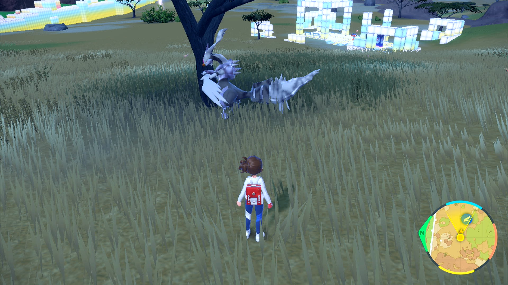
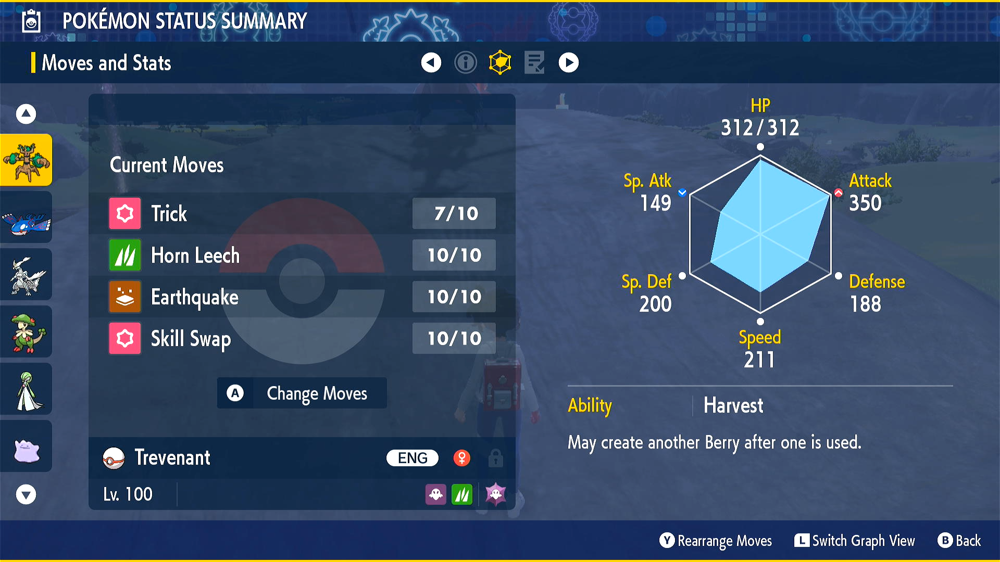
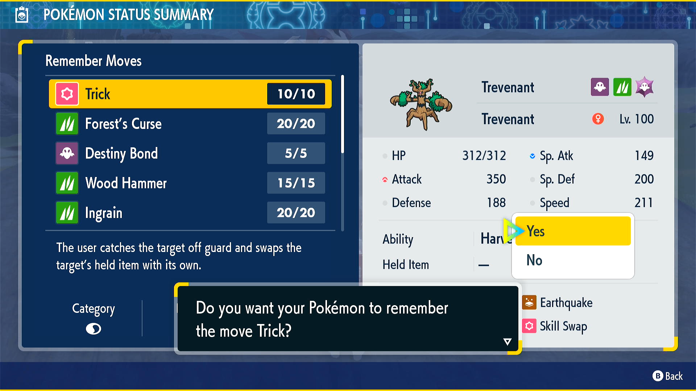
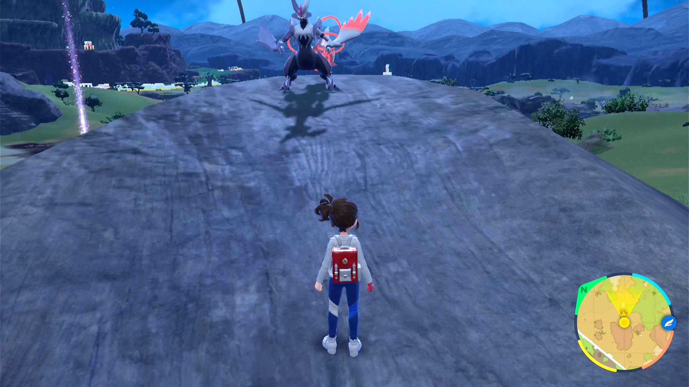
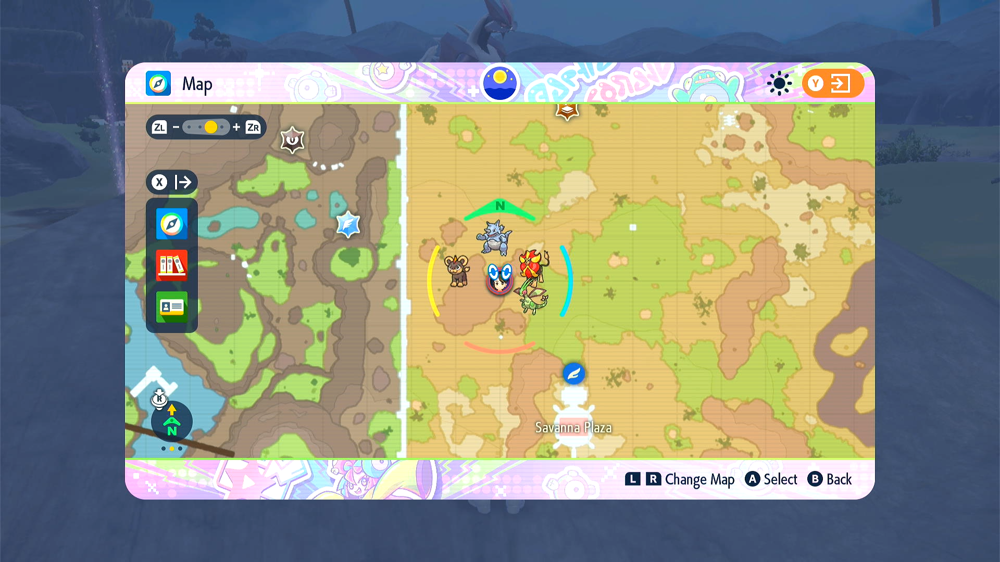
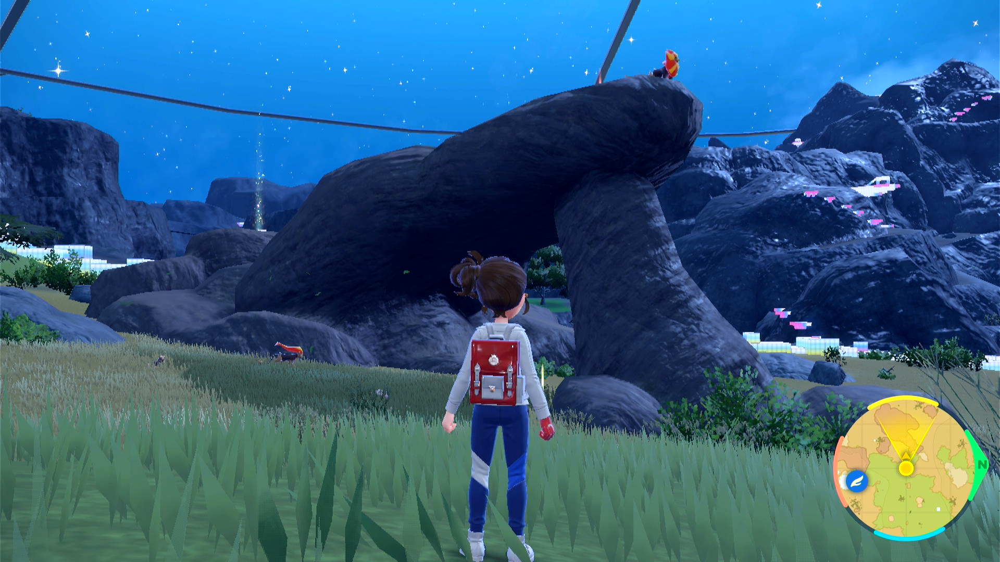
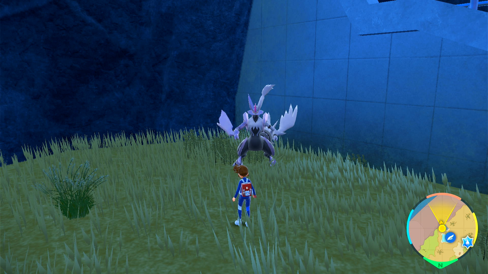
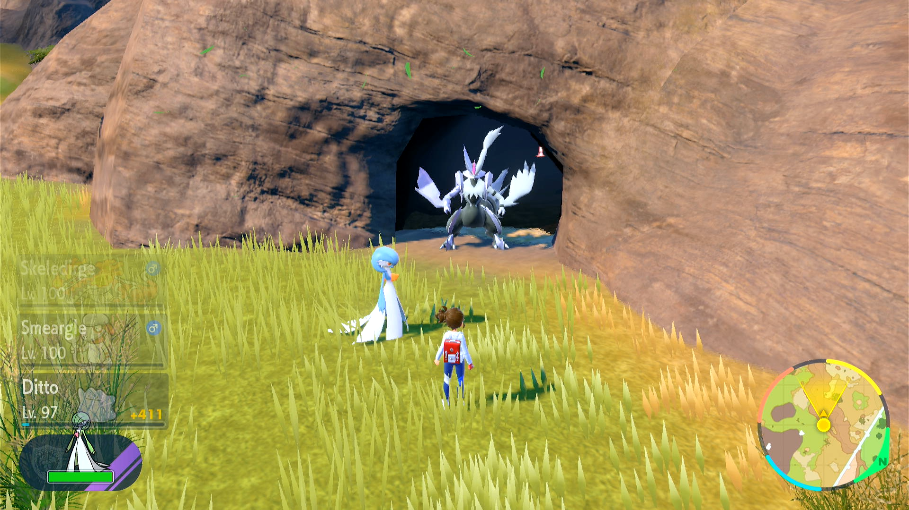

# Tera Roller

## Program Description

This is an experimental program to *help* farm the version 3.0.0 item duplication glitch. Though in theory, this program can be used to farm any item held by a wild Pokémon.

**Important Note:** This program is not reliable enough to run completely unattended. It will break within a short amount of time unless you pick a very good start position and get lucky. Do not expect this program to fully farm 999 of an item without having to manually intervene a bunch of times.

Before you begin, make sure you understand how the glitch works:
- https://www.youtube.com/watch?v=vBel6GplgnY
- https://www.youtube.com/watch?v=IeKAjpM18mc

The program does not automate the part that clones a Pokémon into the wild. Instead, it automates the part that repeatedly battles it and steals its item. So you still need to setup according to the video.

### How This Program Works:

Your lead Pokémon must know Trick in the 1st position. This is what will be used to steal items. Furthermore, if this Pokémon forgets Trick, it must have Trick in the first relearn slot. When it runs out of PP, the program will forget and relearn Trick to restore its PP.

However, this program has two major failure cases:
1. If the clone wanders away from you such that the program can no longer engage it by throwing your lead out.
2. If you encounter anything other than the clone.

In either case, the program will detect this error condition and stop. There is ongoing research on how to minimize these scenarios as well as how to recover from them.

### Instructions

1. The cloned Pokémon is already in the wild.
2. The cloned and is holding an item.
3. The cloned Pokémon cannot do any damage do either your or itself. (knows no damaging moves or self-harming moves)
4. The cloned Pokémon cannot block you from using Trick. (don't have it know both Imprison and Trick!)
5. The cloned Pokémon cannot block you from running. (no Arena Trap, etc...)
6. Your lead Pokémon is not holding an item.
7. Your lead Pokémon's first move is Trick.
8. Your lead Pokémon's first relearn slot after forgetting Trick is Trick itself.
9. Make sure there are no other wild Pokémon near you or the cloned Pokémon.
10. Start the program either in battle with the cloned Pokémon or standing in front of and facing it. (the program handles both cases)

**How get Trick into the 1st relearn slot:**

- If your Pokémon has Trick not in the first 4 relearn slots, you cannot use it as you will not be able to get it into the first slot.
- If your Pokémon has Trick in the 2nd-4th slots, have it learn all the moves above it. That will move Trick into the first slot.
- If your Pokémon can only learn Trick as a TM, it will have it in a relearn slot only if it was TM'ed the move in Scarlet/Violet. If it was transferred in from a different already knowing Trick, you will first need to forget Trick and relearn it through a TM.

 

## Suggested Start Locations

This is ongoing research. Feel free to check back for updates. Likewise you can participate in this research in our Discord server.

**The Spawning Tree: (average clones to failure: 20-30)**

The location around the tree that spawns your clone is not a great location as it will wander around and there are lots of wild Pokémon to attack you. Unless you get lucky, running the program here will rarely last more than 20-30 items cloned before the clone wanders off or you get attacked by something else.

However, much like you are told to lure the Smeargle into a specific spot to trigger the glitch, you can do the same to your cloned Pokémon. Walk around it until you see the green question mark above it. Then you can travel far away and it will follow you. Thus you can bring your clone to almost anywhere in the Savanna Biome.

**The Pride Rock: (average clones to failure: 50-70)**

Near the west wide of Savanna Biome is a rock that looks like the pride rock in Lion King where Simba (+ his dad) stands on top. In Scarlet/Violet, there will be a male Pyroar standing in the same place and pose.

Depending on what your clone Pokémon is, it may be possible to lead it up the rock. (Kyurem is confirmed to work) You want to corner the clone on the tip of the rock while you stand further down. The clone will be able to run away and you will be relatively protected from getting attacked.

Failure cases are:
1. Eventually getting attacked from behind. (usually a Deerling)
2. The encounter cycle rotates out of place and the clone wanders away from in front of you.

 

**Terarium Entrance: (bad - average clones to failure: 10-20)**

Next to the ramp at the entrance of the Terarium. While it looks isolate, it has been tested to be bad. You get attacked from behind by lots of things.

**Various Caves: (average clones to failure: 20-30)**

Large clones cannot be led into the cave. It's unknown if smaller ones can. Outside you get attacked.

## Credits

- **Author:** Kuroneko/Mysticial

**Discord Server:** 

