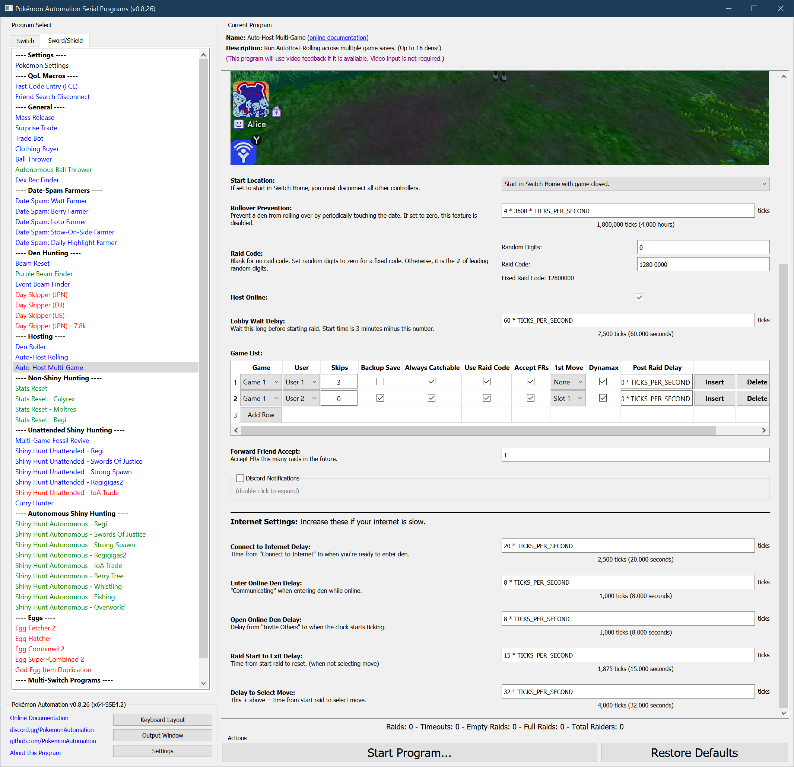

# Auto Host - MultiGame

**Related Programs:**
- **Microcontroller:** [Auto-Host Multi-Game](https://github.com/PokemonAutomation/Microcontroller/blob/master/Wiki/Programs/PokemonSwSh/AutoHost-MultiGame.md)
- **Computer Control:** [Auto-Host Multi-Game](https://github.com/PokemonAutomation/ComputerControl/blob/master/Wiki/Programs/PokemonSwSh/AutoHost-MultiGame.md) (this program)

The computer-control version of this program provides substantial improvements over the microcontroller version.

## Program Description
This is a multi-game version of [AutoHost-Rolling](AutoHost-Rolling.md).

> **Don't use this program until you have used AutoHost-Rolling and are familiar with all its options. This program is significantly more complicated to setup.**

This program will auto-host across multiple game saves with different user profiles. In short, you specify a list of user profiles and auto-host settings. The program will then run down this list and auto-host each game accordingly. Once it has finished hosting everything on the list, it starts from the beginning again.

Other than that, this program has all the same features as AutoHost-Rolling. Some settings can be customized per game save, others are global and apply to everything.

If you have 8 user profiles and the ability to play both Sword and Shield without changing cartridges, you can theoretically host up to 16 dens with this program.

If video feedback is disabled, this program behaves identically to the [microcontroller AutoHost-MultiGame](https://github.com/PokemonAutomation/Microcontroller/blob/master/Wiki/Programs/PokemonSwSh/AutoHost-MultiGame.md).

If video feedback is enabled, it will keep track of stats and will waste a lot less time waiting since it can see when it's ready to move on from each stage.

> **Important Warning:**
> 
> *All auto-hosts carry a risk of destroying the den that is being hosted. The failure case is an error that causes the program to clear the raid and drop a new wishing piece. Dropping a wishing piece is a hard-save and cannot be reversed via backup save.*
> 
> If you care about your den, get rid of all your wishing pieces. They are easy to get back later with watt farming.

### Setup for All Switches

1. Text Speed: Fast
2. Casual mode: Off
3. System time: Un-synced
4. Make sure you have a strong internet connection. (if hosting online)

### Instructions

1. All participating saves must be saved in front of a wishing piece den with watts collected.
2. All participating saves should be in a location that is safe from getting attacked by wild Pokémon.
3. If you are hosting from one game version only (Sword or Shield), it must be the 1st slot in the games list.
4. If you are hosting from both Sword and Shield, they must be in slots 1 and 2 of the games list.
5. Close all games across all systems.
5. Start the program in the Switch home or the [Change Grip/Order Menu](https://github.com/PokemonAutomation/Microcontroller/blob/master/Wiki/Programs/NintendoSwitch/ChangeGripOrderMenu.md) depending on which option you choose.

> *If starting the game requires checking the internet (because it is digital on a non-primary Switch), you will need to enable ["**Start Game Requires Internet**"](/Wiki/Programs/NintendoSwitch/FrameworkSettings.md#start-game-requires-internet).

## Options:

Most of the options in this program as the same as [AutoHost-Rolling](AutoHost-Rolling.md). The main difference is that you can specify multiple game saves.

## Game List:

This is the important part of the multi-game autohost since it is where you specify the list of games and what settings to host within each game.

This example above 2 games running with different settings. The 1st game runs on user #2 with the usual 3-day roll. The 2nd game runs on user #2 as a soft-locked den with a 1st turn move select with dynamax.

In other words, there is a quite a bit of customization that can be done for each game.

## Per-Game Options:
These options can be customized per game.

### Game Slot Position:

If you are hosting from one game version only, set this to 1. You don't need to read any further.
If you are hosting from both Sword and Shield, set this to the game slot of the version when the program starts.

For example:
- If you want to host on Sword and Sword is the 1st slot in the game list when the program starts, set to 1.
- If you want to host on Shield and Shield is the 2nd slot in the game list when the program starts, set to 2.

When hosting from both Sword and Shield, the games will swap position each time the program starts the 2nd game. This program knows this and will keep track of their positions. Thus, the slot that you specify is when the program starts, not the slot it will be at when the auto-host reaches that point.

### User Slot Position:

This is the [user profile](https://github.com/PokemonAutomation/Microcontroller/blob/master/Wiki/Programs/NintendoSwitch/UserSlotNumber.md) for the user that will be hosted.

### Backup Save:

If set to true, the game will load backup save upon soft-reset.

The idea here is to roll forward from the save frame to the shiny frame. Once on the shiny frame (with the desired softlock), you enter and exit the camp to setup a backup save on the shiny frame. That way, you can load the backup save on the shiny frame while leaving the real save safely 3 or more frames before
.
This option only makes sense when **(Skips = 0)**.

### Catchability:

Some dens have uncatchable Pokémon (i.e. Mewtwo or Zeraora). If the den has any such uncatchable Pokémon, you must set this to false. If the den has uncatchable Pokémon, but it is hard-locked in a way that prevents any of them from showing up while rolling or hosting, then it is safe to leave this as true.

### Frame Skips:

This option sets how many frames to skip before hosting. Set to 0 if either hard-locked or backup save soft-locked on the Pokémon to host. Otherwise, set this to the # of frames behind the target you are saved. In most cases, this will be 3 frames. But sometimes people will save further back on high-value dens as a safety against accidental roll-over.

### Accept Friend Requests:

Set to true if you wish to accept friend requests for the user for this den.

### First Move Select:

This is a silly feature that lets you choose a first move before resetting the game.

If **(1st Move = 0)**, no first move is selected and the program resets as usual.

Otherwise, the move slot if the slot # for the move (1 = first move). The **Dynamax** box will let you dmax/gmax the Pokémon as well.

### Additional Raid Delay:

If you are farming a Pokémon and the time between raids is too short to join consecutive raids, use this to add time between raids. This extra wait time is done in the Switch Home after closing the game after a raid.

## Global Options:

This program uses [**Tolerate System Update Menu (slow)**](/Wiki/Programs/NintendoSwitch/FrameworkSettings.md#tolerate-system-update-menu-slow) to bypass the system update window.

In addition to the main options below, there are more [global options](PokemonSettings.md) that can be configured if you encounter problems.

All options here are global and will be applied to all the participating save files.

### Raid Code:

See [Raid Code Entry](https://github.com/PokemonAutomation/Microcontroller/blob/master/Wiki/Programs/PokemonSwSh/RaidCode.md).

### Host Online:

Set this to true if you want to host online and false if you want to host locally.

### Start Time:

Wait this long in the lobby before starting the raid. Thus the start time is 3:00 minus this value. The default is to wait 60 seconds which starts the raid at 2:00.

### Accept Friend Requests for Future Games:

While hosting the current den, accept friend requests for a future den.
- If 0, accept friend requests for the current den.
- If 1, accept friend requests for the next den to be hosted.
- If 2, accept friend requests for the den that will be hosted 2 dens later.
- ...

The motivation here is that there is a significant delay from when you accept a friend requests to when the person can see the stamp. If you are accepting FRs for the den that's currently being hosted, the user that just got accepted may need to wait until the auto-host loops around the entire list of dens and returns the current one. This can take a very long time if you are hosting a lot of dens.

This option lets you shift the order of the FR accepts so that the accepted FRs become relevant much sooner.

### Rollover Prevention:

If none of the dens are rolling (**SKIPS = 0**), the date will advance naturally. This means that the dens being hosted will eventually roll over. To prevent this, the auto-host will periodically touch the date at the specified interval.

Set this value to zero to disable the feature. This option is ignored if at least one den has (**SKIPS > 0**).

### Internet Connection Delays:

There are multiple timings here related to your internet connection. You may need to adjust these to ensure the auto-host works correctly.

Try with the defaults first. If things don't work, then try increasing these timings. Likewise, if your internet connection is very fast, feel free to reduce some of these delays.

## Credits

- **MC Version:** Kuroneko/Mysticial + SakuraKim
- **Ported From MC:** Kuroneko/Mysticial

**Discord Server:** 

