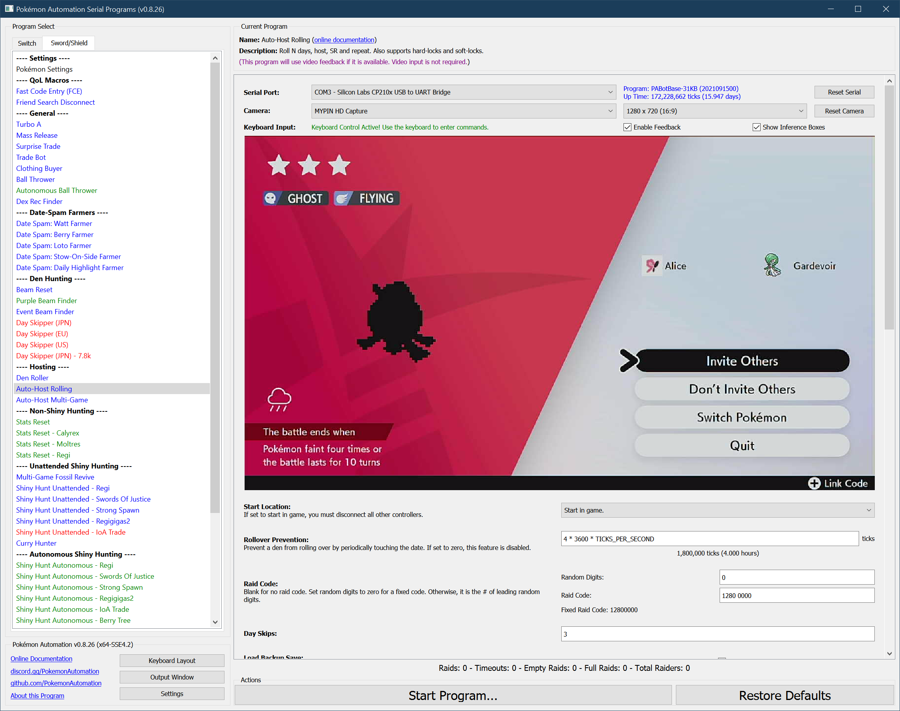
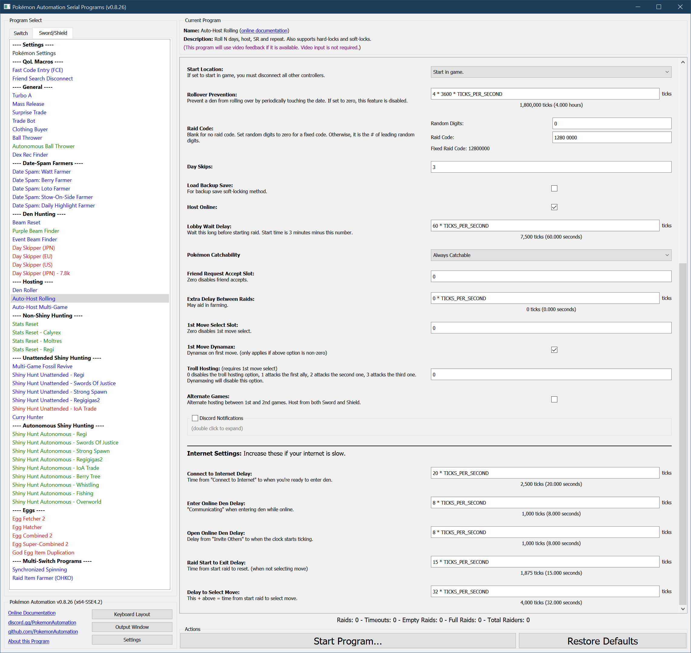

# AutoHost-Rolling

## Program Description

This is the all-in-one autohost that can host all of the following:

- Rolling autohosts
   - Roll a den and host a random Pokémon.
   - **To host a rolling den:** Set N to 3 (or more).

- Hard-locked Dens
   - Host a den that is locked on a single mon
   - **To host a hard-locked den:** Set N to zero.

- [Soft-locked Dens](#hosting-a-soft-lock)
   - Host's a singular soft-locked mon _but_ maintains a backup save for re-rolling the den
   - **To host a soft-locked den:** Set N to zero and check the box for "**Load Backup Save**". (see below.)
   - Follow the hyperlink above for instructions specific to hosting a soft-locked den

Functionally, all this program does is repeat the following sequence forever:
1. Roll the den forward by N days.
2. Host the Pokémon.
3. Reset the game.

If video feedback is disabled, this program behaves identically to the [microcontroller AutoHost-Rolling](https://github.com/PokemonAutomation/Microcontroller/blob/master/Wiki/Programs/PokemonSwSh/AutoHost-Rolling.md).

If video feedback is enabled, it will keep track of stats and will run faster since it can see the screen and waste less time waiting.

---

**Important Warning:**

*All auto-hosts carry a risk of destroying the den that is being hosted. The failure case is an error that causes the program to clear the raid and drop a new wishing piece. Dropping a wishing piece is a hard-save and _cannot_ be reversed via backup save.*

If you care about your den, get rid of all your wishing pieces. They are easy to get back later with watt farming.

---

## Setup of Settings

**Switch Settings:**
1. Screen size: Must be 100% within the Switch settings
2. [Switch 2: The profile you are using must be the 1st (left-most) profile.](/Wiki/Programs/NintendoSwitch/Switch2Notes.md#resetting-a-game-moves-the-cursor-to-the-1st-user-profile)
3. System Time: Unsynced

**Program Settings:**
1. Video Resolution: 1080p or higher

**Game Settings:**
1. Text Speed: Fast
2. Auto-Save: Off
3. Casual Mode: Off

> *If starting the game requires checking the internet (because it is digital on a non-primary Switch), you will need to enable ["**Start Game Requires Internet**"](/Wiki/Programs/NintendoSwitch/FrameworkSettings.md#start-game-requires-internet).

## Instructions

1. Game is _not_ currently connected to internet (Y-comm is white)
2. Position character as follows:
   - Somewhere safe from being attacked by wild Pokémon
   - Standing in front of a wishing piece den _with watts collected_
3. Save
4. Return game to overworld
5. Start the program in game or the [Change Grip/Order Menu](https://github.com/PokemonAutomation/Microcontroller/blob/master/Wiki/Programs/NintendoSwitch/ChangeGripOrderMenu.md) depending on which option you choose.

## Optional Features

- Host offline using local communication instead of online.
- Automatically accept friend requests.
- Add a delay between raids to make farming more efficient when you can't clear a raid before the next one starts.
- Select a first move for the hosting Pokémon.
- Troll host and attack your allies for more challenge.

### Default Program Settings

By default, the program will start the raid at 2:00. Everybody needs to be ready by then or the raid may fail. This can be changed by modifying "**Lobby Wait Delay**".

***

### Options

This program uses [**Tolerate System Update Menu (slow)**](/Wiki/Programs/NintendoSwitch/FrameworkSettings.md#tolerate-system-update-menu-slow) to bypass the system update window.

In addition to the main options below, there are more [global options](PokemonSettings.md) that can be configured if you encounter problems.

### Raid Code:

See [Raid Code Entry](https://github.com/PokemonAutomation/Microcontroller/blob/master/Wiki/Programs/PokemonSwSh/RaidCode.md).

### Frame Skips:

This option sets how many frames to skip before hosting. Set to 0 if either hard-locked or backup save soft-locked on the Pokémon to host. Otherwise, set this to the # of frames behind the target you are saved. In most cases, this will be 3 frames. But sometimes people will save further back on high-value dens as a safety against accidental roll-over.

### Host Online:

Check this box if you want to host online and false if you want to host locally.

> Make sure you have a strong internet connection if hosting online

### Start Time:

Wait this long in the lobby before starting the raid. Thus the start time is 3:00 minus this value. The default is to wait 60 seconds which starts the raid at 2:00.

### Backup Save:

If set to true, the game will load backup save upon soft-reset.

> Use this for hosting a soft-locked den
> This option only makes sense when **Day Skips** is set to zero.

The idea here is to roll forward from the save frame to the shiny frame. Once on the shiny frame (with the desired softlock), you enter and exit the camp to setup a backup save on the shiny frame. That way, you can load the backup save on the shiny frame while leaving the real save safely 3 or more frames before.

### Catchability:

Some dens have uncatchable Pokémon (i.e. Mewtwo or Zeraora). If the den has any such uncatchable Pokémon, you must set this to "Maybe Uncatchable". If the den has uncatchable Pokémon, but it is hard-locked in a way that prevents any of them from showing up while rolling or hosting, then it is safe to leave this as "Always Catchable".

### Accept Friend Requests:

If set to zero, do not accept friend requests. Otherwise, this is the [user profile](https://github.com/PokemonAutomation/Microcontroller/blob/master/Wiki/Programs/NintendoSwitch/UserSlotNumber.md) to accept friend requests for.

Once enabled, the program will automatically accept friend-requests while waiting in the lobby. It will do this multiple times to avoid getting disconnected and to give people more chances to see the code when streaming.

> There is no current way to change how often the program accepts friend-requests

### Additional Raid Delay:

If you are farming a Pokémon and the time between raids is too short to join consecutive raids, use this to add time between raids. This extra wait time is done after entering the den, but before entering the code. Thus, the raid stamp pops up later.

### First Move Select:

> This is a silly feature that lets you choose a first move before resetting the game.

If "**1st Move Select Slot**" is 0, no first move is selected and the program resets as usual.

Otherwise, the move slot if the slot # for the move (1 = first move). The "1st Move Dynamax" option will let you dmax/gmax the Pokémon as well. 

### Alternate Games:

If you are able to play both Sword and Shield on the Switch without changing cartridges, this option will let you host both Sword and Shield dens on the same user using the same settings. When set to true, the auto-host will soft-reset into the other game instead of the same game.

> Needless to say, Sword and Shield must be the 1st and 2nd game slots in the Switch Home menu.

### Rollover Prevention:

If the den is not rolling (**Day Skips = 0**), the date will advance naturally. This means that the den being hosted will eventually roll over. To prevent this, the auto-host will periodically touch the date at the specified interval.

Set this value to zero to disable the feature. This option is ignored if **(Day Skips > 0)** since it is unnecessary.

### Internet Connection Delays:

There are multiple timings here related to your internet connection. You may need to adjust these to ensure the auto-host works correctly.

Try with the defaults first. If things don't work, then try increasing these timings. Likewise, if your internet connection is very fast, feel free to reduce some of these delays.

## Hosting a Soft-Lock

For auto-hosting we no longer use the method of disconnecting from the raid. Instead we use a safe method involving backup saves. Here's how it works:

1. Save 3 (or more) frames before the shiny frame.
2. Roll to the shiny and repeat until you get the desired Pokémon.
3. While still in front of the den, enter the Pokémon Camp and leave it.
> This establishes a backup save on the shiny frame with the current Pokémon.
4. It hosts as if you are hardlocked. But when you reset, loads a backup save instead of regular save.
5. When you are done hosting and you want to clear the softlock, just load the game normally. It will load back on the original saved frame that is 3 (or more) frames before the shiny.

This method is safe because it doesn't do any actual saving. If the backup save is lost, you simply lose the soft-lock. This method also works offline, but it will freeze the raid for about a minute before the raiders can start the battle.

To configure the program to load backup save instead of the regular save, set **Load Backup Save** to true.

> *For water dens, you will not be able to camp. However, here are some alternatives:*
> 1. *Go into Y-COMM, then join and clear a random raid. This will establish a backup save.*
> 2. *Manually host one raid online and disconnect. When you return to the overworld, it will establish a backup save.*

## Credits

- **MC Version:** Kuroneko/Mysticial + SakuraKim
- **Ported From MC:** Kuroneko/Mysticial

**Discord Server:** 

