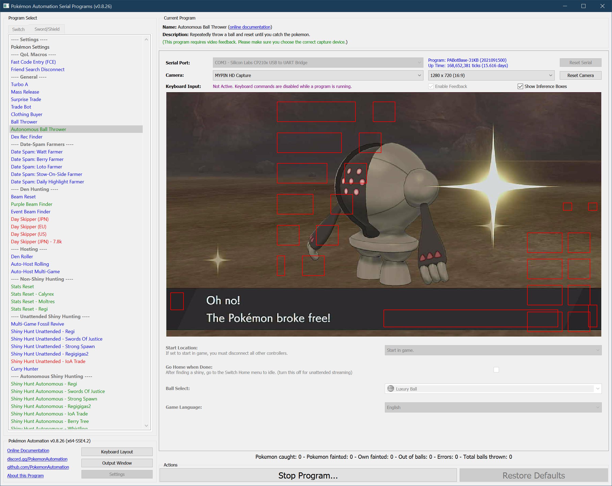

# Autonomous Ball Thrower

**Related Programs:**
- **Microcontroller:** [Ball Thrower](https://github.com/PokemonAutomation/Microcontroller/blob/master/Wiki/Programs/PokemonSwSh/BallThrower.md)
- **Computer Control:** [Ball Thrower](https://github.com/PokemonAutomation/ComputerControl/blob/master/Wiki/Programs/PokemonSwSh/BallThrower.md)
- **Computer Control:** [Autonomous Ball Thrower](https://github.com/PokemonAutomation/ComputerControl/blob/master/Wiki/Programs/PokemonSwSh/AutonomousBallThrower.md) (this program)

## Program Description

Keep throwing ball until you catch the Pokémon you're fighting. In case of failure to catch the Pokémon (in case your Pokémon or the opposing Pokémon faint, you run out of balls, etc) it will reset the game and wait until a pokémon attacks you.

## Preparation Instructions

1. Screen size: Must be 100% within the Switch settings
2. Video Resolution: 1280 x 720 or higher in program settings

## Instructions

1. Save before being attacked by the Pokémon.
2. Run the program and let the Pokémon attack you (alternatively, you can manually trigger the fight yourself but it will wait forever if you need to reset).

If the catch rate is low, you may need to follow the setup described in [Ball Thrower](BallThrower.md).

## Options

### Start location:

If set to start in game, you must disconnect all other controllers.

### Go Home when Done:

After finding a shiny, go to the Switch Home to idle. Turn this off for unattended streaming so that your viewers can see the shiny.

### Ball Select:

The ball you want to catch the Pokémon in.

### Game Language:

Pick the language you're playing in.

## Credits

- **Author:** pifopi

**Discord Server:** 

