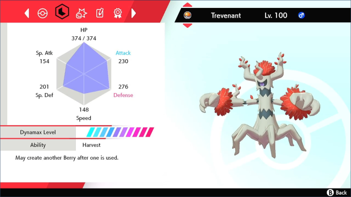
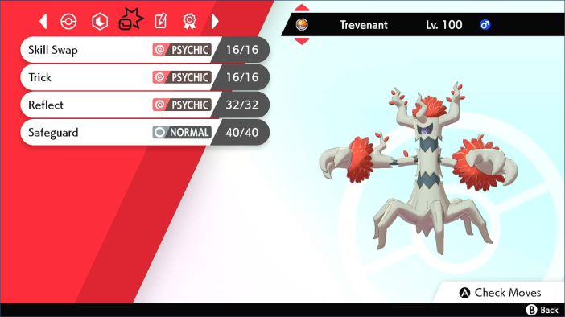

# Ball Thrower (deprecated)

***This program is deprecated and is no longer maintained. Please use [Autonomous Ball Thrower](https://github.com/PokemonAutomation/ComputerControl/blob/master/Wiki/Programs/PokemonSwSh/AutonomousBallThrower.md) instead.***

-----

**Related Programs:**
- [Ball Thrower](https://github.com/PokemonAutomation/ComputerControl/blob/master/Wiki/Programs/PokemonSwSh/BallThrower.md) (this program)
- [Autonomous Ball Thrower](https://github.com/PokemonAutomation/ComputerControl/blob/master/Wiki/Programs/PokemonSwSh/AutonomousBallThrower.md)

The "autonomous" version of this program will automatically detect stop conditions such as successful catch, somebody faints, out of balls.

## Program Description

As its name implies, this program automatically throws balls to catch a Pokémon.

This program is intended for a very specific use case - to Beast Ball catch legendaries. It requires a tremendous amount of setup as well as a large supply of Beast Balls (900+).

> *Obtaining that many Beast Balls by fully legitimate means is difficult even with automation. Therefore, this program is really only useful to those who have access to God Egg duplication or have joined a hacked 999x raid.*

### Initial Setup

This program blindly throws balls without context. Thus the only way it can work is to setup the following:

1. You need to have enough balls to ensure a catch with high probability.
   1. 900+ Beast Balls is recommended
2. You need to be able to reduce the opposing Pokémon down to 1 HP with paralysis.
3. The opposing Pokémon can never run out of PP. 
4. Your current Pokémon can never get knocked out. [A perfect wall](https://github.com/PokemonAutomation/Microcontroller/blob/master/Wiki/Programs/PokemonSwSh/PokemonWalls.md)

   > Since the program will only be throwing balls, your in-battle Pokémon will never use any moves or any items. Thus it must be able to wall the opposing Pokémon without using moves or items.
   > 
   > How you do this will depend on what you are battling. But generally speaking, this falls into two categories:
   > 1. Completely disable all of the opposing Pokémon's damaging moves (type immunity + Imprison).
   > 2. Reduce the damage that you take such that passive healing (from Leftovers) is sufficient to stay alive.

### Setup of Settings

**Game Settings:**
1. Text Speed: Fast
2. Casual mode: Off
3. The "Send to Boxes" option must be set to "Automatic".

### Setup of Party

   > If any Pokémon in your party is not level 100, make sure they cannot level up or learn any abilities should they level up after catching the opposing Pokémon.

1. A Pokémon(s) with False Swipe and a paralyzing move
   1. These can be separate Pokémon if you wish.
2. A Pokémon that knows Soak or Magic Powder
   1. To change the typing from Ghost and allow you to hit it with False Swipe
3. A Pokémon that can wall the Legendary you are hunting
   1. See the associated [Pokémon Walls](https://github.com/PokemonAutomation/Microcontroller/blob/master/Wiki/Programs/PokemonSwSh/PokemonWalls.md) appendix page.
   2. With the exception of Zapdos and Calyrex (Ghost), every single legendary in Sword/Shield has a wall that is completely immune to it.
4. A Trevenant with Harvest (ability), Skill Swap (move), and holding a Leppa Berry
   1. To do this, you need to trick a Leppa Berry and Skill Swap (an item recovering ability) onto the opposing Pokémon. This can be done using a Trevenant with the Harvest ability that is holding a Leppa Berry.

Example of Trevenant:

 

| Noteworthy Support Pokémon |   |   |   |
| --- | --- | --- | --- |
| Lanturn | Soak | Eerie Impluse | Thunder Wave |
| Gardevoir | Charm | Thunder Wave | Double Team|

   > Methods to reduce damage taken:
   > - Train your Pokémon to tank. (level 100, correct nature, EVs in relevant defensive stats)
   > - The move Soak will change type to remove STAB and enable False Swipe to hit ghost types.
   > - X Defend and X Sp. Def (whichever is applicable including both)
   > - Reduce opposing Pokémon attack and/or special attack. (Charm, Eerie Impulse)
   > - Accuracy/Evasion: Sand Attack, Double Team
   > - Non-expiring healing moves: Aqua Ring, Ingrain

### Instructions

1. Stock up on balls
   1. Make sure the last used ball is the one you are trying to catch with.
   2. For a legendary that is paralyzed at 1 HP, a Beast Ball has a 0.86% chance of success. Thus it will take on average 120 balls to catch.
   3. The probability of failing to catch after 999 Beast Balls is about 1 in 4000.
2. Open the menu and place your cursor on the Pokédex. Close the menu.
   1. For Sword of Justice encounters, the cursor will be over the Pokémon Camp which should still work (but is currently untested).
3. Start the fight with the Legendary you are trying to catch.
4. Reduce Opposing Pokémon down to 1 HP and Paralyze.
   1. Reducing down to 1 HP will require something with False Swipe. If the opposing Pokémon is a ghost type, you will need to change its type with a move such as Soak or Magic Powder.
   2. Electric Pokémon cannot be paralyzed.
5. Prevent the Opposing Pokémon from running out of PP.
   1. Early in the battle, you should send out Trevenant and use both Skill Swap and Trick. This moves the PP-restoring Leppa Berry onto the opposing Pokémon and changes its ability to Harvest so that the berry is restored after use. This setup prevents it from ever running out of PP.
6. Swap to your [Pokémon wall](https://github.com/PokemonAutomation/Microcontroller/blob/master/Wiki/Programs/PokemonSwSh/PokemonWalls.md)
7. Place cursor over "Pokémon" button (while in battle)
8. Start the program in game or the [Change Grip/Order Menu](https://github.com/PokemonAutomation/Microcontroller/blob/master/Wiki/Programs/NintendoSwitch/ChangeGripOrderMenu.md) depending on which option you choose.

### Default Program Settings

The program will keep throwing balls until it catches, you run out of balls, or you die. Once it catches, it will return to the overworld. Then it will either trap itself inside the Pokédex or enter and exit the Pokémon Camp.

## Options

This program does not support avoiding the system update window.

This program has no program-specific configuration options.

## Credits

- **Author:** Kuroneko/Mysticial

**Discord Server:** 

