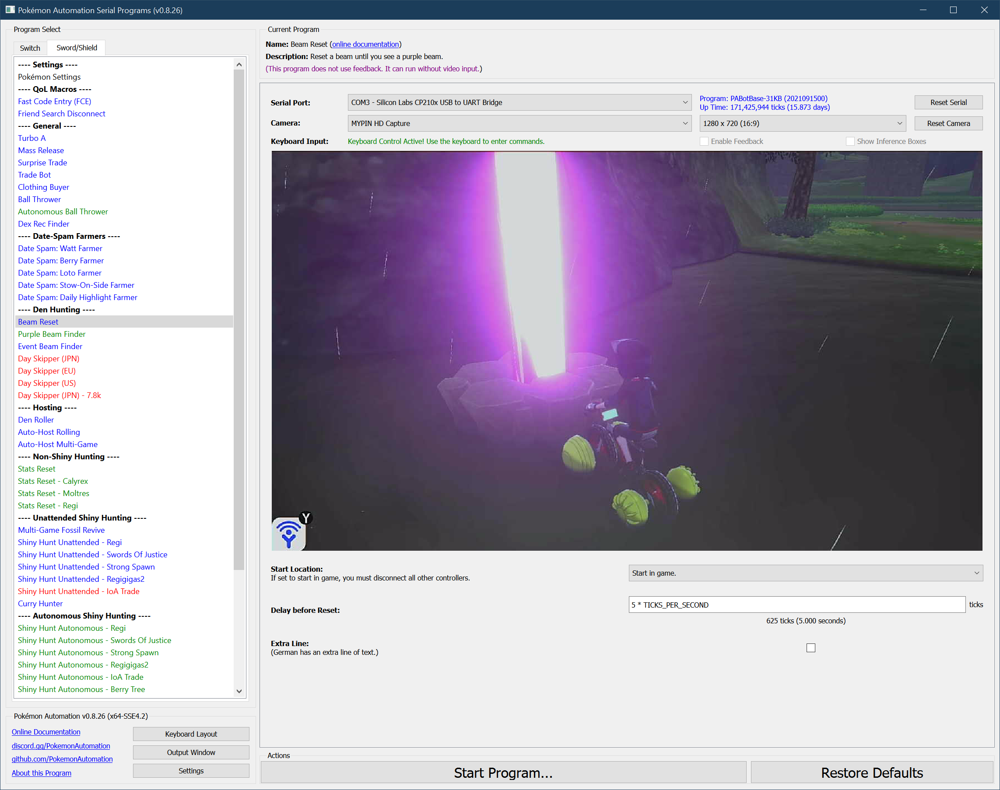

# Beam Reset

**Related Programs:**
- [Beam Reset](https://github.com/PokemonAutomation/ComputerControl/blob/master/Wiki/Programs/PokemonSwSh/BeamReset.md) (this program)
- [Purple Beam Finder](https://github.com/PokemonAutomation/ComputerControl/blob/master/Wiki/Programs/PokemonSwSh/PurpleBeamFinder.md)

## Program Description

Automatically reset a den beam. The purpose is for finding purple beams.

Drop a wishing piece in, check if it's red or purple. Pause for you to check, then reset.

### Setup of Settings

**Switch Settings:**
1. Screen size: Must be 100% within the Switch settings
2. [Switch 2: The profile you are using must be the 1st (left-most) profile.](/Wiki/Programs/NintendoSwitch/Switch2Notes.md#resetting-a-game-moves-the-cursor-to-the-1st-user-profile)

**Program Settings:**
1. Video Resolution: 1080p or higher

**Game Settings:**
1. Text Speed: ***SLOW*** (this is different from other programs!)
2. Auto-Save: Off
3. Casual mode: Off

### Instructions

1. You must stand in front of an empty den with watts collected.
2. You must be facing the center of the den.
3. Save.
4. Start the program in game or the [Change Grip/Order Menu](https://github.com/PokemonAutomation/Microcontroller/blob/master/Wiki/Programs/NintendoSwitch/ChangeGripOrderMenu.md) depending on which option you choose.

### Default Program Settings

On each beam, the program will go in-and-out of the game several times to flash the beam and grab your attention. Then it will wait in the Home menu for 5 seconds before it resets the game. **If you like the beam, you must stop the program during these 5 seconds.**

Depending on your Switch, the weather, the type of beam (red or purple), and your alignment with the den, you may not see a beam immediately. In some cases, you may not see a beam for several in-and-outs.

Red beams will show up faster. Purple beams are slower and will appear after the text starts showing up. If you see no beam before the program returns to the home menu the last time, it is likely a purple beam.

## Options

This program uses [**Tolerate System Update Menu (fast)**](/Wiki/Programs/NintendoSwitch/FrameworkSettings.md#tolerate-system-update-menu-fast) to bypass the system update window.

### Delay before Reset:

Wait this long before resetting the game for the next attempt.

### Extra Line:

German (and possibly other languages) has an extra line of text before the wishing piece is dropped. Check this box if this is the case.

## Credits

- **Author:** Kuroneko/Mysticial

**Discord Server:** 

