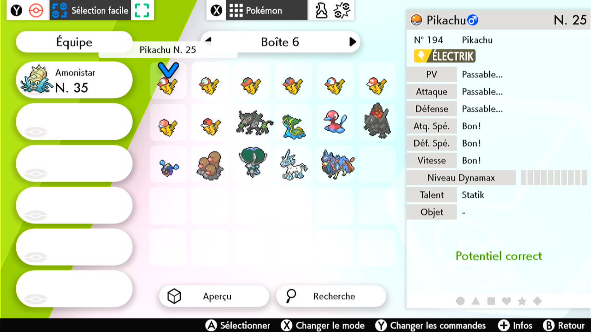

# Box Reorder National Dex

## Program Description

Order boxes of Pokémon, based on their national dex index.

## Preparation Instructions

**Switch Settings:**
1. Screen size: Must be 100% within the Switch settings

**Program Settings:**
1. Video Resolution: 720p or higher

**Game Settings:**
1. Text Speed: Fast

## Instructions

1. Be on "easy selection" in your boxes (blue selector).
2. Have the Pokémon name and ability displayed on the right (press "+" to switch between the views).
3. Be on the first Pokémon (first box, first row, first column).
4. No gap between Pokémon

## Options

### Start location:

If set to start in game, you must disconnect all other controllers.

### Game Language:

Pick the language you're playing in.

### Pokémon count:

Number of Pokémon to order.

### Dodge the System Update Window:

When set to true, the program will dodge the system update window. Do not set this option if the system update window is not present. Unlike other programs, this program will not be able to tolerate the extra button presses if they land in the box system.

## Credits

- **Author:** pifopi

**Discord Server:** 

