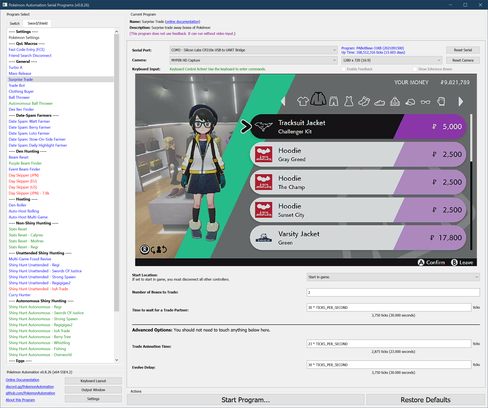

# Clothing Buyer

## Program Description

As its name implies, this program will automatically buy clothing.

### Setup of Settings

1. Text Speed: Fast
2. Casual mode: Off

### Instructions

1. You are in the menu for buying clothing. (Anywhere is fine.)
2. Start the program in game or the [Change Grip/Order Menu](https://github.com/PokemonAutomation/Microcontroller/blob/master/Wiki/Programs/NintendoSwitch/ChangeGripOrderMenu.md) depending on which option you choose.

### Default Program Settings

This program is not particularly efficient, but will properly handle items that have already been purchased. It will eventually clear an entire store regardless of how many items there are in each category.

Preliminary testing suggests that this program takes an hour to buy out the entire Wedgehurst clothing store.

*Be aware that this program will change your clothing. So you may need to fix it when you're done.*

   > Note that this program does not stop since it does not know when it is done. Therefore you must stop it manually and check to see if it there is anything left to buy.

## Options

This program uses [**Tolerate System Update Menu (fast)**](/Wiki/Programs/NintendoSwitch/FrameworkSettings.md#tolerate-system-update-menu-fast) to bypass the system update window.

Most of the options here are self-explanatory.

## Credits

- **Author:** Kuroneko/Mysticial

**Discord Server:** 

