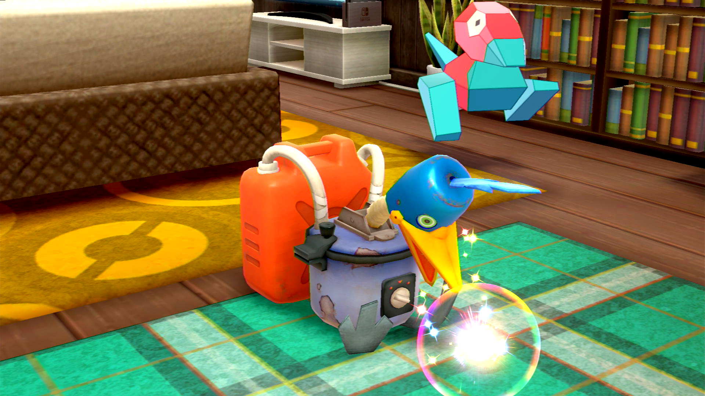

# Cram-o-matic RNG

## Program Description

This program will perform RNG manipulation to get rare balls from the Cram-o-matic.

Demo Video: https://cdn.discordapp.com/attachments/755635697737531544/1036457871480729620/Cram-o-matic.mp4

### Setup of Settings

1. Screen size: Must be 100% within the Switch settings
2. Video Resolution: 1280 x 720 or higher in program settings
3. System time: Un-synced (the program touches the date to prevent date-skips which will affect RNG seeds)
4. Text Speed: Fast

### Instructions

1. Your lead Pokémon must be a non-shiny Orbeetle.
2. Stand in front of the Cram-o-matic.
3. Open the bag and place the cursor over the Apricorns you want to use.
 > If you want Sport Balls you need to have a second type of Apricorn directly below the one your cursor is placed on.
4. Close your bag and place the cursor over the "Pokémon" option.
5. Close the menu.
6. Start the program in-game or the [Change Grip/Order Menu](https://github.com/PokemonAutomation/Microcontroller/blob/master/Wiki/Programs/NintendoSwitch/ChangeGripOrderMenu.md) depending on which option you choose.

## Options

### Primary Apricorns:

The amount of Apricorns you have in the selected bag slot.

### Secondary Apricorns:

The amount of Apricorns you have in the bag slot directly below the selected slot.
This number is used for Sport Balls.

  > If either Primary or Secondary Apricorns is not set correctly the program might start to use other items from your bag, destroying them in the process! 

### NPCs:

The number of NPCs in the dojo.

This number includes Pokémon.
It does **NOT** include the Cram-o-matic, Rotom terminal, vending machines or the TV.

### Wanted Balls:

The selection of balls you want the program to get. 

**Ball**
The type of ball you want.
The exact type for each Apricorn color can be found [here](https://www.serebii.net/swordshield/cram-o-matic.shtml).

**Only Bonus**
The program only uses this selection if the Cram-o-matic produces five items instead of one. 
It is not recommended to only have rows Apricorn, Safari or Sport Balls and "Only Bonus" checked.

**Priority** 
The program tries not to skip selections with high priority. A higher number means a higher priority. 
Each iteration has the potential to skip wanted rng states. This program will skip lower priority selections if they have the potential to skip higher priority ones.

## Advanced Settings:

These are advanced settings. You shouldn't need to touch these unless something isn't working and you're trying to debug it yourself.

### Max priority advances:

How many rng states after a found selection will be checked so no selection with higher priority will be skipped.
If this value is zero priority will be ignored.

### Max unknown advances:

After one iteration this many states will be checked to find the current rng state.

## Credits

- **Discovery/original code to calculate target:** Anubis
- **Author:** Fye

**Discord Server:** 

