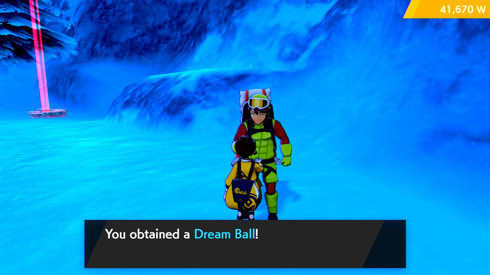

# Daily Highlight RNG

## Program Description

This program will perform RNG manipulation to get rare items (especially Beast Ball and Dream Ball) from the Daily Highlight Watt Trader in the Snowslide Slope area of the Crown Tundra.
The success rate for each manipulated highlight is around 80%.

### Setup of Settings

**Switch Settings:**
1. Screen size: Must be 100% within the Switch settings
2. [Switch 2: The profile you are using must be the 1st (left-most) profile.](/Wiki/Programs/NintendoSwitch/Switch2Notes.md#resetting-a-game-moves-the-cursor-to-the-1st-user-profile)
3. System Time: Unsynced

**Program Settings:**
1. Video Resolution: 1080p or higher

**Game Settings:**
1. Text Speed: Fast
2. The Rotom Phone apps on the menu are in their default locations.
   1. The Town Map app must be in the 2nd row on the far left.
   2. The Pokémon app must be in the 1st row, 2nd from the left.
3. Y-Comm glitch must be active
   1. Verify glitch is active by checking for a "flash" when re-entering the game from the Home menu.

### Instructions

1. The Snowslide Slope fly spot must be unlocked.
2. You have talked to the Watt Trader before.
3. Your lead Pokémon must be a non-shiny Orbeetle.
4. Fly to the Snowslide Slope.
5. Close the menu if it is open.
6. Start the program in-game or the [Change Grip/Order Menu](https://github.com/PokemonAutomation/Microcontroller/blob/master/Wiki/Programs/NintendoSwitch/ChangeGripOrderMenu.md) depending on which option you choose.

## Options

### Number of Highlights:

The number of Daily Highlights you want the program to manipulate and buy. 
Keep in mind not all manipulations are successful. 
The program will keep running even if you have not enough Watts left.
If this option is set to zero the program will continue running until it is stopped manually.

### Calibrate the Number of NPCs this Many Day Skips:

How often the number of NPCs should be calibrated.
The program needs to know how many NPCs are in the area but it takes time to calibrate.
If you have a low success rate decrease this value.

### Desired Highlights:

The selection of items you want the program to get. 

## Credits

- **Datamine of Trader Mechanics:** Anubis [Source](https://docs.google.com/spreadsheets/u/0/d/1pNYtCJKRh_efX9LvzjCiA-0n2lGSFnVmSWwmPzgSOMw/htmlview)(external site)
- **Author:** Fye

**Discord Server:** 

