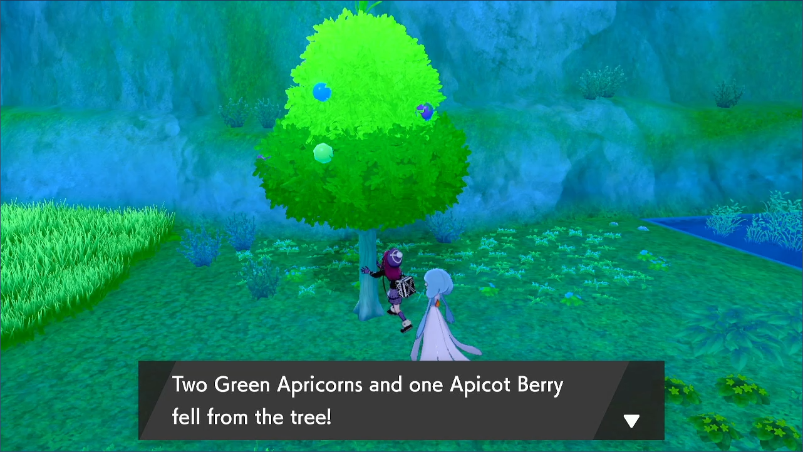
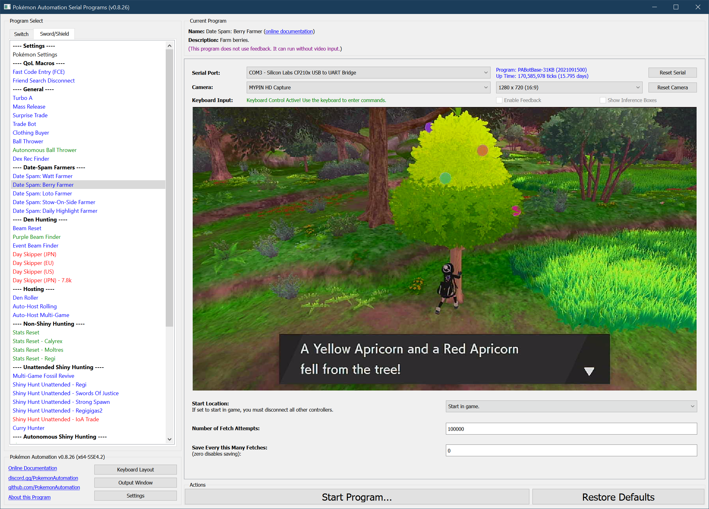

# Date Spam - Berry Farmer

**Related Programs:**
- **Microcontroller:** [Date Spam - Berry Farmer](https://github.com/PokemonAutomation/Microcontroller/blob/master/Wiki/Programs/PokemonSwSh/DateSpam-BerryFarmer.md)
- **Computer Control:** [Date Spam - Berry Farmer](https://github.com/PokemonAutomation/ComputerControl/blob/master/Wiki/Programs/PokemonSwSh/DateSpam-BerryFarmer.md) (this program)

The microcontroller and computer-control versions of this program are functionally identical.

## Program Description

BerryFarmer will farm berries from a tree. It requires activating the Y-Comm.

This program runs at 13.4 seconds per fetch.

### Setup of Settings

1. Text Speed: Fast
2. Casual mode: Off
3. Y-Comm glitch must be active
   1. Verify glitch is active by checking for a "flash" when re-entering the game from the Home menu.

### Instructions

1. You must be standing in front of a berry tree.
2. Your location should be safe from getting attacked by wild Pokémon.
3. Start the program in game or the [Change Grip/Order Menu](/Wiki/Programs/NintendoSwitch/ChangeGripOrderMenu.md) depending on which option you choose.

   > **Stability Recommendation:** Stand behind the berry tree so that the tree is directly in front of (and blocking) your character. Sometimes, the program will miss a button press which causes the date-spamming to happen in the game instead of the Switch settings. This will cause the character to move downwards and away from the tree if you’re not standing behind it.

## Options

This program does not have the ability to avoid the system update window. Should the window appear while the program is running, the program will enter a safe do-nothing loop within the Switch settings.

Most of the options here are self-explanatory.

**Discord Server:** 

