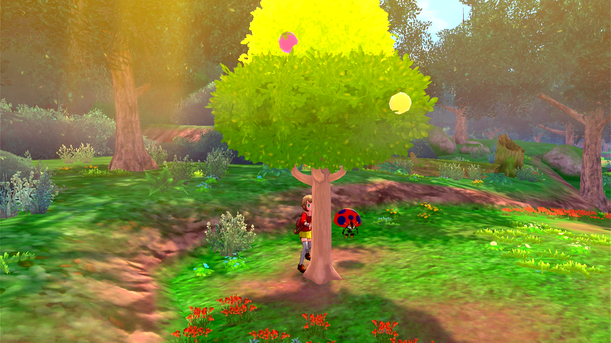

# Date Spam - Berry Farmer 2

**Related Programs:**
- **Microcontroller:** [Date Spam - Berry Farmer](https://github.com/PokemonAutomation/Microcontroller/blob/master/Wiki/Programs/PokemonSwSh/DateSpam-BerryFarmer.md)
- **Computer Control:** [Date Spam - Berry Farmer](https://github.com/PokemonAutomation/ComputerControl/blob/master/Wiki/Programs/PokemonSwSh/DateSpam-BerryFarmer.md)
- **Computer Control:** [Date Spam - Berry Farmer 2](https://github.com/PokemonAutomation/ComputerControl/blob/master/Wiki/Programs/PokemonSwSh/DateSpam-BerryFarmer2.md) (this program)
- **Computer Control:** [Shiny Hunt (Autonomous) - Berry Tree](https://github.com/PokemonAutomation/ComputerControl/blob/master/Wiki/Programs/PokemonSwSh/ShinyHuntAutonomous-BerryTree.md)

This version of the program uses sound feedback to be more efficient.

## Program Description

BerryFarmer2 will farm berries from a tree. It requires activating the Y-Comm glitch.

Under optimal conditions, this program runs at an average of around 9 seconds per fetch.

In rare cases, a battle starts and the opposing Pokémon gets defeated. If you do not want a Pokémon to accidentally gain experience or EV points remove it from your party.
This program will detect shiny Pokémon, however, a better alternative for this specific use is [Shiny Hunt (Autonomous) - Berry Tree](https://github.com/PokemonAutomation/ComputerControl/blob/master/Wiki/Programs/PokemonSwSh/ShinyHuntAutonomous-BerryTree.md).

### Setup of Settings

1. Screen size: Must be 100% within the Switch settings
2. Video Resolution: 1280 x 720 or higher in program settings
3. Audio input is properly set up.
4. Text Speed: Fast
5. Casual mode: Off
6. Background Music: 0 (needs to be unlocked in Motostoke)
7. System time: Un-synced
8. VS (Y-Comm) glitch must be active

### Setup of Party
1. Your lead Pokémon must be able to run away. (faster or holding Smoke Ball)
2. Your lead Pokémon must either be able to OHKO or not be able to use its first move. (for example, no PP left)
3. Your lead Pokémon must not be shiny. (this will cause false positive detection)

### Instructions

1. You must be standing in front of a berry tree.
2. Your location should be safe from getting attacked by wild Pokémon.
3. Start the program in-game or the [Change Grip/Order Menu](https://github.com/PokemonAutomation/Microcontroller/blob/master/Wiki/Programs/NintendoSwitch/ChangeGripOrderMenu.md) depending on which option you choose.

   > **Stability Recommendation:** Stand behind the berry tree so that the tree is directly in front of (and blocking) your character. Sometimes, the program will miss a button press which causes the date-spamming to happen in the game instead of the Switch settings. This will cause the character to move downwards and away from the tree if you're not standing behind it.

## Options

### Number of Fetch Attempts:

How many times the program will attempt to fetch berries.

### Save Every this many Fetches:

The program will automatically save after this many fetch attempts. 

Zero disables saving.

### Game Language:

If set to a language, the program will attempt to read the name of each Pokémon you encounter and log it.

If you are playing in an Asian language (Japanese, Korean, Chinese), set your video resolution to 1080p or higher. These languages are difficult to accurately read with text recognition at low resolutions.

## Credits

- **Author:** Fye
- **Shiny Detection:** Kuroneko/Mysticial

**Discord Server:** 

