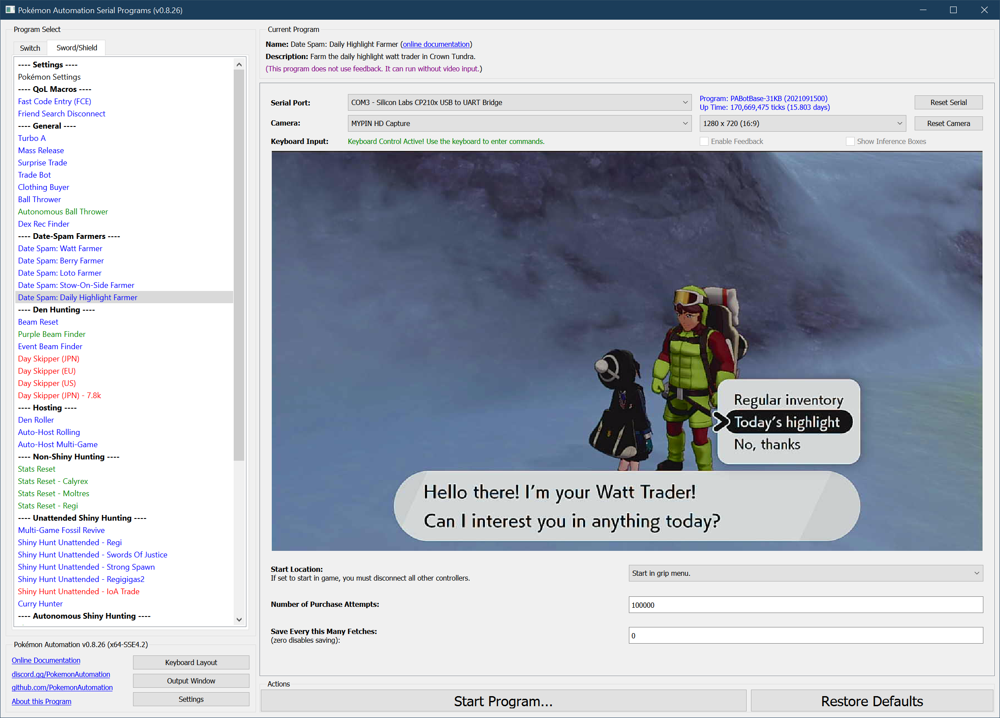

# Date Spam - Daily Highlight Farmer

**Related Programs:**
- **Microcontroller:** [Date Spam - Daily Highlight Farmer](https://github.com/PokemonAutomation/Microcontroller/blob/master/Wiki/Programs/PokemonSwSh/DateSpam-DailyHighlightFarmer.md)
- **Computer Control:** [Date Spam - Daily Highlight Farmer](https://github.com/PokemonAutomation/ComputerControl/blob/master/Wiki/Programs/PokemonSwSh/DateSpam-DailyHighlightFarmer.md) (this program)

The microcontroller and computer-control versions of this program are functionally identical.

## Program Description

Farm the daily highlight watt trader in Crown Tundra. It requires activating the VS glitch.

This program runs at 15.8 seconds per purchase.

### Setup of Settings

1. Text Speed: Fast
2. Casual mode: Off
3. System time: Un-synced
4. Y-Comm glitch must be active
   1. Verify glitch is active by checking for a "flash" when re-entering the game from the Home menu.

### Instructions

1. You must be standing in front of the daily highlights watt trader in Snowslide Slope.
2. Start the program in game or the [Change Grip/Order Menu](https://github.com/PokemonAutomation/Microcontroller/blob/master/Wiki/Programs/NintendoSwitch/ChangeGripOrderMenu.md) depending on which option you choose.

## Options

This program does not have the ability to avoid the system update window. Should the window appear while the program is running, the program will enter a safe do-nothing loop within the Switch settings.

Most of the options here are self-explanatory.

## Credits

- **Author:** Kuroneko/Mysticial
- **Optimized:** SakuraKim
- **Ported to CC:** Kuroneko/Mysticial

**Discord Server:** 

