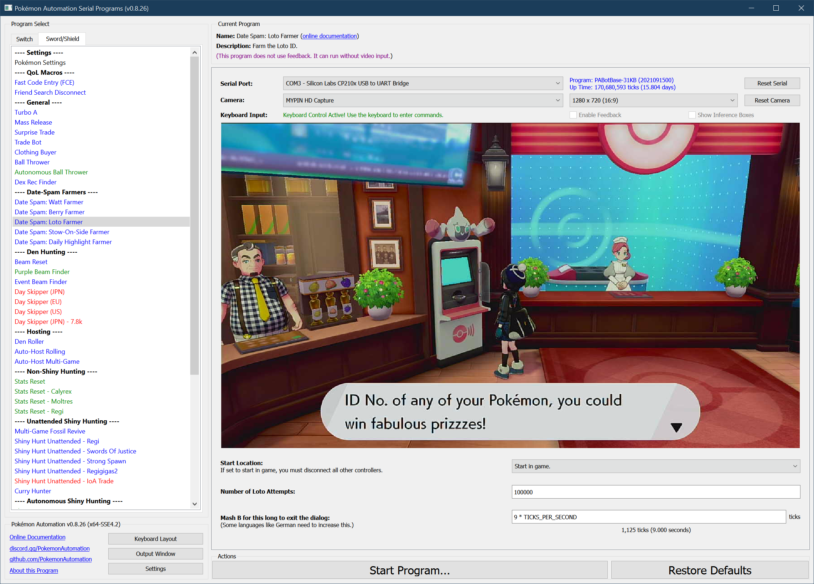

# Date Spam - Loto Farmer

## Program Description

LotoFarmer will farm the loto. It requires activating the Y-Comm glitch.

**Switch 1:**
- **Wired Controller:** 21.8 seconds/attempt
- **ESP32 Wireless:** 22.2 seconds/attempt
- **sys-botbase 2.x:** 29.0 seconds/attempt (very unreliable)
- **sys-botbase 3.0:** TBD

**Switch 2:**
- **Wired Controller:** 22.3 seconds/attempt

### Setup of Settings

**Switch Settings:**
1. Screen size: Must be 100% within the Switch settings
2. [Switch 2: The profile you are using must be the 1st (left-most) profile.](/Wiki/Programs/NintendoSwitch/Switch2Notes.md#resetting-a-game-moves-the-cursor-to-the-1st-user-profile)
3. System Time: Unsynced

**Program Settings:**
1. Video Resolution: 720p or higher

**Game Settings:**
1. Text Speed: Fast
2. Casual mode: Off
3. Y-Comm glitch must be active
   1. Verify glitch is active by checking for a "flash" when re-entering the game from the Home menu.

### Instructions

1. You must be standing in front of the PC.
2. Start the program in game or the [Change Grip/Order Menu](https://github.com/PokemonAutomation/Microcontroller/blob/master/Wiki/Programs/NintendoSwitch/ChangeGripOrderMenu.md) depending on which option you choose.

## Options

This program does not have the ability to avoid the system update window. Should the window appear while the program is running, the program will enter a safe do-nothing loop within the Switch settings.

Most of the options here are self-explanatory.

## Credits

- **Author:** Kuroneko/Mysticial
- **Optimized:** SakuraKim
- **Ported to CC:** Kuroneko/Mysticial

**Discord Server:** 

