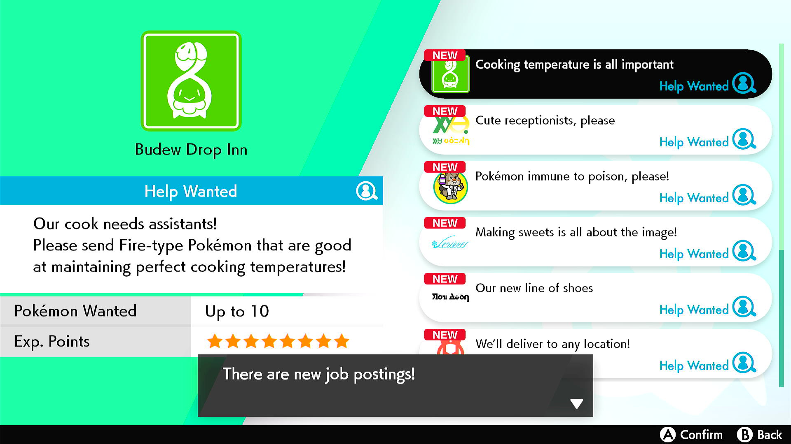

# Date Spam - Poke Jobs
## Program Description

This program farms Poké Jobs in order to make Pokémons gain experience without evolving or learning new moves. Evolution can later be triggered by leveling or by using Rare Candies is level 100 has been reached. Moves can be learned from the Move Reminder.

### Setup of Settings

1. Text Speed: Fast
2. Casual mode: Off
3. System time: Un-synced
4. Y-Comm glitch must be active
   1. Verify glitch is active by checking for a "flash" when re-entering the game from the Home menu.

   > **Warning:** If you have all eight badges, it is recommended to complete the ten-stars Poké Job at least once before using this program. This Poké Job is named _Top-secret project_. When this special job is completed the first time, the only jobs available are EV-training jobs. If this program is run in this state, Pokémons will receive EV-training which might not be intended.

### Instructions

1. Place the Pokémons to be trained in the same box
2. The box must either be box #1 or the box before it must all be full
3. Select the box then close the menu
4. Stand in front of the Rotom machine
5. Start the program in game 

### Default Program Settings

The default settings for this program completes a single Poké Job per day during 200 days.

   > While the concurrency setting allows one to train more Pokémons at once, setting the concurrency too high will deplete all experience training jobs possibly sending Pokémons to EV-training jobs.

***

### Options

Options are self-explanatory.

***

## Advanced features

### Mash B for this long upon completion of Poké Job:

   > **SETTINGS THIS TO LESS THAN 8 SECONDS WILL BREAK THE PROGRAM**

Increasing this to 9 seconds or more might fix the program in case it is behaving erratically.

**Discord Server:** 

