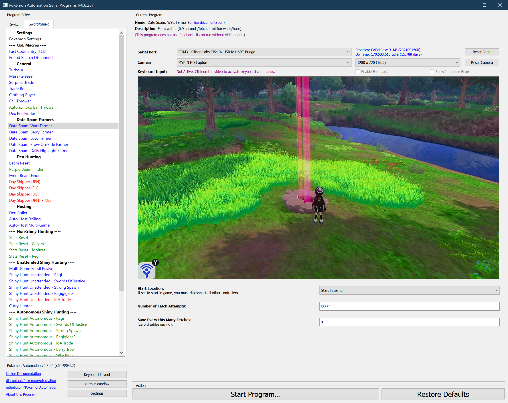

# Date Spam - Watt Farmer

**Related Programs:**
- **Microcontroller:** [Date Spam - Watt Farmer](https://github.com/PokemonAutomation/Microcontroller/blob/master/Wiki/Programs/PokemonSwSh/DateSpam-WattFarmer.md)
- **Computer Control:** [Date Spam - Watt Farmer](https://github.com/PokemonAutomation/ComputerControl/blob/master/Wiki/Programs/PokemonSwSh/DateSpam-WattFarmer.md) (this program)

The microcontroller and computer-control versions of this program are functionally identical.

## Program Description

WattFarmer will farm watts from a wishing piece beam. It requires activating the VS glitch.

This program runs at 7.2 seconds per fetch. This is about 1 million watts/hour at 2000/fetch.

### Setup of Settings

1. Text Speed: Fast
2. Casual mode: Off
3. System time: Un-synced
4. Y-Comm glitch must be active
   1. Verify glitch is active by checking for a "flash" when re-entering the game from the Home menu.
5. You must be offline.
6. Airplane mode must be off.

   > **Stability Recommendation:** Stand ***behind*** the den so that the beam is directly in front of your character. Sometimes, the program will miss a button press which causes the date-spamming to happen in the game instead of the Switch settings. This will cause the character to move downwards and away from the den if you’re not standing behind it.

### Instructions

1. You must be standing in front of a wishing piece den with watts collected.
2. Your location should be safe from getting attacked by wild Pokémon.
3. Start the program in game or the [Change Grip/Order Menu](/Wiki/Programs/NintendoSwitch/ChangeGripOrderMenu.md) depending on which option you choose.

## Options

This program does not have the ability to avoid the system update window. Should the window appear while the program is running, the program will enter a safe do-nothing loop within the Switch settings.

Most of the options here are self-explanatory.

**Discord Server:** 

