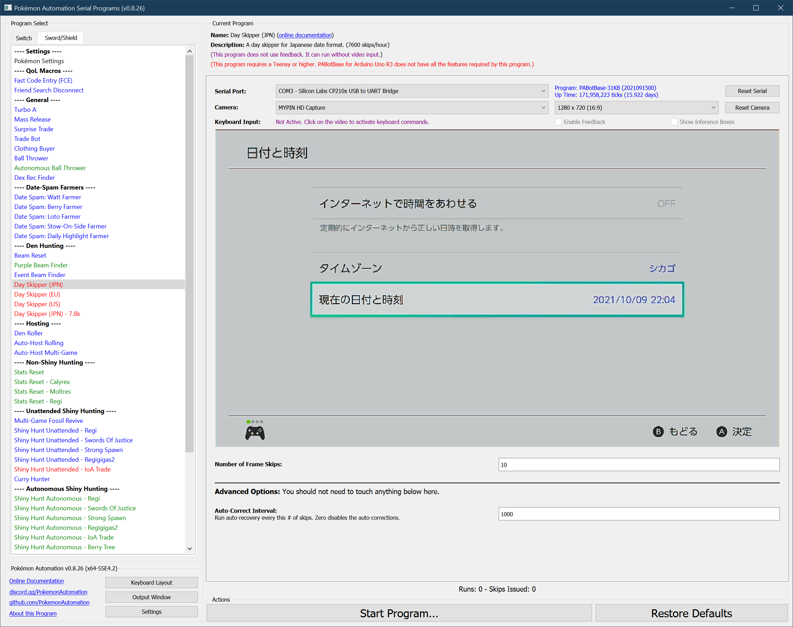

# Day Skipper (JPN)

**Related Programs:**
- **Microcontroller:** [Day Skipper (JPN)](https://github.com/PokemonAutomation/Microcontroller/blob/master/Wiki/Programs/PokemonSwSh/DaySkipperJPN.md)
- **Microcontroller:** [Day Skipper (EU)](https://github.com/PokemonAutomation/Microcontroller/blob/master/Wiki/Programs/PokemonSwSh/DaySkipperEU.md)
- **Microcontroller:** [Day Skipper (US)](https://github.com/PokemonAutomation/Microcontroller/blob/master/Wiki/Programs/PokemonSwSh/DaySkipperUS.md)
- **Microcontroller:** [Day Skipper (JPN) - 7.8k](https://github.com/PokemonAutomation/Microcontroller/blob/master/Wiki/Programs/PokemonSwSh/DaySkipperJPN-7.8k.md)
- **Computer Control:** [Day Skipper (JPN)](https://github.com/PokemonAutomation/ComputerControl/blob/master/Wiki/Programs/PokemonSwSh/DaySkipperJPN.md) (this program)
- **Computer Control:** [Day Skipper (EU)](https://github.com/PokemonAutomation/ComputerControl/blob/master/Wiki/Programs/PokemonSwSh/DaySkipperEU.md)
- **Computer Control:** [Day Skipper (US)](https://github.com/PokemonAutomation/ComputerControl/blob/master/Wiki/Programs/PokemonSwSh/DaySkipperUS.md)
- **Computer Control:** [Day Skipper (JPN) - 7.8k](https://github.com/PokemonAutomation/ComputerControl/blob/master/Wiki/Programs/PokemonSwSh/DaySkipperJPN-7.8k.md)

There are different skippers for each date format. Use the one that matches yours or change your language/region to match the faster Japanese date skippers.
The microcontroller and computer-control versions of the same program are functionally identical.

## Program Description

This is the original "7k Skipper". It is a Japanese day skipper that runs at 7619 skips/hour.

### Setup of Settings

1. System time: Un-synced
2. The language for your Switch must be set to Japanese (日本語).
3. Set the date to the 1st of a month with 31 days that is not March.
3. The VS (Y-COMM) glitch must be active.

### Instructions

Most people use the following workflow:

1. Undock the Switch if it is docked.
2. Change the Switch language to Japanese.
3. Set the date to the 1st of a month with 31 days that is not March.
4. Enter the game and go to a Pokémon center.
   1. The Isle of Armor dojo is not reliable!
5. Connect to the internet and start a link battle.
6. When someone is found, turn on airplane mode and keep it on.
7. Mash B to clear all the messages.
8. Confirm that the VS glitch is active by leaving and re-entering the game. The screen should flash when you re-enter the game.
9. Go into settings and date time.
10. Dock the Switch if desired.
11. Start the program.
   > Start the script anywhere in the Date/Time menu except the time zone menu. It will automatically find the right place.

   > If the game is a digital copy and the Switch is not the primary, you will not be able to turn on airplane mode for longer skips that take multiple hours. This is because the Switch will periodically check online to see if it's allowed to keep running the game. Airplane mode prevents this which causes the game to halt.
   > If this applies to you, either make the Switch the primary, or don't enable airplane mode. If you opt for the latter, you can expect the day skipper to make a lot more errors.

### Default Program Settings

When the program finishes skipping, it will continue to enter/exit the date change menu every 15 seconds without changing the date. This prevents the time from advancing naturally and potentially passing midnight which would result in an extra (unintended) day skip.

### Day Skipper Appendix:

It is strongly recommended to read each of these sections. These are common to all the day skippers.
- [Maximizing Switch Stability](https://github.com/PokemonAutomation/Microcontroller/blob/master/Wiki/Programs/NintendoSwitch/SwitchStability.md)
- [Common Usage Errors](https://github.com/PokemonAutomation/Microcontroller/blob/master/Wiki/Programs/PokemonSwSh/DaySkippers.md#common-usage-errors#common-usage-errors)
- [How Many Skips are Remaining?](https://github.com/PokemonAutomation/Microcontroller/blob/master/Wiki/Programs/PokemonSwSh/DaySkippers.md#common-usage-errors#how-many-skips-are-remaining)
- [Errors and Auto-Corrections](https://github.com/PokemonAutomation/Microcontroller/blob/master/Wiki/Programs/PokemonSwSh/DaySkippers.md#common-usage-errors#errors-and-auto-corrections)

## Options

### Frame Skips:

Skip this many frames. The actual number of skips performed may be less if any errors were made.

This can be as large as 4,294,967,295. But it will take 60+ years to skip that many frames.

### Auto-Recover Interval:

Perform an auto-recovery every this number of skips. This is the recovery routine that recovers from trapping errors. You shouldn't need to touch this value.

## Credits

- **Original:** Kuroneko/Mysticial
- **Rewritten:** SakuraKim
- **Ported to CC:** Kuroneko/Mysticial

**Discord Server:** 

