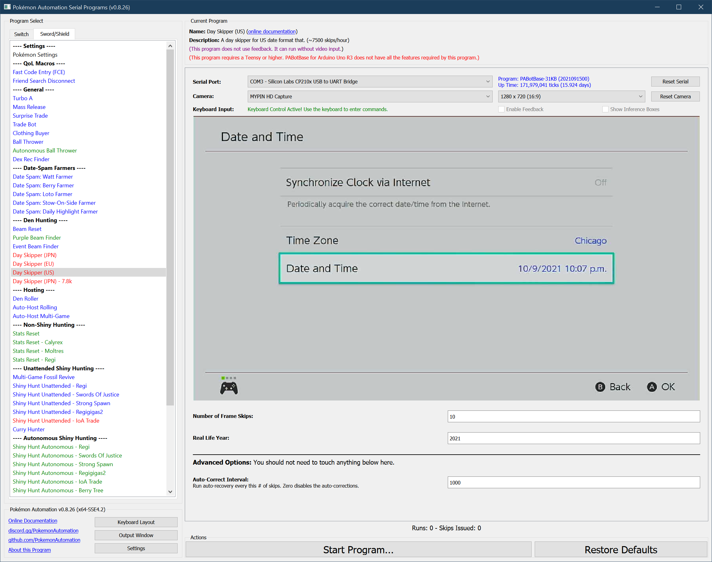

# Day Skipper (US)

**Related Programs:**
- [Day Skipper (JPN)](https://github.com/PokemonAutomation/ComputerControl/blob/master/Wiki/Programs/PokemonSwSh/DaySkipperJPN.md)
- [Day Skipper (EU)](https://github.com/PokemonAutomation/ComputerControl/blob/master/Wiki/Programs/PokemonSwSh/DaySkipperEU.md)
- [Day Skipper (US)](https://github.com/PokemonAutomation/ComputerControl/blob/master/Wiki/Programs/PokemonSwSh/DaySkipperUS.md) (this program)
- [Day Skipper (JPN) - 7.8k](https://github.com/PokemonAutomation/ComputerControl/blob/master/Wiki/Programs/PokemonSwSh/DaySkipperJPN-7.8k.md)

There are different skippers for each date format. Use the one that matches yours or change your language/region to match the faster Japanese date skippers.

## Program Description

This is the US day skipper that runs at about:
- Switch 1: **7000 - 7200** skips/hour
- Switch 2: **5512** skips/hour

On the Switch 1, the exact speed will depend on the real life year. For the year 2020, it will run at about 7180 skips/hour.

> Note that this skipper is slower than the [Japanese date skipper](DaySkipperJPN.md). If you are doing large skips, it is recommended to change the Switch language to Japanese and use the Japanese skipper.*

### Setup of Settings

This setup here depends on whether you are on a Switch 1 or a Switch 2.

**Switch 1:**

1. System time: Un-synced
2. The language/region for the Switch must have a date layout of mm/dd/ year/hour/min/AM.
   1. Unlike the JPN date skipper, you do not need to set the starting the date. However you do need to set the current year correctly.
3. The VS (Y-COMM) glitch must be active.
4. The console type is set to "Switch 1".

**Switch 2:**

1. System time: Un-synced
2. The language/region for the Switch must have a date layout of mm/dd/ year/hour/min/AM.
3. Set the date to the 1st of a month with 31 days that is not March.
4. The VS (Y-COMM) glitch must be active.
5. The console type is set to any of the Switch 2 options.

### Instructions

Most people use the following workflow:

1. Undock the Switch if it is docked.
2. Enter the game and go to a Pokémon center.
   1. The Isle of Armor dojo is not reliable!
3. Connect to the internet and start a link battle.
4. When someone is found, turn on airplane mode and keep it on.
5. Mash B to clear all the messages.
6. Confirm that the VS glitch is active by leaving and re-entering the game. The screen should flash when you re-enter the game.
7. Go into settings and date time.
8. Dock the Switch if desired.
9. Start the program.
   > Start the script anywhere in the Date/Time menu except the time zone menu. It will automatically find the right place.

   > If the game is a digital copy and the Switch is not the primary, you will not be able to turn on airplane mode for longer skips that take multiple hours. This is because the Switch will periodically check online to see if it's allowed to keep running the game. Airplane mode prevents this which causes the game to halt.
   > If this applies to you, either make the Switch the primary, or don't enable airplane mode. If you opt for the latter, you can expect the day skipper to make a lot more errors.

### Default Program Settings

When the program finishes skipping, it will continue to enter/exit the date change menu every 15 seconds without changing the date. This prevents the time from advancing naturally and potentially passing midnight which would result in an extra (unintended) day skip.

### Day Skipper Appendix:

It is strongly recommended to read each of these sections. These are common to all the day skippers.
- [Maximizing Switch Stability](https://github.com/PokemonAutomation/Microcontroller/blob/master/Wiki/Programs/NintendoSwitch/SwitchStability.md)
- [Common Usage Errors](https://github.com/PokemonAutomation/Microcontroller/blob/master/Wiki/Programs/PokemonSwSh/DaySkippers.md#common-usage-errors#common-usage-errors)
- [How Many Skips are Remaining?](https://github.com/PokemonAutomation/Microcontroller/blob/master/Wiki/Programs/PokemonSwSh/DaySkippers.md#common-usage-errors#how-many-skips-are-remaining)
- [Errors and Auto-Corrections](https://github.com/PokemonAutomation/Microcontroller/blob/master/Wiki/Programs/PokemonSwSh/DaySkippers.md#common-usage-errors#errors-and-auto-corrections)

## Options

### Frame Skips:

Skip this many frames. The actual number of skips performed may be less if any errors were made.

This can be as large as 4,294,967,295. But it will take 60+ years to skip that many frames.

### Real Life Year (Switch 1 only):

Set this to the current year in real life. 
More specifically, this needs to be the year that the time-sync will change the date to.

This option is ignored on the Switch 2.

### Auto-Recover Interval (Switch 1 only):

Perform an auto-recovery every this number of skips. This is the recovery routine that recovers from trapping errors. You shouldn't need to touch this value.

This option is ignored on the Switch 2.

## Credits

- **Original:** Kuroneko/Mysticial
- **Rewritten:** SakuraKim
- **Ported to CC:** Kuroneko/Mysticial

**Discord Server:** 

