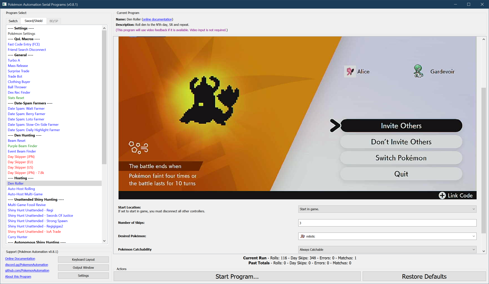
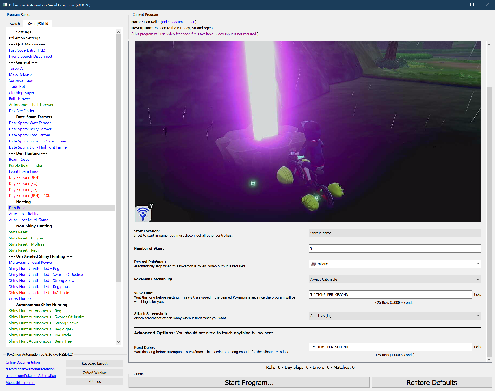

# Den Roller

**Related Programs:**
- **Microcontroller:** [Den Roller](https://github.com/PokemonAutomation/Microcontroller/blob/master/Wiki/Programs/PokemonSwSh/DenRoller.md)
- **Computer Control:** [Den Roller](https://github.com/PokemonAutomation/ComputerControl/blob/master/Wiki/Programs/PokemonSwSh/DenRoller.md) (this program)

The computer-control version of this program provides substantial improvements over the microcontroller version.

## Program Description

Roll a den forward by N days, show what it is, then reset. Use this program to roll for a specific Pokémon in your den.

If video feedback is disabled, this program behaves identically to the [microcontroller DenRoller](https://github.com/PokemonAutomation/Microcontroller/blob/master/Wiki/Programs/PokemonSwSh/DenRoller.md).

If video feedback is enabled, it will keep track of stats, automatically stop on the Pokémon of your choice, and notify you. Thus this program can be used to find extremely rare rolls such as Milotic.

### Setup of Settings

1. Text Speed: Fast
2. Casual mode: Off
3. System time: Un-synced

> *If starting the game requires checking the internet (because it is digital on a non-primary Switch), you will need to enable ["**Start Game Requires Internet**"](/Wiki/Programs/NintendoSwitch/FrameworkSettings.md#start-game-requires-internet).

### Instructions

1. Stand in front of a wishing piece den with watts collected.
   1. Your location should be safe from getting attacked by wild Pokémon.
2. Save.
3. Return to the overworld (not in a menu).
4. Start the program in game or the [Change Grip/Order Menu](https://github.com/PokemonAutomation/Microcontroller/blob/master/Wiki/Programs/NintendoSwitch/ChangeGripOrderMenu.md) depending on which option you choose.

## Options

This program uses [**Tolerate System Update Menu (slow)**](/Wiki/Programs/NintendoSwitch/FrameworkSettings.md#tolerate-system-update-menu-slow) to bypass the system update window.

### Frame Skips:

The number of frames to roll. The default is 3. But some people may prefer to save high-value dens more than 3 days back for added safety in case of accidental roll-over.

### Desired Pokémon:

Stop on this Pokémon when it is found. If not set, the program behaves identically to microcontroller DenRoller and will keep rolling.

### Catchability:

Some dens have uncatchable Pokémon (i.e. Mewtwo or Zeraora). If the den has any such uncatchable Pokémon, you must set this to "Maybe Uncatchable".

### View Time:

View the rolled Pokémon for this long before resetting. This option only applies if video feedback is disabled.

## Credits

- **Original:** Kuroneko/Mysticial
- **Optimized:** SakuraKim
- **Ported to CC:** Kuroneko/Mysticial

**Discord Server:** 

